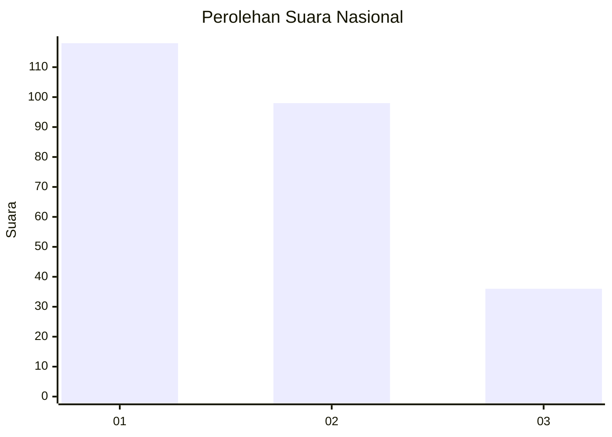
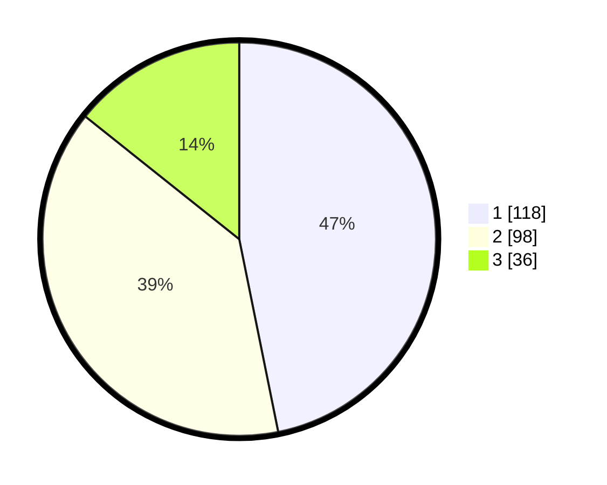

# Hasil

## Grafik

## Tabel

| No.    | Nama Paslon    | Suara | Suara (raw) | Persentase |
|:------ |:-------------- | -----:| -----------:| ----------:|
| 100025 | ANIES MUHAIMIN | 118   | [118][p-1]  | 46,83      |
| 100026 | PRABOWO GIBRAN | 98    | [98][p-2]   | 38,89      |
| 100027 | GANJAR MAHFUD  | 36    | [36][p-3]   | 14,29      |

[p-1]: https://github.com/gigit-pemilu/pemilu-2024/blob/main/pilpres/hitung-suara/sub/31-dki-jakarta/sub/74-jakarta-selatan/sub/06-cilandak/sub/1005-cipete-selatan/sub/009-tps/sub/paslon-1.txt
[p-2]: https://github.com/gigit-pemilu/pemilu-2024/blob/main/pilpres/hitung-suara/sub/31-dki-jakarta/sub/74-jakarta-selatan/sub/06-cilandak/sub/1005-cipete-selatan/sub/009-tps/sub/paslon-2.txt
[p-3]: https://github.com/gigit-pemilu/pemilu-2024/blob/main/pilpres/hitung-suara/sub/31-dki-jakarta/sub/74-jakarta-selatan/sub/06-cilandak/sub/1005-cipete-selatan/sub/009-tps/sub/paslon-3.txt

## Foto C Plano

https://sirekap-obj-formc.kpu.go.id/3d12/pemilu/ppwp/31/74/06/10/05/3174061005009-20240216-165831--ea3b11d0-2e41-49fc-a509-2698d99a4e2c.jpg

https://sirekap-obj-formc.kpu.go.id/3d12/pemilu/ppwp/31/74/06/10/05/3174061005009-20240216-165919--35e4b6ac-e023-47b3-9b04-34c76fc64d64.jpg

https://sirekap-obj-formc.kpu.go.id/3d12/pemilu/ppwp/31/74/06/10/05/3174061005009-20240216-170001--1bb2d64b-7086-434f-8088-4626e41aebf8.jpg

## Metadata

| Key        | Value               |
| ---------- | ------------------- |
| Time Stamp | 2024-02-19 12:00:00 |

