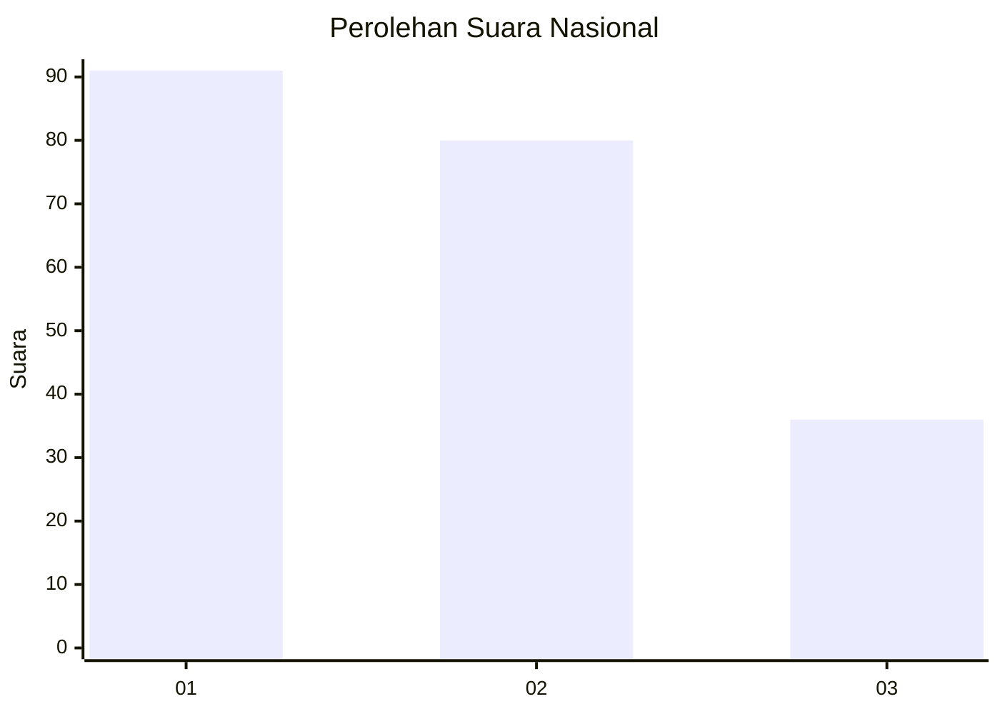
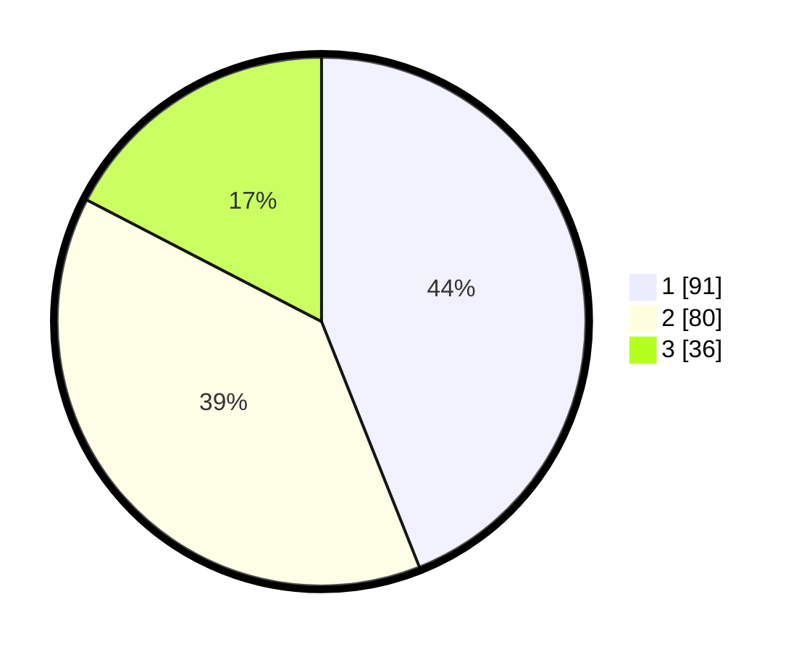

# Hasil

## Grafik

## Tabel

| No.    | Nama Paslon    | Suara | Suara (raw) | Persentase |
|:------ |:-------------- | -----:| -----------:| ----------:|
| 100025 | ANIES MUHAIMIN | 91    | [91][p-1]   | 43,96      |
| 100026 | PRABOWO GIBRAN | 80    | [80][p-2]   | 38,65      |
| 100027 | GANJAR MAHFUD  | 36    | [36][p-3]   | 17,39      |

[p-1]: https://github.com/gigit-pemilu/pemilu-2024/blob/main/pilpres/hitung-suara/sub/31-dki-jakarta/sub/74-jakarta-selatan/sub/06-cilandak/sub/1005-cipete-selatan/sub/010-tps/sub/paslon-1.txt
[p-2]: https://github.com/gigit-pemilu/pemilu-2024/blob/main/pilpres/hitung-suara/sub/31-dki-jakarta/sub/74-jakarta-selatan/sub/06-cilandak/sub/1005-cipete-selatan/sub/010-tps/sub/paslon-2.txt
[p-3]: https://github.com/gigit-pemilu/pemilu-2024/blob/main/pilpres/hitung-suara/sub/31-dki-jakarta/sub/74-jakarta-selatan/sub/06-cilandak/sub/1005-cipete-selatan/sub/010-tps/sub/paslon-3.txt

## Foto C Plano

https://sirekap-obj-formc.kpu.go.id/2d05/pemilu/ppwp/31/74/06/10/05/3174061005010-20240216-170452--1851f9c2-bbe3-4d85-9d53-80af50488dba.jpg

https://sirekap-obj-formc.kpu.go.id/2d05/pemilu/ppwp/31/74/06/10/05/3174061005010-20240216-170529--0e6deca8-a5ac-4897-ac6e-58025cbf57bb.jpg

https://sirekap-obj-formc.kpu.go.id/2d05/pemilu/ppwp/31/74/06/10/05/3174061005010-20240216-170602--6a18a6fe-f4ae-4dd1-b680-8656ac7bc36b.jpg

## Metadata

| Key        | Value               |
| ---------- | ------------------- |
| Time Stamp | 2024-02-19 12:00:00 |

