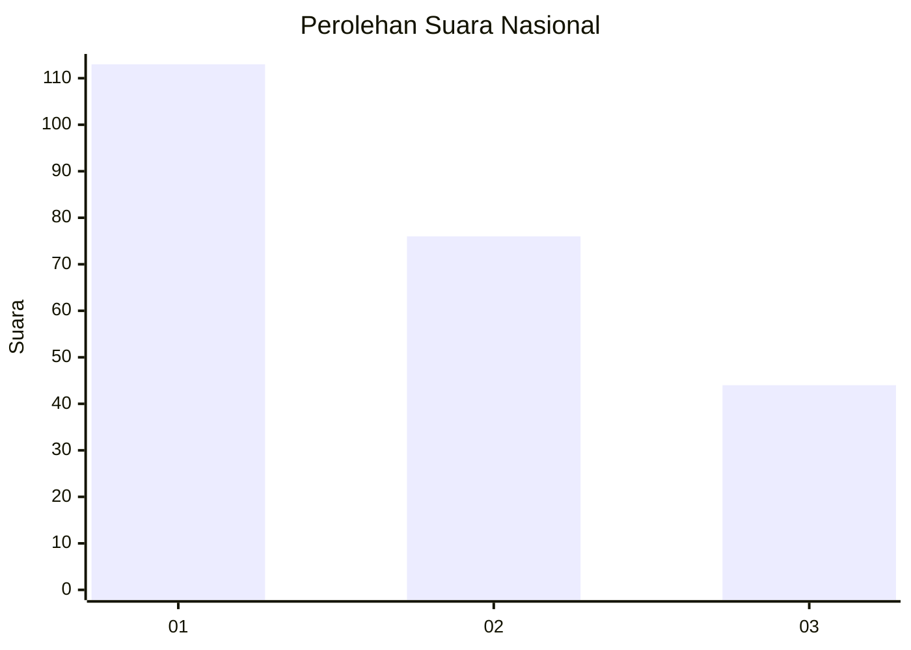
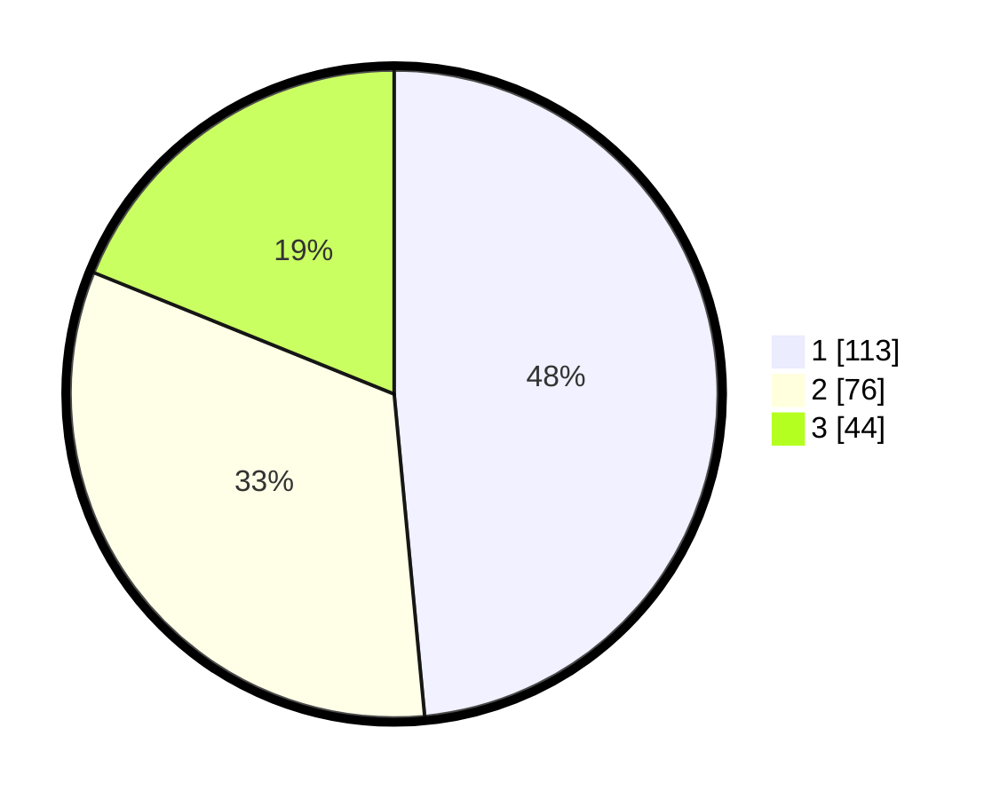

# Hasil

## Grafik

## Tabel

| No.    | Nama Paslon    | Suara | Suara (raw) | Persentase |
|:------ |:-------------- | -----:| -----------:| ----------:|
| 100025 | ANIES MUHAIMIN | 113   | [113][p-1]  | 48,50      |
| 100026 | PRABOWO GIBRAN | 76    | [76][p-2]   | 32,62      |
| 100027 | GANJAR MAHFUD  | 44    | [44][p-3]   | 18,88      |

[p-1]: https://github.com/gigit-pemilu/pemilu-2024/blob/main/pilpres/hitung-suara/sub/31-dki-jakarta/sub/74-jakarta-selatan/sub/06-cilandak/sub/1005-cipete-selatan/sub/015-tps/sub/paslon-1.txt
[p-2]: https://github.com/gigit-pemilu/pemilu-2024/blob/main/pilpres/hitung-suara/sub/31-dki-jakarta/sub/74-jakarta-selatan/sub/06-cilandak/sub/1005-cipete-selatan/sub/015-tps/sub/paslon-2.txt
[p-3]: https://github.com/gigit-pemilu/pemilu-2024/blob/main/pilpres/hitung-suara/sub/31-dki-jakarta/sub/74-jakarta-selatan/sub/06-cilandak/sub/1005-cipete-selatan/sub/015-tps/sub/paslon-3.txt

## Foto C Plano

https://sirekap-obj-formc.kpu.go.id/2c48/pemilu/ppwp/31/74/06/10/05/3174061005015-20240216-172642--9031058a-6102-4f56-becc-27415a19475f.jpg

https://sirekap-obj-formc.kpu.go.id/2c48/pemilu/ppwp/31/74/06/10/05/3174061005015-20240216-172752--f5851a9a-0b71-44b1-bcad-3321ea64de60.jpg

https://sirekap-obj-formc.kpu.go.id/2c48/pemilu/ppwp/31/74/06/10/05/3174061005015-20240216-172824--7e5e9659-e379-4459-8515-00a829fc177c.jpg

## Metadata

| Key        | Value               |
| ---------- | ------------------- |
| Time Stamp | 2024-02-24 22:31:28 |

