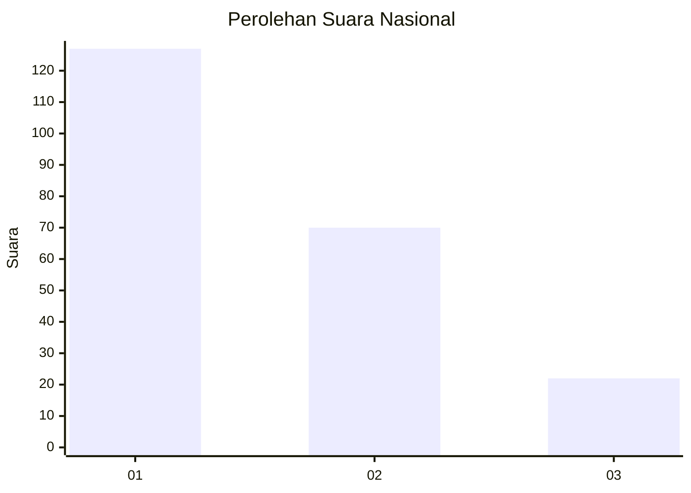
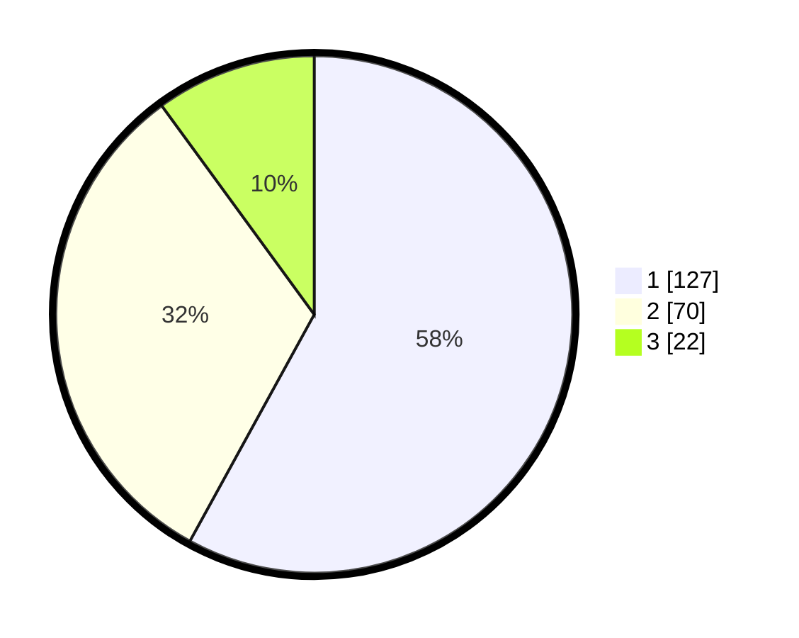

# Hasil

## Grafik

## Tabel

| No.    | Nama Paslon    | Suara | Suara (raw) | Persentase |
|:------ |:-------------- | -----:| -----------:| ----------:|
| 100025 | ANIES MUHAIMIN | 127   | [127][p-1]  | 57,99      |
| 100026 | PRABOWO GIBRAN | 70    | [70][p-2]   | 31,96      |
| 100027 | GANJAR MAHFUD  | 22    | [22][p-3]   | 10,05      |

[p-1]: https://github.com/gigit-pemilu/pemilu-2024/blob/main/pilpres/hitung-suara/sub/31-dki-jakarta/sub/74-jakarta-selatan/sub/06-cilandak/sub/1005-cipete-selatan/sub/016-tps/sub/paslon-1.txt
[p-2]: https://github.com/gigit-pemilu/pemilu-2024/blob/main/pilpres/hitung-suara/sub/31-dki-jakarta/sub/74-jakarta-selatan/sub/06-cilandak/sub/1005-cipete-selatan/sub/016-tps/sub/paslon-2.txt
[p-3]: https://github.com/gigit-pemilu/pemilu-2024/blob/main/pilpres/hitung-suara/sub/31-dki-jakarta/sub/74-jakarta-selatan/sub/06-cilandak/sub/1005-cipete-selatan/sub/016-tps/sub/paslon-3.txt

## Foto C Plano

https://sirekap-obj-formc.kpu.go.id/58e3/pemilu/ppwp/31/74/06/10/05/3174061005016-20240216-173239--df3445ad-20e6-402e-80ea-9c1f71a5956b.jpg

https://sirekap-obj-formc.kpu.go.id/58e3/pemilu/ppwp/31/74/06/10/05/3174061005016-20240216-173312--3febb18d-870f-44ff-9bac-8a2a9625f087.jpg

https://sirekap-obj-formc.kpu.go.id/58e3/pemilu/ppwp/31/74/06/10/05/3174061005016-20240216-173417--54ebeb08-bb41-4ff2-955f-ac63ef626963.jpg

## Metadata

| Key        | Value               |
| ---------- | ------------------- |
| Time Stamp | 2024-02-24 22:31:28 |

