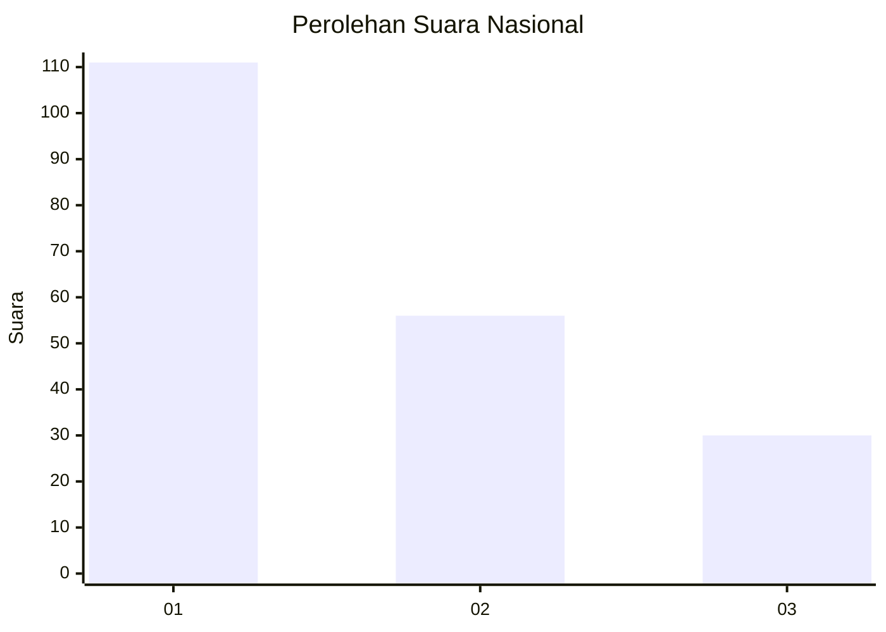
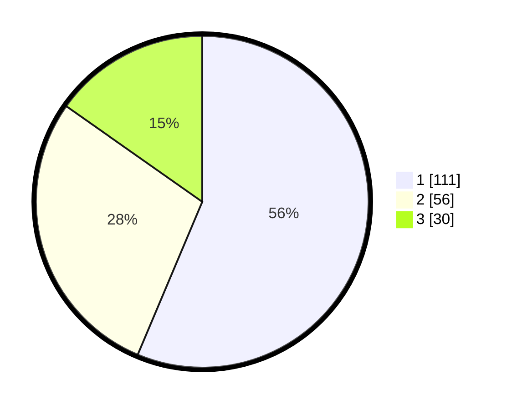

# Hasil

## Grafik

## Tabel

| No.    | Nama Paslon    | Suara | Suara (raw) | Persentase |
|:------ |:-------------- | -----:| -----------:| ----------:|
| 100025 | ANIES MUHAIMIN | 111   | [111][p-1]  | 56,35      |
| 100026 | PRABOWO GIBRAN | 56    | [56][p-2]   | 28,43      |
| 100027 | GANJAR MAHFUD  | 30    | [30][p-3]   | 15,23      |

[p-1]: https://github.com/gigit-pemilu/pemilu-2024/blob/main/pilpres/hitung-suara/sub/31-dki-jakarta/sub/74-jakarta-selatan/sub/06-cilandak/sub/1005-cipete-selatan/sub/021-tps/sub/paslon-1.txt
[p-2]: https://github.com/gigit-pemilu/pemilu-2024/blob/main/pilpres/hitung-suara/sub/31-dki-jakarta/sub/74-jakarta-selatan/sub/06-cilandak/sub/1005-cipete-selatan/sub/021-tps/sub/paslon-2.txt
[p-3]: https://github.com/gigit-pemilu/pemilu-2024/blob/main/pilpres/hitung-suara/sub/31-dki-jakarta/sub/74-jakarta-selatan/sub/06-cilandak/sub/1005-cipete-selatan/sub/021-tps/sub/paslon-3.txt

## Foto C Plano

https://sirekap-obj-formc.kpu.go.id/bb46/pemilu/ppwp/31/74/06/10/05/3174061005021-20240216-175506--124b1fe7-3961-4331-9ef2-154c902e7cca.jpg

https://sirekap-obj-formc.kpu.go.id/bb46/pemilu/ppwp/31/74/06/10/05/3174061005021-20240216-180011--3cd12d41-47a7-4a20-b1ca-79babd8e9be4.jpg

https://sirekap-obj-formc.kpu.go.id/bb46/pemilu/ppwp/31/74/06/10/05/3174061005021-20240216-180040--96a30390-a4d5-4d68-9e48-c84ddfa4474b.jpg

## Metadata

| Key        | Value               |
| ---------- | ------------------- |
| Time Stamp | 2024-02-24 22:31:28 |

