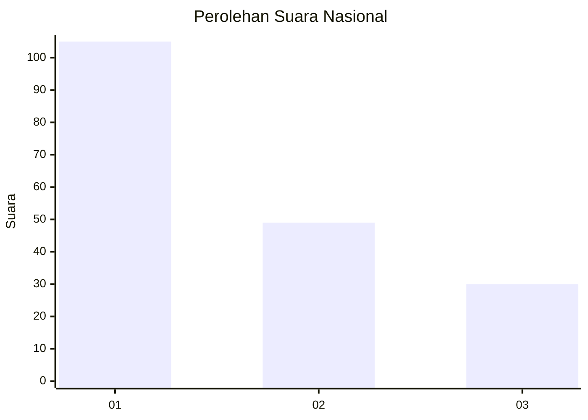
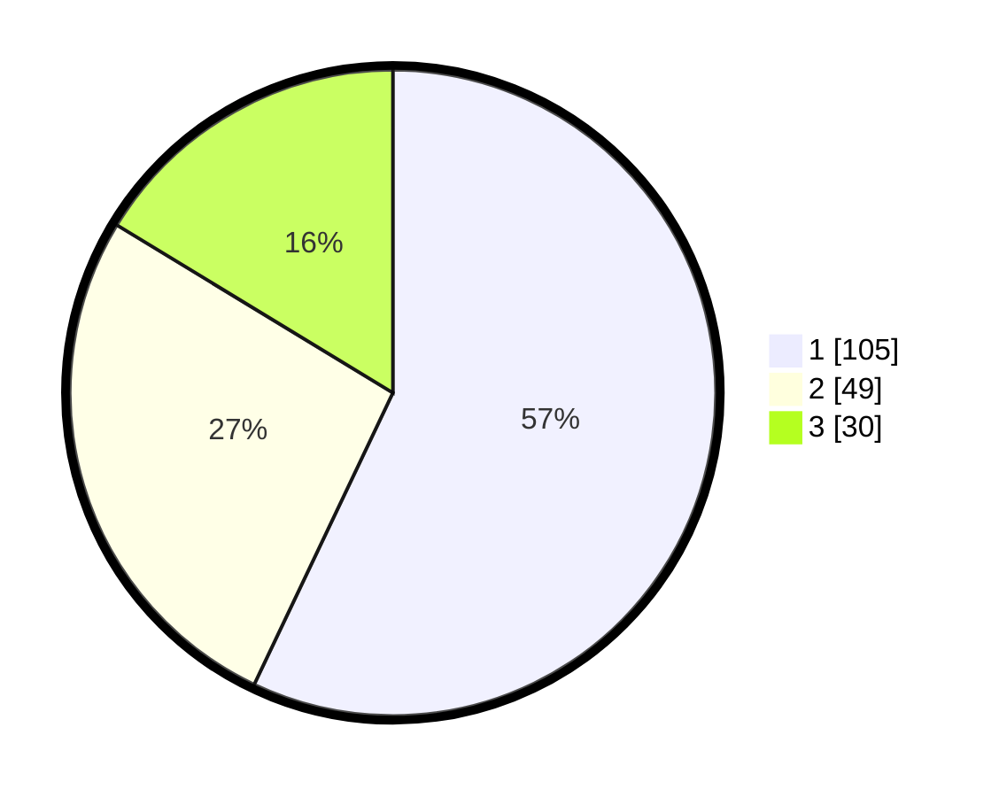

# Hasil

## Grafik

## Tabel

| No.    | Nama Paslon    | Suara | Suara (raw) | Persentase |
|:------ |:-------------- | -----:| -----------:| ----------:|
| 100025 | ANIES MUHAIMIN | 105   | [105][p-1]  | 57,07      |
| 100026 | PRABOWO GIBRAN | 49    | [49][p-2]   | 26,63      |
| 100027 | GANJAR MAHFUD  | 30    | [30][p-3]   | 16,30      |

[p-1]: https://github.com/gigit-pemilu/pemilu-2024/blob/main/pilpres/hitung-suara/sub/31-dki-jakarta/sub/74-jakarta-selatan/sub/06-cilandak/sub/1005-cipete-selatan/sub/023-tps/sub/paslon-1.txt
[p-2]: https://github.com/gigit-pemilu/pemilu-2024/blob/main/pilpres/hitung-suara/sub/31-dki-jakarta/sub/74-jakarta-selatan/sub/06-cilandak/sub/1005-cipete-selatan/sub/023-tps/sub/paslon-2.txt
[p-3]: https://github.com/gigit-pemilu/pemilu-2024/blob/main/pilpres/hitung-suara/sub/31-dki-jakarta/sub/74-jakarta-selatan/sub/06-cilandak/sub/1005-cipete-selatan/sub/023-tps/sub/paslon-3.txt

## Foto C Plano

https://sirekap-obj-formc.kpu.go.id/a675/pemilu/ppwp/31/74/06/10/05/3174061005023-20240216-195757--4f19eab5-549e-4b60-a290-ad4c7251aa1a.jpg

https://sirekap-obj-formc.kpu.go.id/a675/pemilu/ppwp/31/74/06/10/05/3174061005023-20240216-195826--ff4099bf-6a6f-41f7-9d16-f09268efe4f0.jpg

https://sirekap-obj-formc.kpu.go.id/a675/pemilu/ppwp/31/74/06/10/05/3174061005023-20240216-200023--7dafc5ee-d1f1-4c45-9acd-a2eff728ab92.jpg

## Metadata

| Key        | Value               |
| ---------- | ------------------- |
| Time Stamp | 2024-02-24 22:31:28 |

