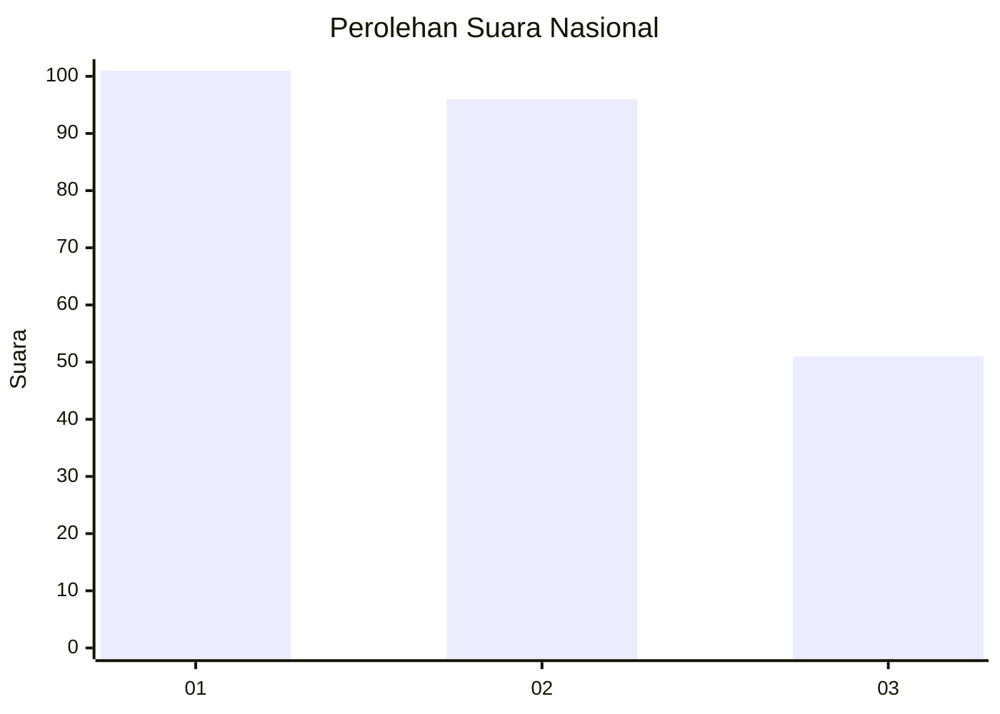
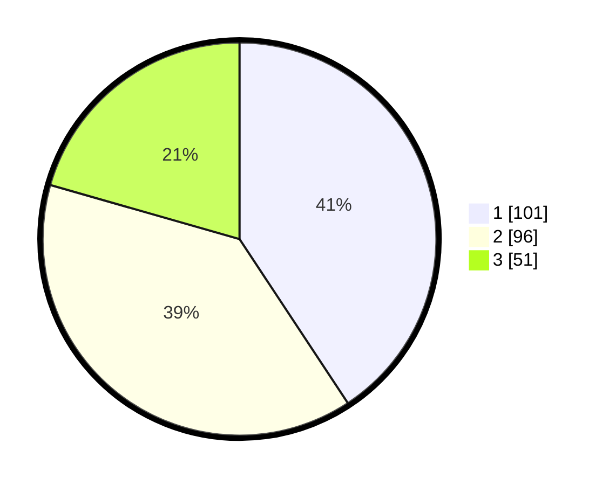

# Hasil

## Grafik

## Tabel

| No.    | Nama Paslon    | Suara | Suara (raw) | Persentase |
|:------ |:-------------- | -----:| -----------:| ----------:|
| 100025 | ANIES MUHAIMIN | 101   | [101][p-1]  | 40,73      |
| 100026 | PRABOWO GIBRAN | 96    | [96][p-2]   | 38,71      |
| 100027 | GANJAR MAHFUD  | 51    | [51][p-3]   | 20,56      |

[p-1]: https://github.com/gigit-pemilu/pemilu-2024/blob/main/pilpres/hitung-suara/sub/31-dki-jakarta/sub/74-jakarta-selatan/sub/06-cilandak/sub/1005-cipete-selatan/sub/024-tps/sub/paslon-1.txt
[p-2]: https://github.com/gigit-pemilu/pemilu-2024/blob/main/pilpres/hitung-suara/sub/31-dki-jakarta/sub/74-jakarta-selatan/sub/06-cilandak/sub/1005-cipete-selatan/sub/024-tps/sub/paslon-2.txt
[p-3]: https://github.com/gigit-pemilu/pemilu-2024/blob/main/pilpres/hitung-suara/sub/31-dki-jakarta/sub/74-jakarta-selatan/sub/06-cilandak/sub/1005-cipete-selatan/sub/024-tps/sub/paslon-3.txt

## Foto C Plano

https://sirekap-obj-formc.kpu.go.id/39d9/pemilu/ppwp/31/74/06/10/05/3174061005024-20240216-200810--2c29fa1f-9e74-4008-98bc-e3a5e46d8efd.jpg

https://sirekap-obj-formc.kpu.go.id/39d9/pemilu/ppwp/31/74/06/10/05/3174061005024-20240216-200843--e35373b3-bb38-451f-8cb4-feae2e8bed83.jpg

https://sirekap-obj-formc.kpu.go.id/39d9/pemilu/ppwp/31/74/06/10/05/3174061005024-20240216-201004--1a3bc895-96a1-4d53-bc0e-7d02db0a6b40.jpg

## Metadata

| Key        | Value               |
| ---------- | ------------------- |
| Time Stamp | 2024-02-24 22:31:28 |

