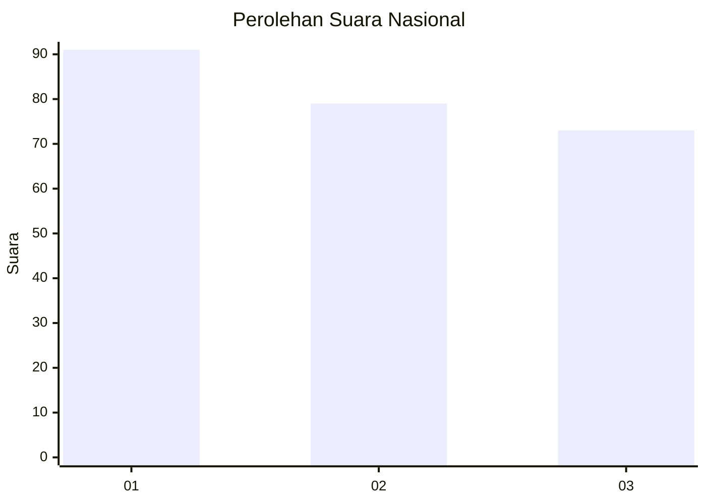
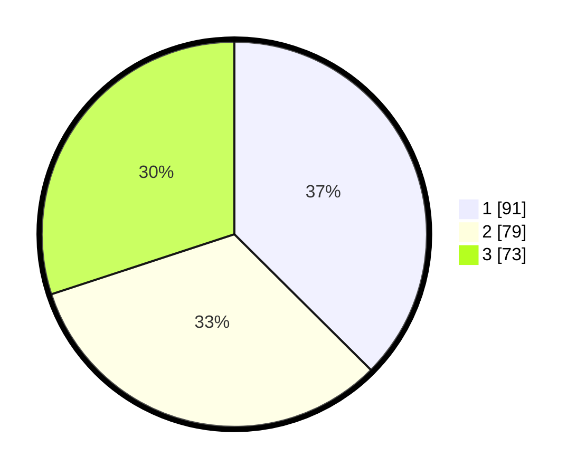

# Hasil

## Grafik

## Tabel

| No.    | Nama Paslon    | Suara | Suara (raw) | Persentase |
|:------ |:-------------- | -----:| -----------:| ----------:|
| 100025 | ANIES MUHAIMIN | 91    | [91][p-1]   | 37,45      |
| 100026 | PRABOWO GIBRAN | 79    | [79][p-2]   | 32,51      |
| 100027 | GANJAR MAHFUD  | 73    | [73][p-3]   | 30,04      |

[p-1]: https://github.com/gigit-pemilu/pemilu-2024/blob/main/pilpres/hitung-suara/sub/31-dki-jakarta/sub/74-jakarta-selatan/sub/06-cilandak/sub/1005-cipete-selatan/sub/025-tps/sub/paslon-1.txt
[p-2]: https://github.com/gigit-pemilu/pemilu-2024/blob/main/pilpres/hitung-suara/sub/31-dki-jakarta/sub/74-jakarta-selatan/sub/06-cilandak/sub/1005-cipete-selatan/sub/025-tps/sub/paslon-2.txt
[p-3]: https://github.com/gigit-pemilu/pemilu-2024/blob/main/pilpres/hitung-suara/sub/31-dki-jakarta/sub/74-jakarta-selatan/sub/06-cilandak/sub/1005-cipete-selatan/sub/025-tps/sub/paslon-3.txt

## Foto C Plano

https://sirekap-obj-formc.kpu.go.id/e5fd/pemilu/ppwp/31/74/06/10/05/3174061005025-20240216-201130--37e6a7d4-5a95-425e-be05-1191a02d2ca8.jpg

https://sirekap-obj-formc.kpu.go.id/e5fd/pemilu/ppwp/31/74/06/10/05/3174061005025-20240216-201230--3a87cf47-c375-444a-8385-192bc393c988.jpg

https://sirekap-obj-formc.kpu.go.id/e5fd/pemilu/ppwp/31/74/06/10/05/3174061005025-20240216-201258--12880cc9-0f1e-4ba0-b6fe-47d7c67b42ef.jpg

## Metadata

| Key        | Value               |
| ---------- | ------------------- |
| Time Stamp | 2024-02-24 22:31:28 |

