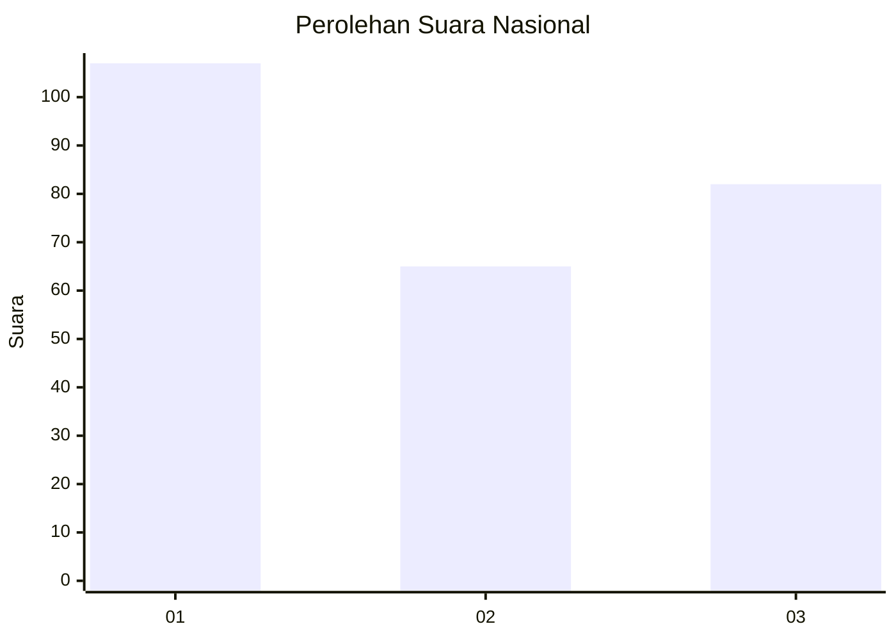
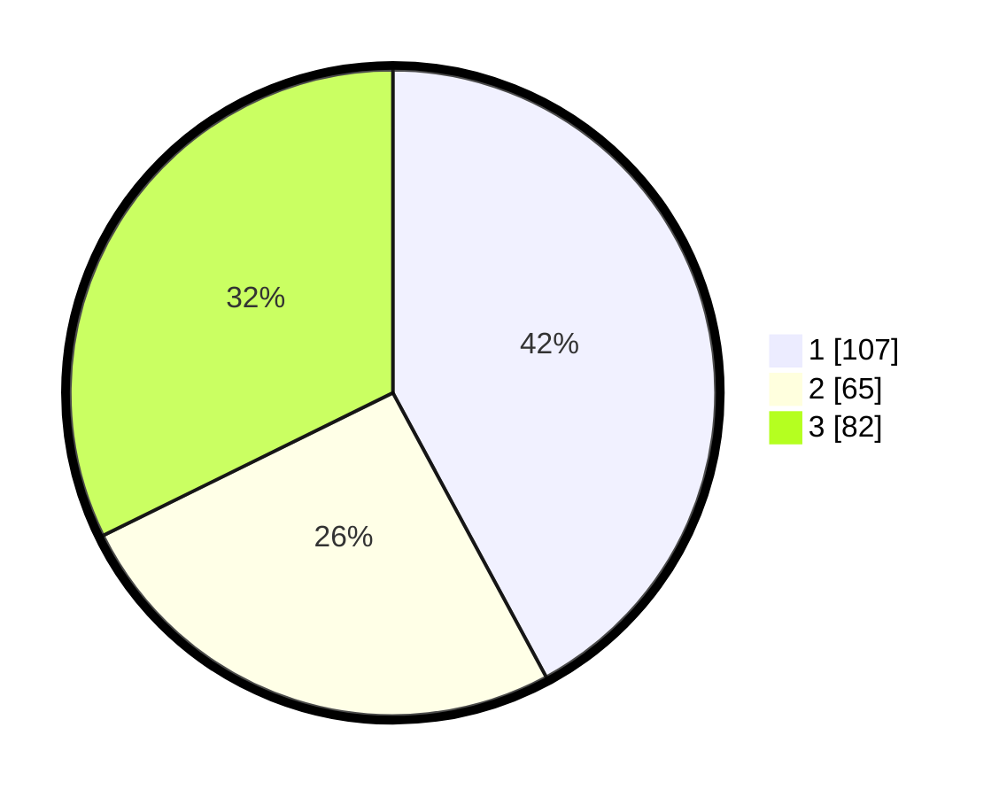

# Hasil

## Grafik

## Tabel

| No. | Nama Paslon    | Suara | Suara (raw) | Persentase |
|:--- |:-------------- | -----:| -----------:| ----------:|
| 1   | ANIES MUHAIMIN | 107   | [107][p-1]  | 42,13      |
| 2   | PRABOWO GIBRAN | 65    | [65][p-2]   | 25,59      |
| 3   | GANJAR MAHFUD  | 82    | [82][p-3]   | 32,28      |

[p-1]: https://github.com/gigit-pemilu/pemilu-2024/blob/main/pilpres/hitung-suara/sub/31-dki-jakarta/sub/74-jakarta-selatan/sub/06-cilandak/sub/1005-cipete-selatan/sub/033-tps/sub/paslon-1.txt
[p-2]: https://github.com/gigit-pemilu/pemilu-2024/blob/main/pilpres/hitung-suara/sub/31-dki-jakarta/sub/74-jakarta-selatan/sub/06-cilandak/sub/1005-cipete-selatan/sub/033-tps/sub/paslon-2.txt
[p-3]: https://github.com/gigit-pemilu/pemilu-2024/blob/main/pilpres/hitung-suara/sub/31-dki-jakarta/sub/74-jakarta-selatan/sub/06-cilandak/sub/1005-cipete-selatan/sub/033-tps/sub/paslon-3.txt

## Foto C Plano

https://sirekap-obj-formc.kpu.go.id/9ebb/pemilu/ppwp/31/74/06/10/05/3174061005033-20240216-203631--2db5b184-f990-4ec1-8fe5-c624e0973bca.jpg

https://sirekap-obj-formc.kpu.go.id/9ebb/pemilu/ppwp/31/74/06/10/05/3174061005033-20240216-203734--9190c999-c465-4f06-bc8b-5b61db318c6f.jpg

https://sirekap-obj-formc.kpu.go.id/9ebb/pemilu/ppwp/31/74/06/10/05/3174061005033-20240216-203759--94d1530f-2e92-4273-8afe-616a693cff3d.jpg

## Metadata

| Key        | Value               |
| ---------- | ------------------- |
| Time Stamp | 2024-02-25 18:00:00 |

