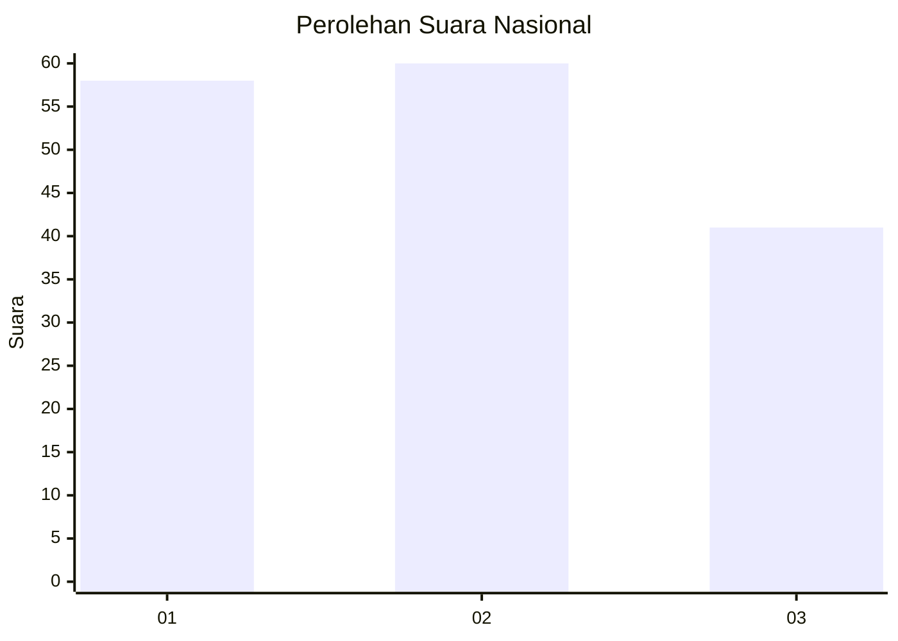
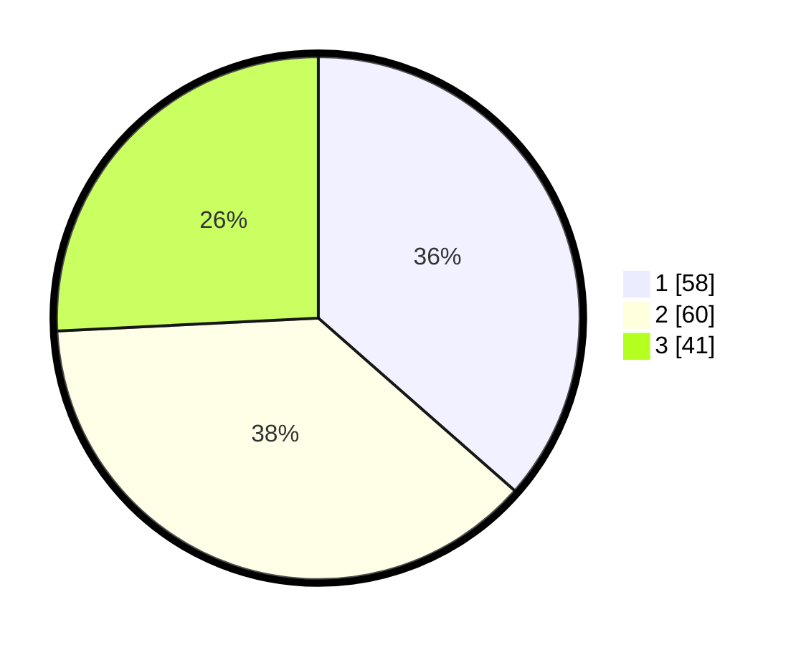

# Hasil

## Grafik

## Tabel

| No.    | Nama Paslon    | Suara | Suara (raw) | Persentase |
|:------ |:-------------- | -----:| -----------:| ----------:|
| 100025 | ANIES MUHAIMIN | 58    | [58][p-1]   | 36,48      |
| 100026 | PRABOWO GIBRAN | 60    | [60][p-2]   | 37,74      |
| 100027 | GANJAR MAHFUD  | 41    | [41][p-3]   | 25,79      |

[p-1]: https://github.com/gigit-pemilu/pemilu-2024/blob/main/pilpres/hitung-suara/sub/31-dki-jakarta/sub/74-jakarta-selatan/sub/06-cilandak/sub/1005-cipete-selatan/sub/034-tps/sub/paslon-1.txt
[p-2]: https://github.com/gigit-pemilu/pemilu-2024/blob/main/pilpres/hitung-suara/sub/31-dki-jakarta/sub/74-jakarta-selatan/sub/06-cilandak/sub/1005-cipete-selatan/sub/034-tps/sub/paslon-2.txt
[p-3]: https://github.com/gigit-pemilu/pemilu-2024/blob/main/pilpres/hitung-suara/sub/31-dki-jakarta/sub/74-jakarta-selatan/sub/06-cilandak/sub/1005-cipete-selatan/sub/034-tps/sub/paslon-3.txt

## Foto C Plano

https://sirekap-obj-formc.kpu.go.id/b926/pemilu/ppwp/31/74/06/10/05/3174061005034-20240216-204034--07ca333b-a1fb-4685-9e60-3530f0b523c0.jpg

https://sirekap-obj-formc.kpu.go.id/b926/pemilu/ppwp/31/74/06/10/05/3174061005034-20240216-204121--70b6b430-8d59-42a0-9477-4de88a9e9e8b.jpg

https://sirekap-obj-formc.kpu.go.id/b926/pemilu/ppwp/31/74/06/10/05/3174061005034-20240216-204152--c14b8ac3-a85d-4e04-b572-5de233a1378b.jpg

## Metadata

| Key        | Value               |
| ---------- | ------------------- |
| Time Stamp | 2024-02-24 22:31:28 |

