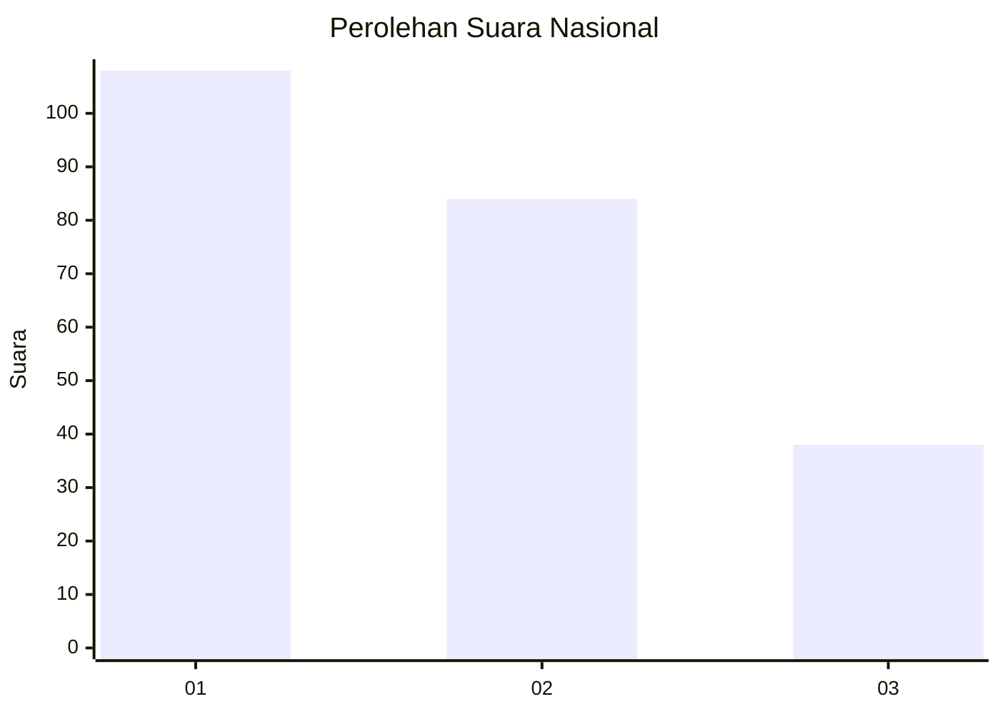
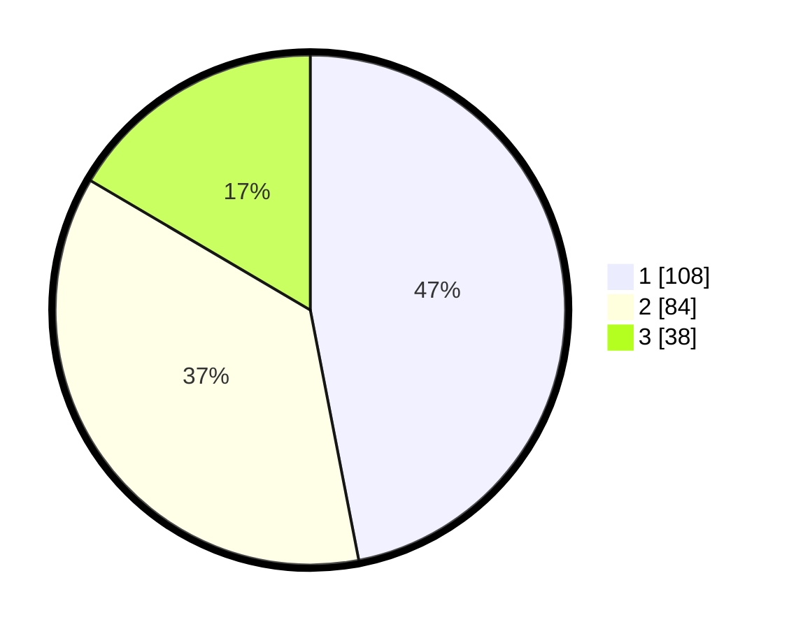

# Hasil

## Grafik

## Tabel

| No.    | Nama Paslon    | Suara | Suara (raw) | Persentase |
|:------ |:-------------- | -----:| -----------:| ----------:|
| 100025 | ANIES MUHAIMIN | 108   | [108][p-1]  | 46,96      |
| 100026 | PRABOWO GIBRAN | 84    | [84][p-2]   | 36,52      |
| 100027 | GANJAR MAHFUD  | 38    | [38][p-3]   | 16,52      |

[p-1]: https://github.com/gigit-pemilu/pemilu-2024/blob/main/pilpres/hitung-suara/sub/31-dki-jakarta/sub/74-jakarta-selatan/sub/06-cilandak/sub/1005-cipete-selatan/sub/041-tps/sub/paslon-1.txt
[p-2]: https://github.com/gigit-pemilu/pemilu-2024/blob/main/pilpres/hitung-suara/sub/31-dki-jakarta/sub/74-jakarta-selatan/sub/06-cilandak/sub/1005-cipete-selatan/sub/041-tps/sub/paslon-2.txt
[p-3]: https://github.com/gigit-pemilu/pemilu-2024/blob/main/pilpres/hitung-suara/sub/31-dki-jakarta/sub/74-jakarta-selatan/sub/06-cilandak/sub/1005-cipete-selatan/sub/041-tps/sub/paslon-3.txt

## Foto C Plano

https://sirekap-obj-formc.kpu.go.id/bbe0/pemilu/ppwp/31/74/06/10/05/3174061005041-20240217-093639--4587622d-214d-445b-8ae4-b1d09bb443d5.jpg

https://sirekap-obj-formc.kpu.go.id/bbe0/pemilu/ppwp/31/74/06/10/05/3174061005041-20240217-093839--16cb2dc2-6faf-48cf-bf06-4c693bd360f2.jpg

https://sirekap-obj-formc.kpu.go.id/bbe0/pemilu/ppwp/31/74/06/10/05/3174061005041-20240217-093935--42295c10-d76d-4ecc-b1db-3fbe783a7984.jpg

## Metadata

| Key        | Value               |
| ---------- | ------------------- |
| Time Stamp | 2024-02-25 14:00:00 |

