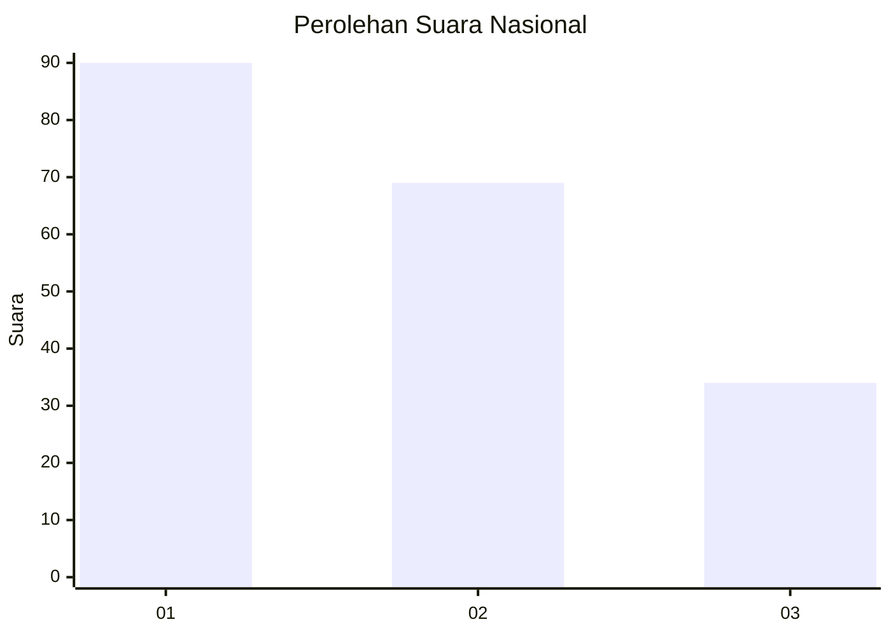
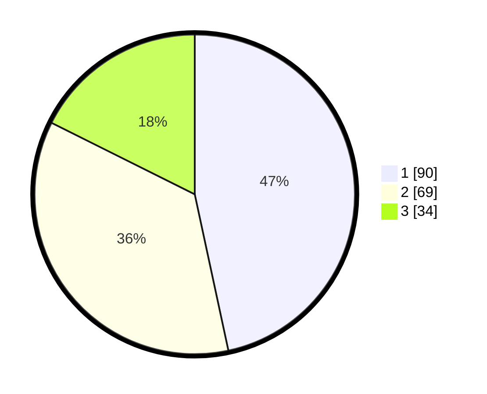

# Hasil

## Grafik

## Tabel

| No.    | Nama Paslon    | Suara | Suara (raw) | Persentase |
|:------ |:-------------- | -----:| -----------:| ----------:|
| 100025 | ANIES MUHAIMIN | 90    | [90][p-1]   | 46,63      |
| 100026 | PRABOWO GIBRAN | 69    | [69][p-2]   | 35,75      |
| 100027 | GANJAR MAHFUD  | 34    | [34][p-3]   | 17,62      |

[p-1]: https://github.com/gigit-pemilu/pemilu-2024/blob/main/pilpres/hitung-suara/sub/31-dki-jakarta/sub/74-jakarta-selatan/sub/06-cilandak/sub/1005-cipete-selatan/sub/042-tps/sub/paslon-1.txt
[p-2]: https://github.com/gigit-pemilu/pemilu-2024/blob/main/pilpres/hitung-suara/sub/31-dki-jakarta/sub/74-jakarta-selatan/sub/06-cilandak/sub/1005-cipete-selatan/sub/042-tps/sub/paslon-2.txt
[p-3]: https://github.com/gigit-pemilu/pemilu-2024/blob/main/pilpres/hitung-suara/sub/31-dki-jakarta/sub/74-jakarta-selatan/sub/06-cilandak/sub/1005-cipete-selatan/sub/042-tps/sub/paslon-3.txt

## Foto C Plano

https://sirekap-obj-formc.kpu.go.id/58a0/pemilu/ppwp/31/74/06/10/05/3174061005042-20240217-094053--04b77b1a-3e05-4d3c-803a-208a32a467e1.jpg

https://sirekap-obj-formc.kpu.go.id/58a0/pemilu/ppwp/31/74/06/10/05/3174061005042-20240217-094119--835b9453-6f9c-4a80-bc9b-8f3fdf02ec23.jpg

https://sirekap-obj-formc.kpu.go.id/58a0/pemilu/ppwp/31/74/06/10/05/3174061005042-20240217-094144--465af0ac-0158-4d3d-b6c6-fbacd62142e0.jpg

## Metadata

| Key        | Value               |
| ---------- | ------------------- |
| Time Stamp | 2024-02-24 22:31:28 |

