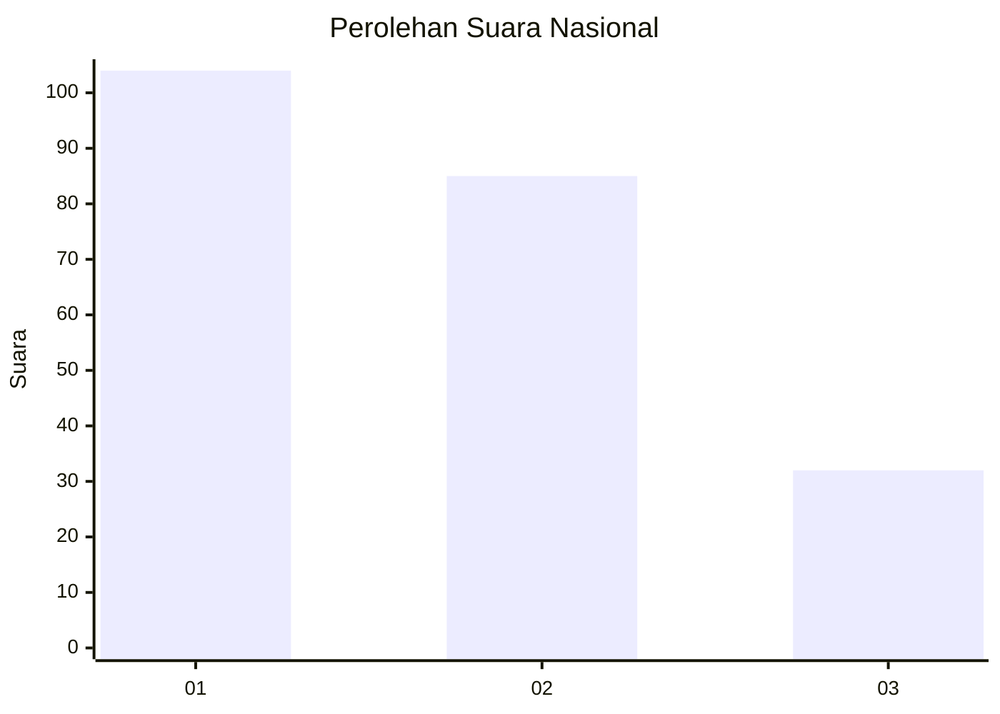
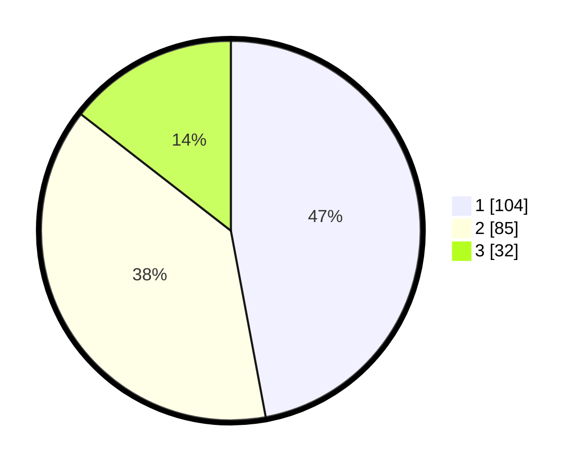

# Hasil

## Grafik

## Tabel

| No.    | Nama Paslon    | Suara | Suara (raw) | Persentase |
|:------ |:-------------- | -----:| -----------:| ----------:|
| 100025 | ANIES MUHAIMIN | 104   | [104][p-1]  | 47,06      |
| 100026 | PRABOWO GIBRAN | 85    | [85][p-2]   | 38,46      |
| 100027 | GANJAR MAHFUD  | 32    | [32][p-3]   | 14,48      |

[p-1]: https://github.com/gigit-pemilu/pemilu-2024/blob/main/pilpres/hitung-suara/sub/31-dki-jakarta/sub/74-jakarta-selatan/sub/06-cilandak/sub/1005-cipete-selatan/sub/044-tps/sub/paslon-1.txt
[p-2]: https://github.com/gigit-pemilu/pemilu-2024/blob/main/pilpres/hitung-suara/sub/31-dki-jakarta/sub/74-jakarta-selatan/sub/06-cilandak/sub/1005-cipete-selatan/sub/044-tps/sub/paslon-2.txt
[p-3]: https://github.com/gigit-pemilu/pemilu-2024/blob/main/pilpres/hitung-suara/sub/31-dki-jakarta/sub/74-jakarta-selatan/sub/06-cilandak/sub/1005-cipete-selatan/sub/044-tps/sub/paslon-3.txt

## Foto C Plano

https://sirekap-obj-formc.kpu.go.id/6e20/pemilu/ppwp/31/74/06/10/05/3174061005044-20240217-094711--185b7130-f977-4219-b80f-a4e5beb60bfc.jpg

https://sirekap-obj-formc.kpu.go.id/6e20/pemilu/ppwp/31/74/06/10/05/3174061005044-20240217-094741--28bdaec9-4901-4811-9c1b-09c09ca42aa9.jpg

https://sirekap-obj-formc.kpu.go.id/6e20/pemilu/ppwp/31/74/06/10/05/3174061005044-20240217-094812--36803905-51f7-480c-9746-36c6b376f73a.jpg

## Metadata

| Key        | Value               |
| ---------- | ------------------- |
| Time Stamp | 2024-02-25 12:00:00 |

