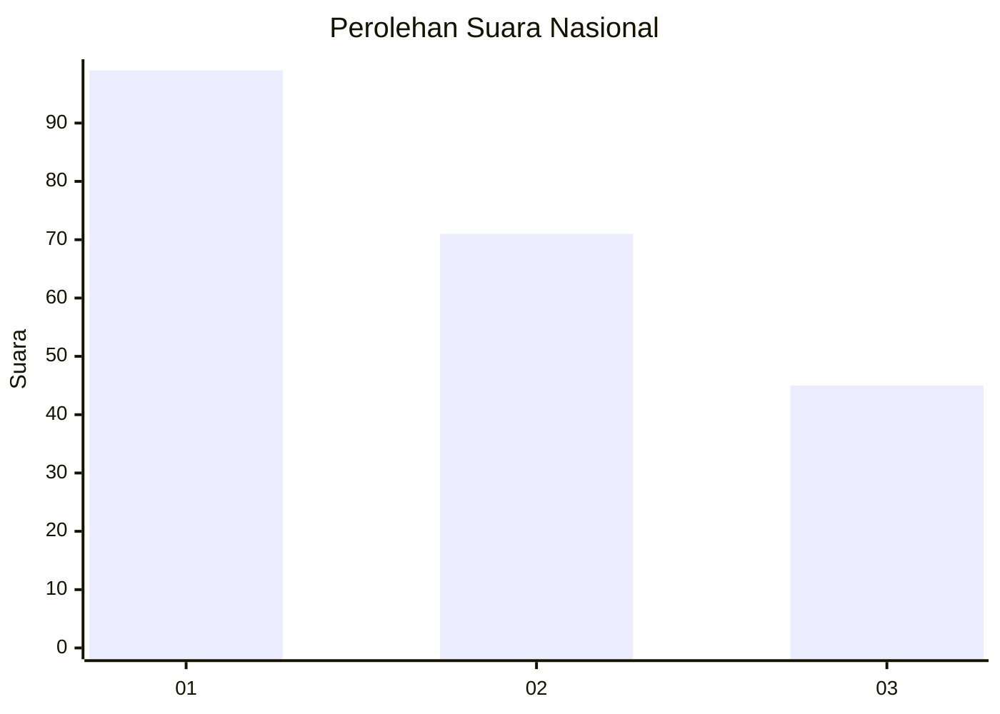
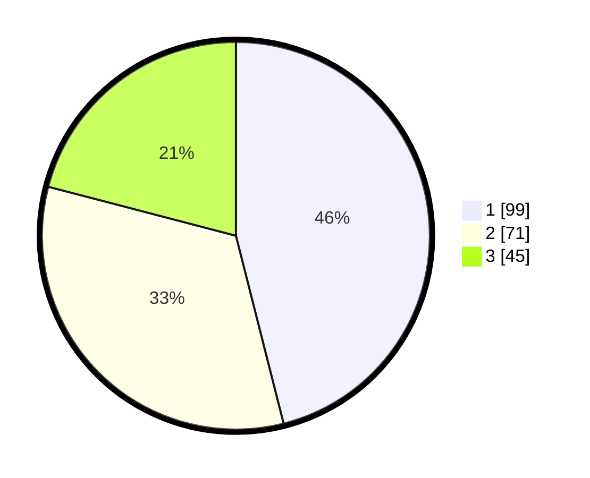

# Hasil

## Grafik

## Tabel

| No.    | Nama Paslon    | Suara | Suara (raw) | Persentase |
|:------ |:-------------- | -----:| -----------:| ----------:|
| 100025 | ANIES MUHAIMIN | 99    | [99][p-1]   | 46,05      |
| 100026 | PRABOWO GIBRAN | 71    | [71][p-2]   | 33,02      |
| 100027 | GANJAR MAHFUD  | 45    | [45][p-3]   | 20,93      |

[p-1]: https://github.com/gigit-pemilu/pemilu-2024/blob/main/pilpres/hitung-suara/sub/31-dki-jakarta/sub/74-jakarta-selatan/sub/06-cilandak/sub/1005-cipete-selatan/sub/048-tps/sub/paslon-1.txt
[p-2]: https://github.com/gigit-pemilu/pemilu-2024/blob/main/pilpres/hitung-suara/sub/31-dki-jakarta/sub/74-jakarta-selatan/sub/06-cilandak/sub/1005-cipete-selatan/sub/048-tps/sub/paslon-2.txt
[p-3]: https://github.com/gigit-pemilu/pemilu-2024/blob/main/pilpres/hitung-suara/sub/31-dki-jakarta/sub/74-jakarta-selatan/sub/06-cilandak/sub/1005-cipete-selatan/sub/048-tps/sub/paslon-3.txt

## Foto C Plano

https://sirekap-obj-formc.kpu.go.id/abd7/pemilu/ppwp/31/74/06/10/05/3174061005048-20240217-101349--5fecf93c-6225-40d8-9c41-b51ff8eb780d.jpg

https://sirekap-obj-formc.kpu.go.id/abd7/pemilu/ppwp/31/74/06/10/05/3174061005048-20240217-101504--1667dfe8-e112-4974-905e-403aef0f1a49.jpg

https://sirekap-obj-formc.kpu.go.id/abd7/pemilu/ppwp/31/74/06/10/05/3174061005048-20240217-101613--4181fe01-b299-4b23-9669-7c10ed7df412.jpg

## Metadata

| Key        | Value               |
| ---------- | ------------------- |
| Time Stamp | 2024-02-24 22:31:28 |

