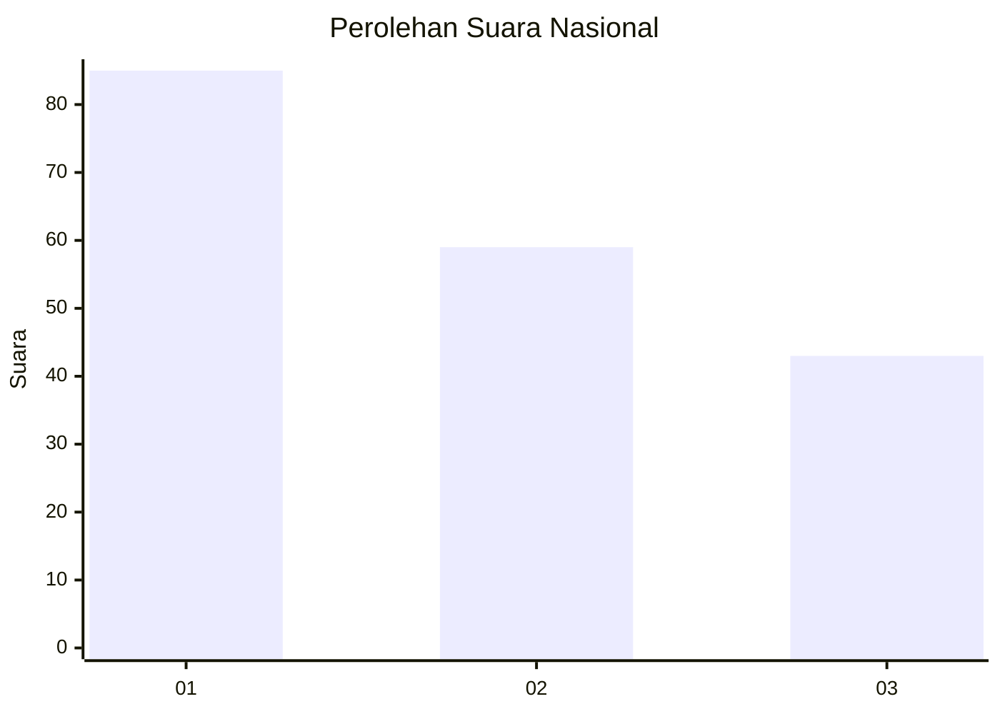
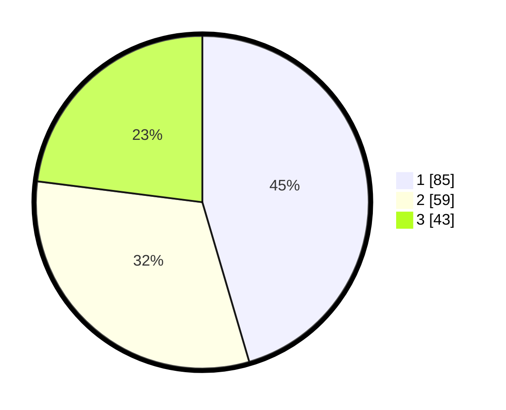

# Hasil

## Grafik

## Tabel

| No.    | Nama Paslon    | Suara | Suara (raw) | Persentase |
|:------ |:-------------- | -----:| -----------:| ----------:|
| 100025 | ANIES MUHAIMIN | 85    | [85][p-1]   | 45,45      |
| 100026 | PRABOWO GIBRAN | 59    | [59][p-2]   | 31,55      |
| 100027 | GANJAR MAHFUD  | 43    | [43][p-3]   | 22,99      |

[p-1]: https://github.com/gigit-pemilu/pemilu-2024/blob/main/pilpres/hitung-suara/sub/31-dki-jakarta/sub/74-jakarta-selatan/sub/06-cilandak/sub/1005-cipete-selatan/sub/050-tps/sub/paslon-1.txt
[p-2]: https://github.com/gigit-pemilu/pemilu-2024/blob/main/pilpres/hitung-suara/sub/31-dki-jakarta/sub/74-jakarta-selatan/sub/06-cilandak/sub/1005-cipete-selatan/sub/050-tps/sub/paslon-2.txt
[p-3]: https://github.com/gigit-pemilu/pemilu-2024/blob/main/pilpres/hitung-suara/sub/31-dki-jakarta/sub/74-jakarta-selatan/sub/06-cilandak/sub/1005-cipete-selatan/sub/050-tps/sub/paslon-3.txt

## Foto C Plano

https://sirekap-obj-formc.kpu.go.id/0e9a/pemilu/ppwp/31/74/06/10/05/3174061005050-20240217-102214--c7ce72ee-8ad4-46fa-9878-71c2120e8461.jpg

https://sirekap-obj-formc.kpu.go.id/0e9a/pemilu/ppwp/31/74/06/10/05/3174061005050-20240217-103217--c19a2a0c-3fec-410f-9510-0e9f716fef6b.jpg

https://sirekap-obj-formc.kpu.go.id/0e9a/pemilu/ppwp/31/74/06/10/05/3174061005050-20240217-102852--b1976134-c0a1-4459-89c1-bce100108b43.jpg

## Metadata

| Key        | Value               |
| ---------- | ------------------- |
| Time Stamp | 2024-02-25 00:00:00 |

