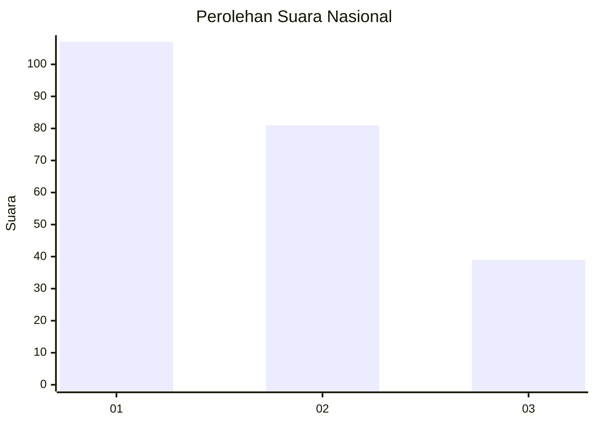
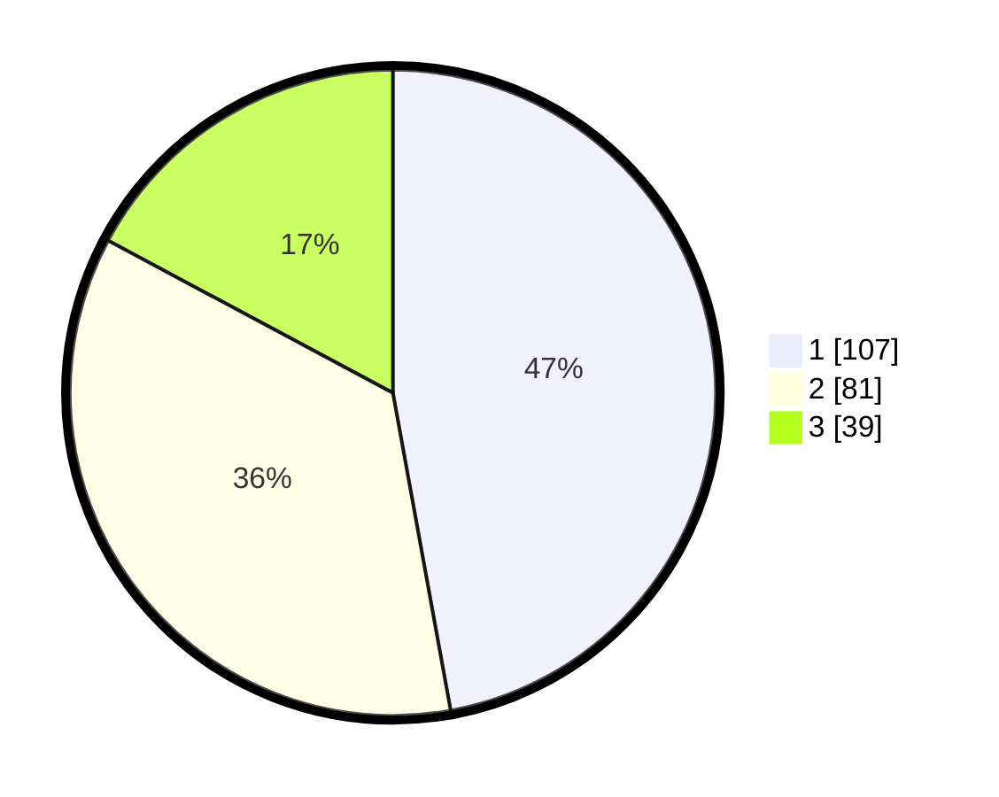

# Hasil

## Grafik

## Tabel

| No.    | Nama Paslon    | Suara | Suara (raw) | Persentase |
|:------ |:-------------- | -----:| -----------:| ----------:|
| 100025 | ANIES MUHAIMIN | 107   | [107][p-1]  | 47,14      |
| 100026 | PRABOWO GIBRAN | 81    | [81][p-2]   | 35,68      |
| 100027 | GANJAR MAHFUD  | 39    | [39][p-3]   | 17,18      |

[p-1]: https://github.com/gigit-pemilu/pemilu-2024/blob/main/pilpres/hitung-suara/sub/31-dki-jakarta/sub/74-jakarta-selatan/sub/06-cilandak/sub/1005-cipete-selatan/sub/051-tps/sub/paslon-1.txt
[p-2]: https://github.com/gigit-pemilu/pemilu-2024/blob/main/pilpres/hitung-suara/sub/31-dki-jakarta/sub/74-jakarta-selatan/sub/06-cilandak/sub/1005-cipete-selatan/sub/051-tps/sub/paslon-2.txt
[p-3]: https://github.com/gigit-pemilu/pemilu-2024/blob/main/pilpres/hitung-suara/sub/31-dki-jakarta/sub/74-jakarta-selatan/sub/06-cilandak/sub/1005-cipete-selatan/sub/051-tps/sub/paslon-3.txt

## Foto C Plano

https://sirekap-obj-formc.kpu.go.id/dd7a/pemilu/ppwp/31/74/06/10/05/3174061005051-20240217-103422--a540324f-847f-4466-8c8d-6e4f2af56882.jpg

https://sirekap-obj-formc.kpu.go.id/dd7a/pemilu/ppwp/31/74/06/10/05/3174061005051-20240217-103508--b4a17cab-3c26-4f49-8810-0854a787f359.jpg

https://sirekap-obj-formc.kpu.go.id/dd7a/pemilu/ppwp/31/74/06/10/05/3174061005051-20240217-103549--18360d20-20d7-4d8a-8e6e-98fe0f96e2af.jpg

## Metadata

| Key        | Value               |
| ---------- | ------------------- |
| Time Stamp | 2024-02-24 22:31:28 |

