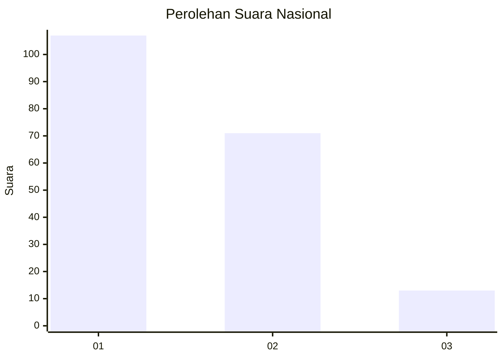
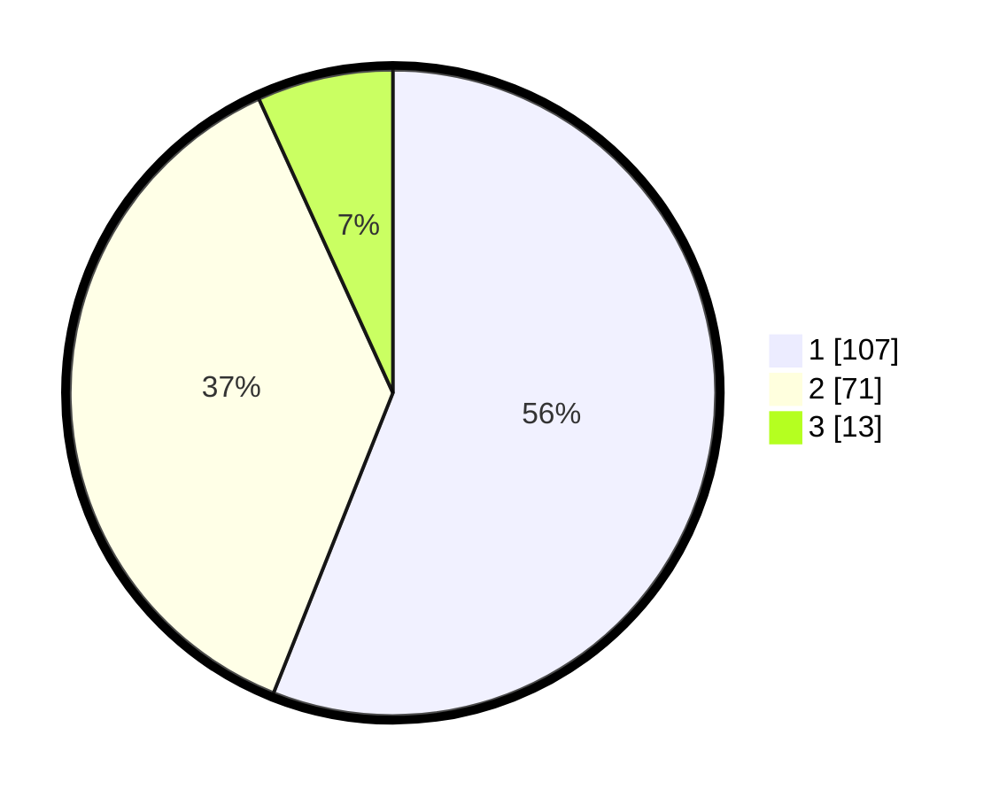

# Hasil

## Grafik

## Tabel

| No.    | Nama Paslon    | Suara | Suara (raw) | Persentase |
|:------ |:-------------- | -----:| -----------:| ----------:|
| 100025 | ANIES MUHAIMIN | 107   | [107][p-1]  | 56,02      |
| 100026 | PRABOWO GIBRAN | 71    | [71][p-2]   | 37,17      |
| 100027 | GANJAR MAHFUD  | 13    | [13][p-3]   | 6,81       |

[p-1]: https://github.com/gigit-pemilu/pemilu-2024/blob/main/pilpres/hitung-suara/sub/31-dki-jakarta/sub/74-jakarta-selatan/sub/06-cilandak/sub/1005-cipete-selatan/sub/055-tps/sub/paslon-1.txt
[p-2]: https://github.com/gigit-pemilu/pemilu-2024/blob/main/pilpres/hitung-suara/sub/31-dki-jakarta/sub/74-jakarta-selatan/sub/06-cilandak/sub/1005-cipete-selatan/sub/055-tps/sub/paslon-2.txt
[p-3]: https://github.com/gigit-pemilu/pemilu-2024/blob/main/pilpres/hitung-suara/sub/31-dki-jakarta/sub/74-jakarta-selatan/sub/06-cilandak/sub/1005-cipete-selatan/sub/055-tps/sub/paslon-3.txt

## Foto C Plano

https://sirekap-obj-formc.kpu.go.id/a9fc/pemilu/ppwp/31/74/06/10/05/3174061005055-20240217-104626--b2002ad3-e9c8-455f-893d-4f30bd56e288.jpg

https://sirekap-obj-formc.kpu.go.id/a9fc/pemilu/ppwp/31/74/06/10/05/3174061005055-20240217-104711--4092e2f2-c154-416e-9040-ea0d8a046aba.jpg

https://sirekap-obj-formc.kpu.go.id/a9fc/pemilu/ppwp/31/74/06/10/05/3174061005055-20240217-104755--d6ef18b1-d020-4d22-a8ee-4dd2957ff05d.jpg

## Metadata

| Key        | Value               |
| ---------- | ------------------- |
| Time Stamp | 2024-02-24 22:31:28 |

