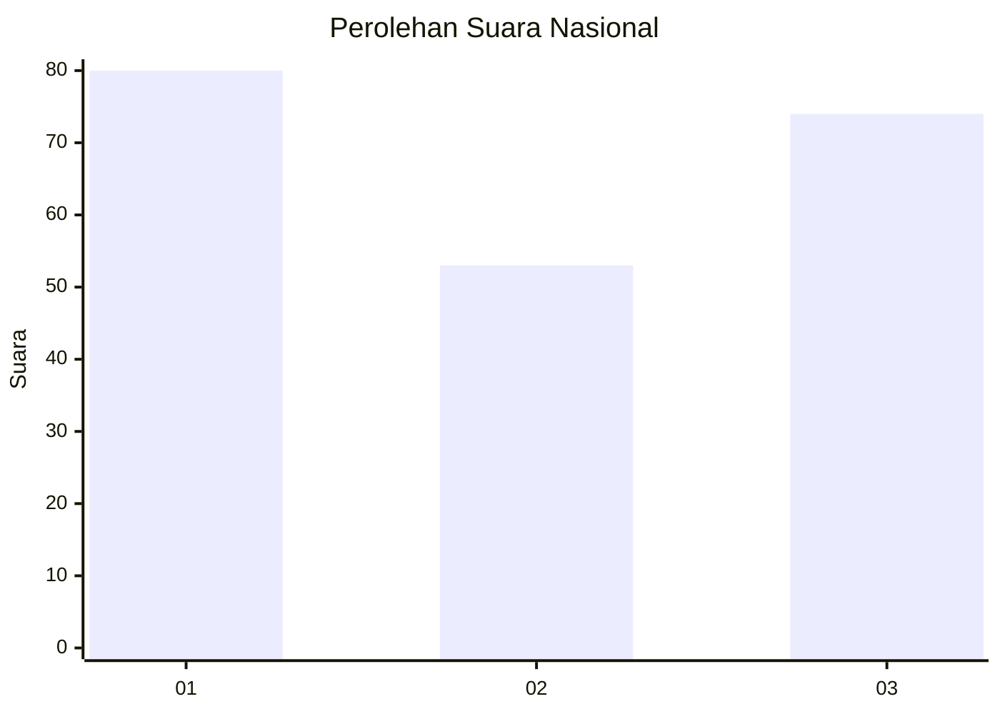
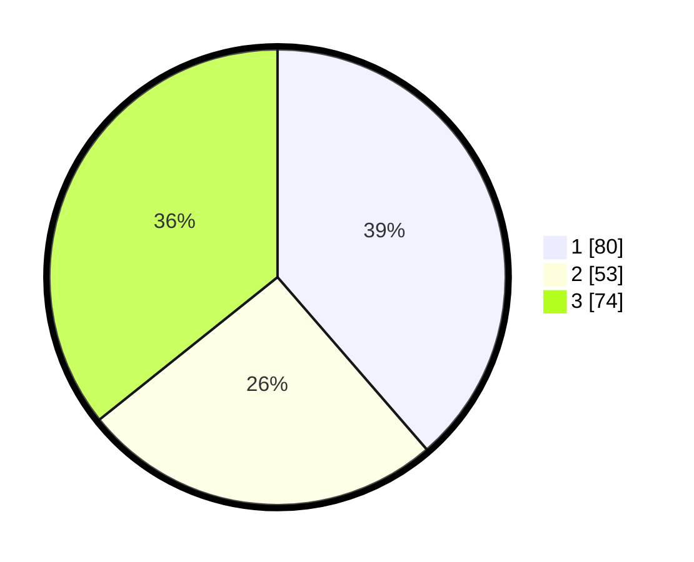

# Hasil

## Grafik

## Tabel

| No.    | Nama Paslon    | Suara | Suara (raw) | Persentase |
|:------ |:-------------- | -----:| -----------:| ----------:|
| 100025 | ANIES MUHAIMIN | 80    | [80][p-1]   | 38,65      |
| 100026 | PRABOWO GIBRAN | 53    | [53][p-2]   | 25,60      |
| 100027 | GANJAR MAHFUD  | 74    | [74][p-3]   | 35,75      |

[p-1]: https://github.com/gigit-pemilu/pemilu-2024/blob/main/pilpres/hitung-suara/sub/31-dki-jakarta/sub/74-jakarta-selatan/sub/06-cilandak/sub/1005-cipete-selatan/sub/059-tps/sub/paslon-1.txt
[p-2]: https://github.com/gigit-pemilu/pemilu-2024/blob/main/pilpres/hitung-suara/sub/31-dki-jakarta/sub/74-jakarta-selatan/sub/06-cilandak/sub/1005-cipete-selatan/sub/059-tps/sub/paslon-2.txt
[p-3]: https://github.com/gigit-pemilu/pemilu-2024/blob/main/pilpres/hitung-suara/sub/31-dki-jakarta/sub/74-jakarta-selatan/sub/06-cilandak/sub/1005-cipete-selatan/sub/059-tps/sub/paslon-3.txt

## Foto C Plano

https://sirekap-obj-formc.kpu.go.id/d094/pemilu/ppwp/31/74/06/10/05/3174061005059-20240217-110342--437311c8-9c3f-494e-b2f0-e15b996558f9.jpg

https://sirekap-obj-formc.kpu.go.id/d094/pemilu/ppwp/31/74/06/10/05/3174061005059-20240217-110147--7d4b519a-c7e9-40df-9388-ae69a2963850.jpg

https://sirekap-obj-formc.kpu.go.id/d094/pemilu/ppwp/31/74/06/10/05/3174061005059-20240217-110237--ca505c85-3d9c-4f5f-848e-7bfb682bbdf4.jpg

## Metadata

| Key        | Value               |
| ---------- | ------------------- |
| Time Stamp | 2024-02-24 22:31:28 |

