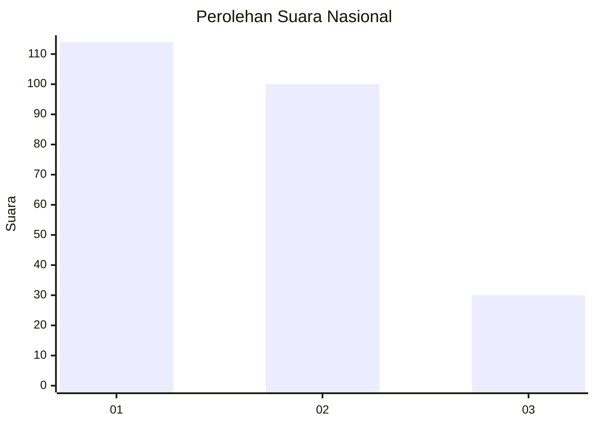
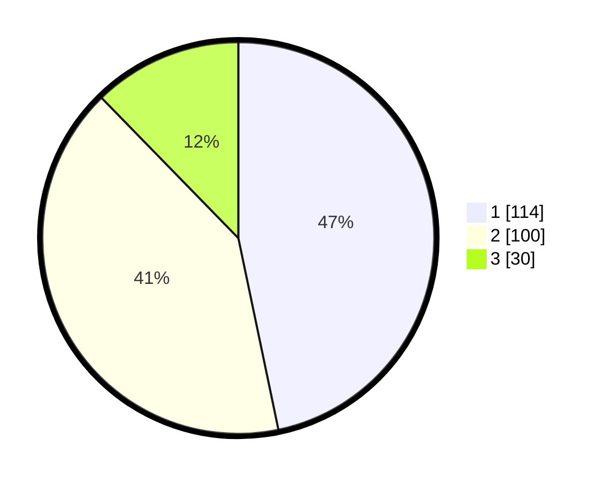

# Hasil

## Grafik

## Tabel

| No.    | Nama Paslon    | Suara | Suara (raw) | Persentase |
|:------ |:-------------- | -----:| -----------:| ----------:|
| 100025 | ANIES MUHAIMIN | 114   | [114][p-1]  | 46,72      |
| 100026 | PRABOWO GIBRAN | 100   | [100][p-2]  | 40,98      |
| 100027 | GANJAR MAHFUD  | 30    | [30][p-3]   | 12,30      |

[p-1]: https://github.com/gigit-pemilu/pemilu-2024/blob/main/pilpres/hitung-suara/sub/31-dki-jakarta/sub/74-jakarta-selatan/sub/06-cilandak/sub/1005-cipete-selatan/sub/071-tps/sub/paslon-1.txt
[p-2]: https://github.com/gigit-pemilu/pemilu-2024/blob/main/pilpres/hitung-suara/sub/31-dki-jakarta/sub/74-jakarta-selatan/sub/06-cilandak/sub/1005-cipete-selatan/sub/071-tps/sub/paslon-2.txt
[p-3]: https://github.com/gigit-pemilu/pemilu-2024/blob/main/pilpres/hitung-suara/sub/31-dki-jakarta/sub/74-jakarta-selatan/sub/06-cilandak/sub/1005-cipete-selatan/sub/071-tps/sub/paslon-3.txt

## Foto C Plano

https://sirekap-obj-formc.kpu.go.id/faec/pemilu/ppwp/31/74/06/10/05/3174061005071-20240217-114450--a3692aab-21da-41e8-9ce3-c41852ef629a.jpg

https://sirekap-obj-formc.kpu.go.id/faec/pemilu/ppwp/31/74/06/10/05/3174061005071-20240217-114602--0969fade-6774-4fde-ae18-2c503616b341.jpg

https://sirekap-obj-formc.kpu.go.id/faec/pemilu/ppwp/31/74/06/10/05/3174061005071-20240217-114646--79792f4b-4af4-4272-8954-609b6890c782.jpg

## Metadata

| Key        | Value               |
| ---------- | ------------------- |
| Time Stamp | 2024-02-24 22:31:28 |

