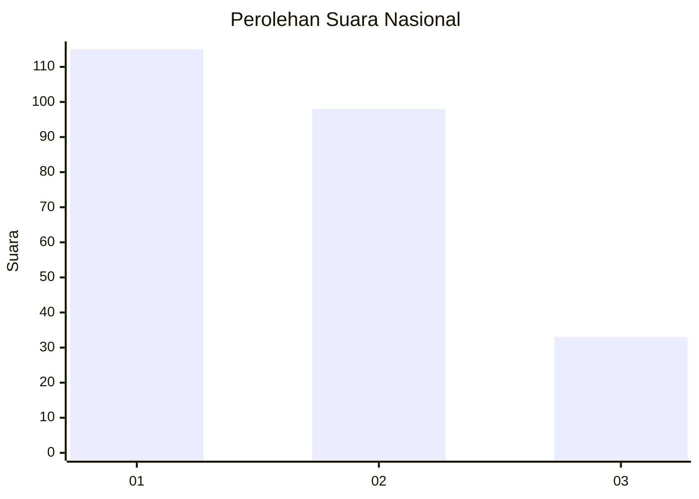
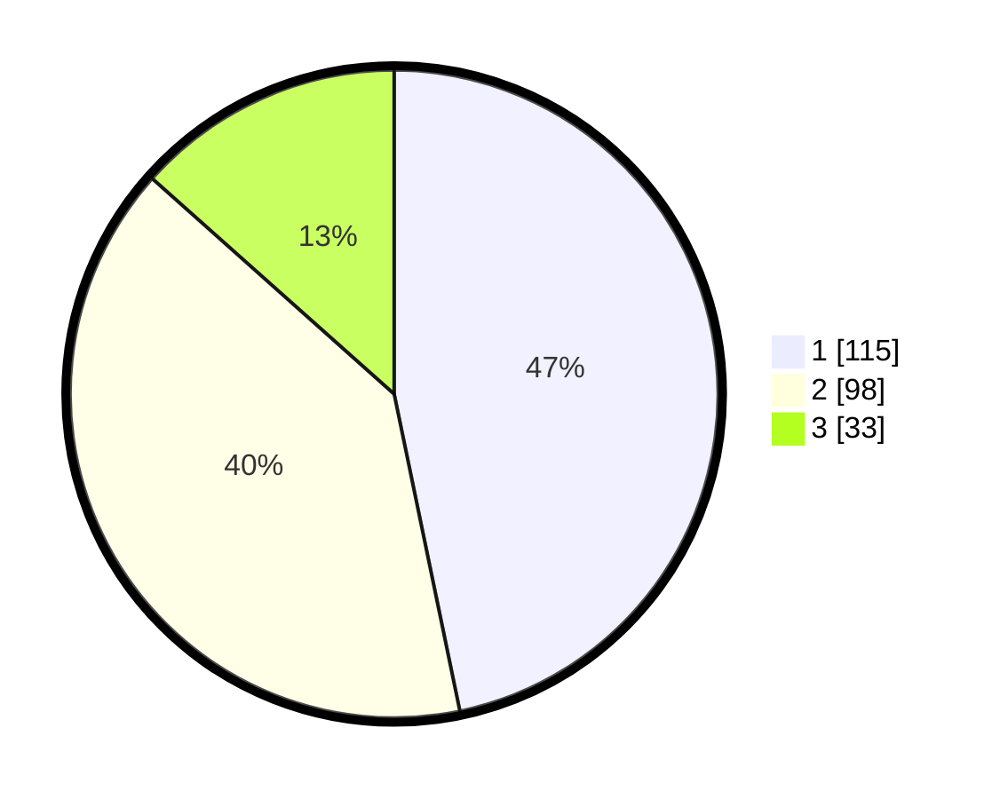

# Hasil

## Grafik

## Tabel

| No.    | Nama Paslon    | Suara | Suara (raw) | Persentase |
|:------ |:-------------- | -----:| -----------:| ----------:|
| 100025 | ANIES MUHAIMIN | 115   | [115][p-1]  | 46,75      |
| 100026 | PRABOWO GIBRAN | 98    | [98][p-2]   | 39,84      |
| 100027 | GANJAR MAHFUD  | 33    | [33][p-3]   | 13,41      |

[p-1]: https://github.com/gigit-pemilu/pemilu-2024/blob/main/pilpres/hitung-suara/sub/31-dki-jakarta/sub/74-jakarta-selatan/sub/06-cilandak/sub/1005-cipete-selatan/sub/073-tps/sub/paslon-1.txt
[p-2]: https://github.com/gigit-pemilu/pemilu-2024/blob/main/pilpres/hitung-suara/sub/31-dki-jakarta/sub/74-jakarta-selatan/sub/06-cilandak/sub/1005-cipete-selatan/sub/073-tps/sub/paslon-2.txt
[p-3]: https://github.com/gigit-pemilu/pemilu-2024/blob/main/pilpres/hitung-suara/sub/31-dki-jakarta/sub/74-jakarta-selatan/sub/06-cilandak/sub/1005-cipete-selatan/sub/073-tps/sub/paslon-3.txt

## Foto C Plano

https://sirekap-obj-formc.kpu.go.id/1992/pemilu/ppwp/31/74/06/10/05/3174061005073-20240217-115452--aa8046ee-2dae-40a9-b290-eaf596bb5230.jpg

https://sirekap-obj-formc.kpu.go.id/1992/pemilu/ppwp/31/74/06/10/05/3174061005073-20240217-115255--4ae72538-2df0-4422-b586-6b0d101f7f08.jpg

https://sirekap-obj-formc.kpu.go.id/1992/pemilu/ppwp/31/74/06/10/05/3174061005073-20240217-115352--fc6159ce-36ab-40c7-80c0-10033ae43258.jpg

## Metadata

| Key        | Value               |
| ---------- | ------------------- |
| Time Stamp | 2024-02-24 22:31:28 |

