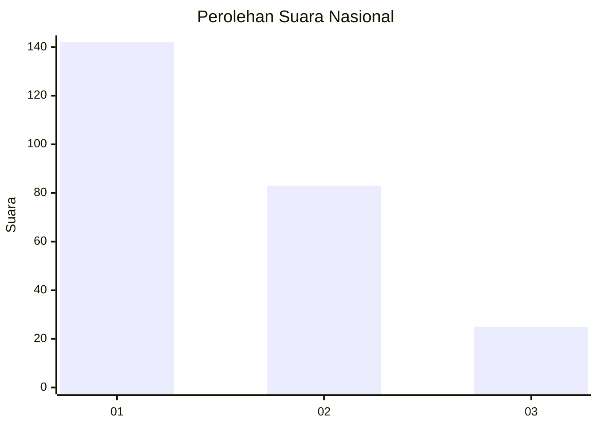
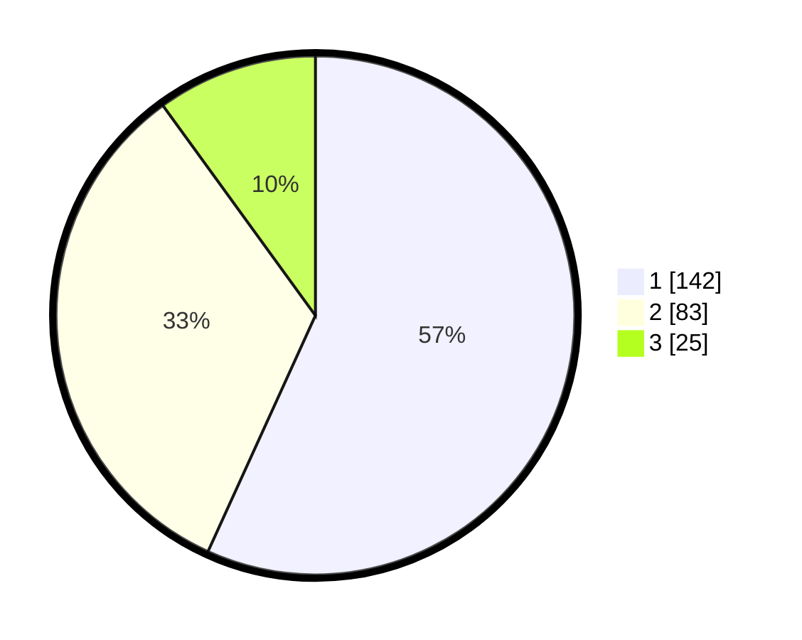

# Hasil

## Grafik

## Tabel

| No.    | Nama Paslon    | Suara | Suara (raw) | Persentase |
|:------ |:-------------- | -----:| -----------:| ----------:|
| 100025 | ANIES MUHAIMIN | 142   | [142][p-1]  | 56,80      |
| 100026 | PRABOWO GIBRAN | 83    | [83][p-2]   | 33,20      |
| 100027 | GANJAR MAHFUD  | 25    | [25][p-3]   | 10,00      |

[p-1]: https://github.com/gigit-pemilu/pemilu-2024/blob/main/pilpres/hitung-suara/sub/31-dki-jakarta/sub/74-jakarta-selatan/sub/06-cilandak/sub/1005-cipete-selatan/sub/077-tps/sub/paslon-1.txt
[p-2]: https://github.com/gigit-pemilu/pemilu-2024/blob/main/pilpres/hitung-suara/sub/31-dki-jakarta/sub/74-jakarta-selatan/sub/06-cilandak/sub/1005-cipete-selatan/sub/077-tps/sub/paslon-2.txt
[p-3]: https://github.com/gigit-pemilu/pemilu-2024/blob/main/pilpres/hitung-suara/sub/31-dki-jakarta/sub/74-jakarta-selatan/sub/06-cilandak/sub/1005-cipete-selatan/sub/077-tps/sub/paslon-3.txt

## Foto C Plano

https://sirekap-obj-formc.kpu.go.id/9670/pemilu/ppwp/31/74/06/10/05/3174061005077-20240217-121205--539dde90-114b-4fe8-9e9d-ece7a27dacdd.jpg

https://sirekap-obj-formc.kpu.go.id/9670/pemilu/ppwp/31/74/06/10/05/3174061005077-20240217-121255--3e0ddbee-bfa3-4968-820b-c5c56b7ae13b.jpg

https://sirekap-obj-formc.kpu.go.id/9670/pemilu/ppwp/31/74/06/10/05/3174061005077-20240217-121344--5215f98c-84f2-49ca-bc43-2bb905ddd980.jpg

## Metadata

| Key        | Value               |
| ---------- | ------------------- |
| Time Stamp | 2024-02-24 22:31:28 |

