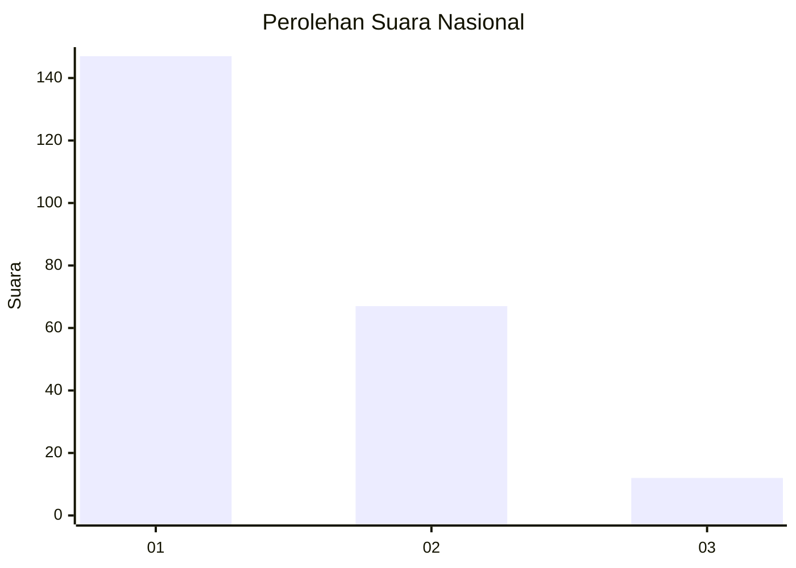
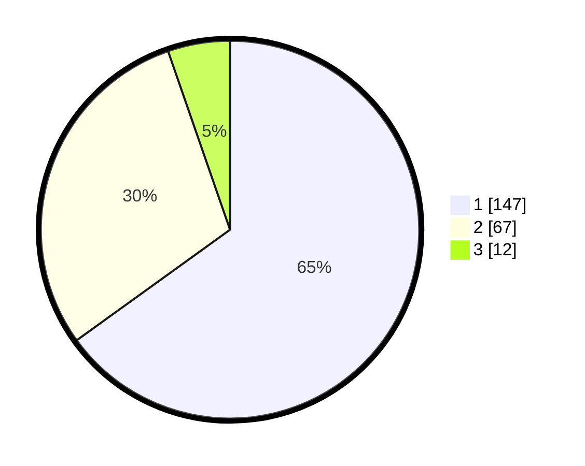

# Hasil

## Grafik

## Tabel

| No.    | Nama Paslon    | Suara | Suara (raw) | Persentase |
|:------ |:-------------- | -----:| -----------:| ----------:|
| 100025 | ANIES MUHAIMIN | 147   | [147][p-1]  | 65,04      |
| 100026 | PRABOWO GIBRAN | 67    | [67][p-2]   | 29,65      |
| 100027 | GANJAR MAHFUD  | 12    | [12][p-3]   | 5,31       |

[p-1]: https://github.com/gigit-pemilu/pemilu-2024/blob/main/pilpres/hitung-suara/sub/31-dki-jakarta/sub/74-jakarta-selatan/sub/06-cilandak/sub/1005-cipete-selatan/sub/078-tps/sub/paslon-1.txt
[p-2]: https://github.com/gigit-pemilu/pemilu-2024/blob/main/pilpres/hitung-suara/sub/31-dki-jakarta/sub/74-jakarta-selatan/sub/06-cilandak/sub/1005-cipete-selatan/sub/078-tps/sub/paslon-2.txt
[p-3]: https://github.com/gigit-pemilu/pemilu-2024/blob/main/pilpres/hitung-suara/sub/31-dki-jakarta/sub/74-jakarta-selatan/sub/06-cilandak/sub/1005-cipete-selatan/sub/078-tps/sub/paslon-3.txt

## Foto C Plano

https://sirekap-obj-formc.kpu.go.id/a042/pemilu/ppwp/31/74/06/10/05/3174061005078-20240217-121529--3e7a0037-27e0-4e8d-b8c8-1051a7a77a35.jpg

https://sirekap-obj-formc.kpu.go.id/a042/pemilu/ppwp/31/74/06/10/05/3174061005078-20240217-121613--5458389d-dae3-47da-ba8b-aaf81af3a5bf.jpg

https://sirekap-obj-formc.kpu.go.id/a042/pemilu/ppwp/31/74/06/10/05/3174061005078-20240217-121730--fcdbc8ec-ab44-4721-bce6-45b88290e9b3.jpg

## Metadata

| Key        | Value               |
| ---------- | ------------------- |
| Time Stamp | 2024-02-24 22:31:28 |

