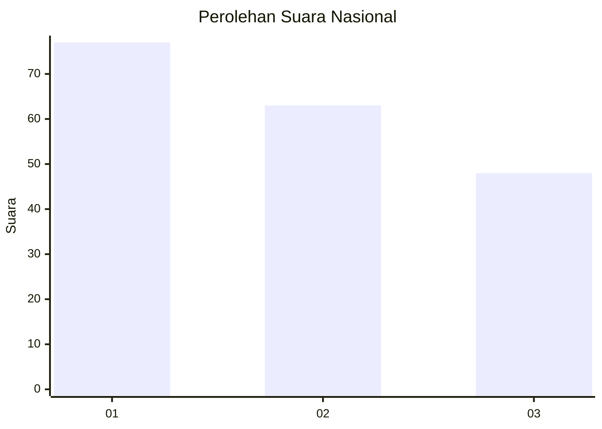
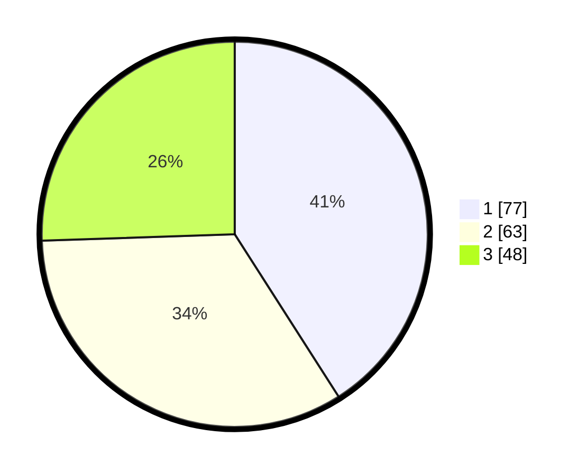

# Hasil

## Grafik

## Tabel

| No.    | Nama Paslon    | Suara | Suara (raw) | Persentase |
|:------ |:-------------- | -----:| -----------:| ----------:|
| 100025 | ANIES MUHAIMIN | 77    | [77][p-1]   | 40,96      |
| 100026 | PRABOWO GIBRAN | 63    | [63][p-2]   | 33,51      |
| 100027 | GANJAR MAHFUD  | 48    | [48][p-3]   | 25,53      |

[p-1]: https://github.com/gigit-pemilu/pemilu-2024/blob/main/pilpres/hitung-suara/sub/31-dki-jakarta/sub/74-jakarta-selatan/sub/06-cilandak/sub/1005-cipete-selatan/sub/080-tps/sub/paslon-1.txt
[p-2]: https://github.com/gigit-pemilu/pemilu-2024/blob/main/pilpres/hitung-suara/sub/31-dki-jakarta/sub/74-jakarta-selatan/sub/06-cilandak/sub/1005-cipete-selatan/sub/080-tps/sub/paslon-2.txt
[p-3]: https://github.com/gigit-pemilu/pemilu-2024/blob/main/pilpres/hitung-suara/sub/31-dki-jakarta/sub/74-jakarta-selatan/sub/06-cilandak/sub/1005-cipete-selatan/sub/080-tps/sub/paslon-3.txt

## Foto C Plano

https://sirekap-obj-formc.kpu.go.id/7cda/pemilu/ppwp/31/74/06/10/05/3174061005080-20240217-135544--7ec241ff-1f47-49a9-be9a-0e828905de31.jpg

https://sirekap-obj-formc.kpu.go.id/7cda/pemilu/ppwp/31/74/06/10/05/3174061005080-20240214-195802--2ba50fb5-e362-47e0-b2ff-6a4db5395d62.jpg

https://sirekap-obj-formc.kpu.go.id/7cda/pemilu/ppwp/31/74/06/10/05/3174061005080-20240217-135743--010c4683-57ef-4330-864f-d412ee5daadd.jpg

## Metadata

| Key        | Value               |
| ---------- | ------------------- |
| Time Stamp | 2024-02-25 15:00:00 |

