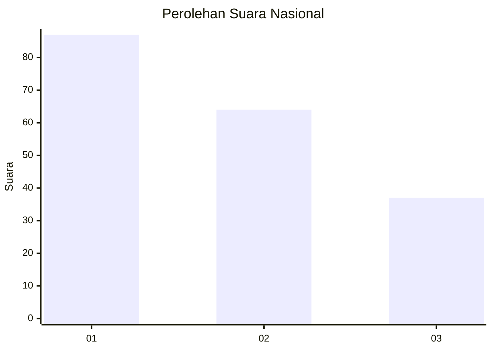
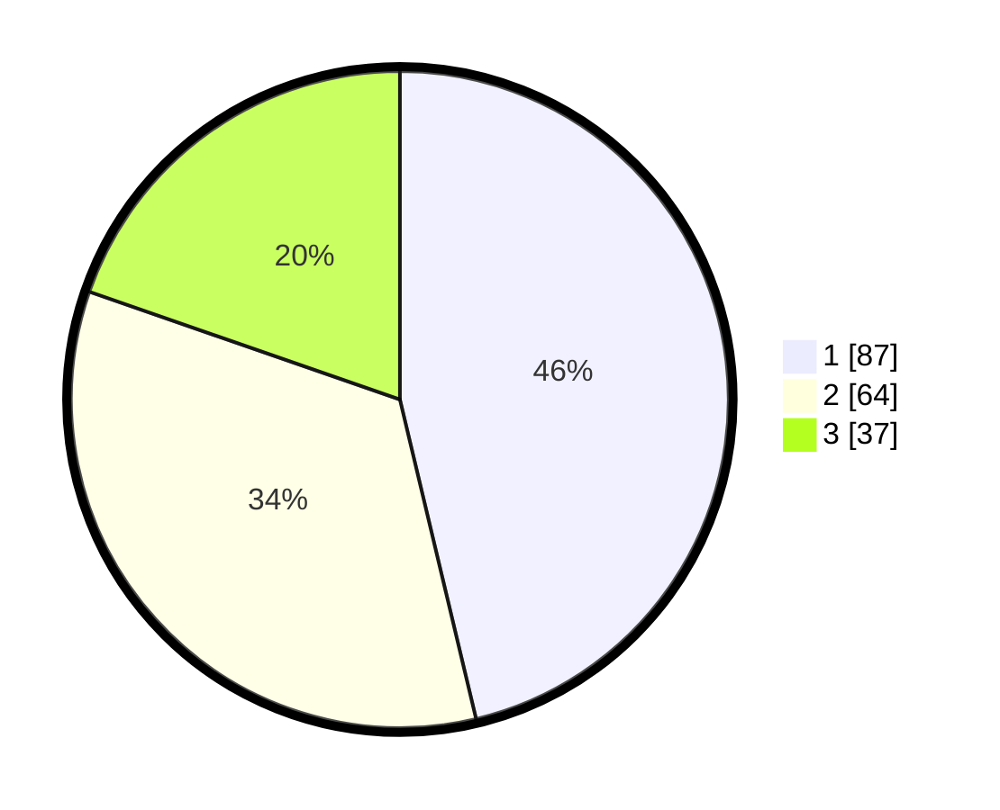

# Hasil

## Grafik

## Tabel

| No.    | Nama Paslon    | Suara | Suara (raw) | Persentase |
|:------ |:-------------- | -----:| -----------:| ----------:|
| 100025 | ANIES MUHAIMIN | 87    | [87][p-1]   | 46,28      |
| 100026 | PRABOWO GIBRAN | 64    | [64][p-2]   | 34,04      |
| 100027 | GANJAR MAHFUD  | 37    | [37][p-3]   | 19,68      |

[p-1]: https://github.com/gigit-pemilu/pemilu-2024/blob/main/pilpres/hitung-suara/sub/31-dki-jakarta/sub/74-jakarta-selatan/sub/06-cilandak/sub/1005-cipete-selatan/sub/081-tps/sub/paslon-1.txt
[p-2]: https://github.com/gigit-pemilu/pemilu-2024/blob/main/pilpres/hitung-suara/sub/31-dki-jakarta/sub/74-jakarta-selatan/sub/06-cilandak/sub/1005-cipete-selatan/sub/081-tps/sub/paslon-2.txt
[p-3]: https://github.com/gigit-pemilu/pemilu-2024/blob/main/pilpres/hitung-suara/sub/31-dki-jakarta/sub/74-jakarta-selatan/sub/06-cilandak/sub/1005-cipete-selatan/sub/081-tps/sub/paslon-3.txt

## Foto C Plano

https://sirekap-obj-formc.kpu.go.id/ff99/pemilu/ppwp/31/74/06/10/05/3174061005081-20240214-224913--e90a4ee3-808f-406b-97a5-e9f6ce059f7f.jpg

https://sirekap-obj-formc.kpu.go.id/ff99/pemilu/ppwp/31/74/06/10/05/3174061005081-20240214-224942--d5912849-b642-462a-b599-002e1401b59e.jpg

https://sirekap-obj-formc.kpu.go.id/ff99/pemilu/ppwp/31/74/06/10/05/3174061005081-20240214-224957--f87a1b48-ceaf-4300-a090-07b34a7dbc94.jpg

## Metadata

| Key        | Value               |
| ---------- | ------------------- |
| Time Stamp | 2024-02-24 22:31:28 |

