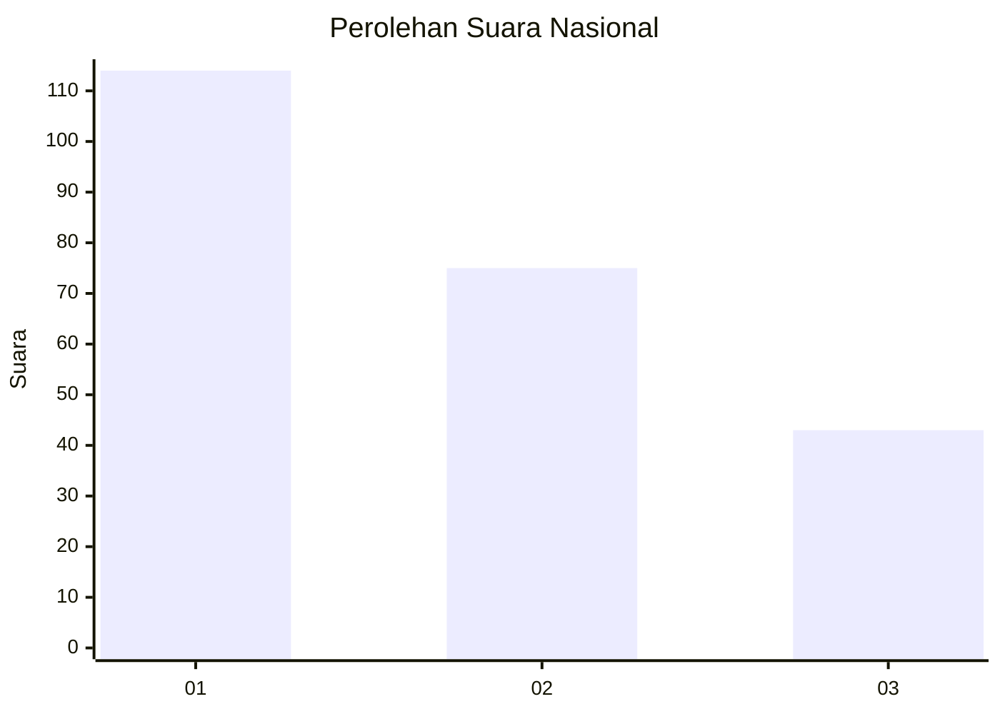
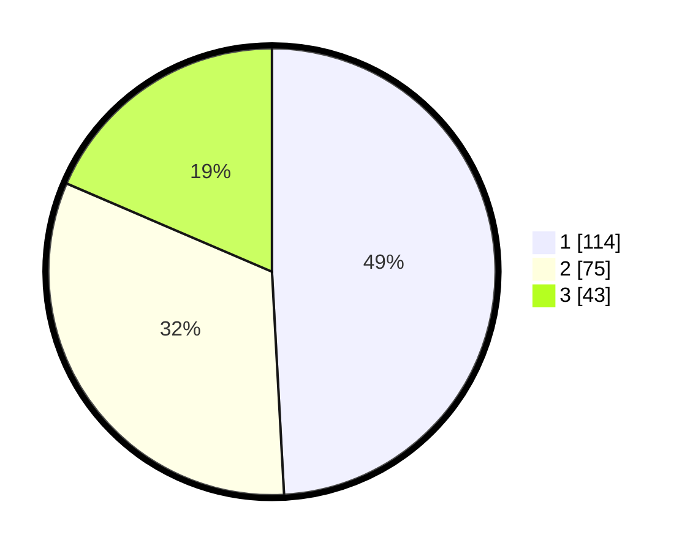

# Hasil

## Grafik

## Tabel

| No.    | Nama Paslon    | Suara | Suara (raw) | Persentase |
|:------ |:-------------- | -----:| -----------:| ----------:|
| 100025 | ANIES MUHAIMIN | 114   | [114][p-1]  | 49,14      |
| 100026 | PRABOWO GIBRAN | 75    | [75][p-2]   | 32,33      |
| 100027 | GANJAR MAHFUD  | 43    | [43][p-3]   | 18,53      |

[p-1]: https://github.com/gigit-pemilu/pemilu-2024/blob/main/pilpres/hitung-suara/sub/31-dki-jakarta/sub/74-jakarta-selatan/sub/06-cilandak/sub/1005-cipete-selatan/sub/083-tps/sub/paslon-1.txt
[p-2]: https://github.com/gigit-pemilu/pemilu-2024/blob/main/pilpres/hitung-suara/sub/31-dki-jakarta/sub/74-jakarta-selatan/sub/06-cilandak/sub/1005-cipete-selatan/sub/083-tps/sub/paslon-2.txt
[p-3]: https://github.com/gigit-pemilu/pemilu-2024/blob/main/pilpres/hitung-suara/sub/31-dki-jakarta/sub/74-jakarta-selatan/sub/06-cilandak/sub/1005-cipete-selatan/sub/083-tps/sub/paslon-3.txt

## Foto C Plano

https://sirekap-obj-formc.kpu.go.id/da6d/pemilu/ppwp/31/74/06/10/05/3174061005083-20240217-140423--13ab2865-0044-48b5-a017-aaf6ee5b9db2.jpg

https://sirekap-obj-formc.kpu.go.id/da6d/pemilu/ppwp/31/74/06/10/05/3174061005083-20240217-140509--11f05bfd-5b50-4f90-a459-185158850fa2.jpg

https://sirekap-obj-formc.kpu.go.id/da6d/pemilu/ppwp/31/74/06/10/05/3174061005083-20240217-140555--75483069-06ff-4a5e-b062-a9faf9025a95.jpg

## Metadata

| Key        | Value               |
| ---------- | ------------------- |
| Time Stamp | 2024-02-24 22:31:28 |

