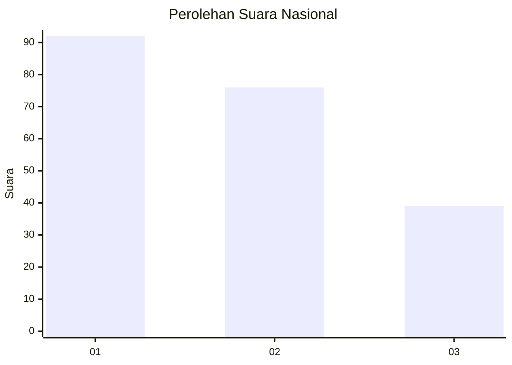
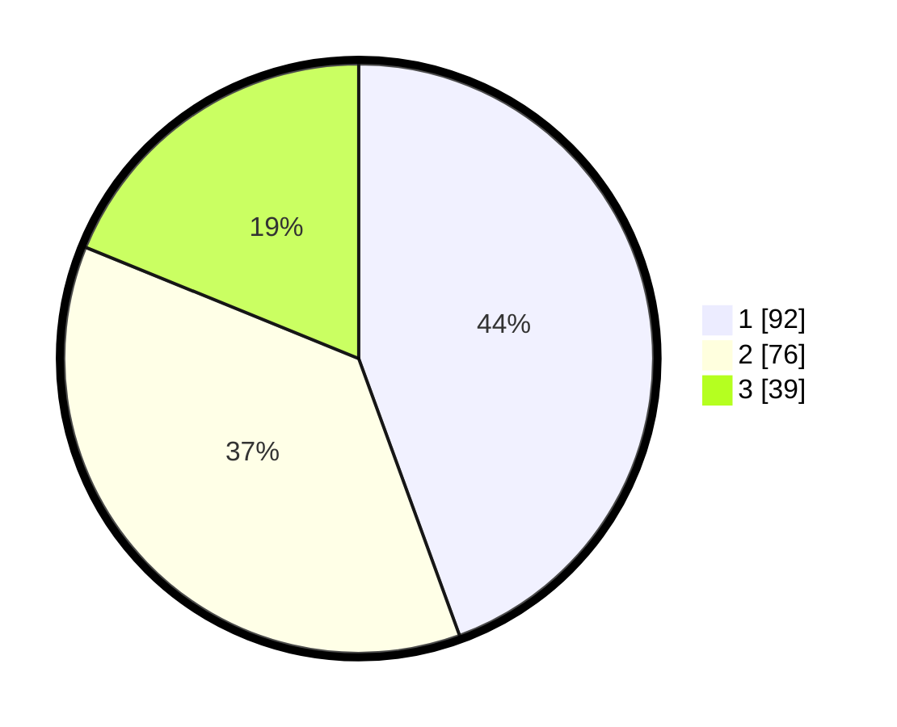

# Hasil

## Grafik

## Tabel

| No.    | Nama Paslon    | Suara | Suara (raw) | Persentase |
|:------ |:-------------- | -----:| -----------:| ----------:|
| 100025 | ANIES MUHAIMIN | 92    | [92][p-1]   | 44,44      |
| 100026 | PRABOWO GIBRAN | 76    | [76][p-2]   | 36,71      |
| 100027 | GANJAR MAHFUD  | 39    | [39][p-3]   | 18,84      |

[p-1]: https://github.com/gigit-pemilu/pemilu-2024/blob/main/pilpres/hitung-suara/sub/31-dki-jakarta/sub/74-jakarta-selatan/sub/06-cilandak/sub/1005-cipete-selatan/sub/085-tps/sub/paslon-1.txt
[p-2]: https://github.com/gigit-pemilu/pemilu-2024/blob/main/pilpres/hitung-suara/sub/31-dki-jakarta/sub/74-jakarta-selatan/sub/06-cilandak/sub/1005-cipete-selatan/sub/085-tps/sub/paslon-2.txt
[p-3]: https://github.com/gigit-pemilu/pemilu-2024/blob/main/pilpres/hitung-suara/sub/31-dki-jakarta/sub/74-jakarta-selatan/sub/06-cilandak/sub/1005-cipete-selatan/sub/085-tps/sub/paslon-3.txt

## Foto C Plano

https://sirekap-obj-formc.kpu.go.id/f23f/pemilu/ppwp/31/74/06/10/05/3174061005085-20240217-150248--b245b629-5225-404b-ada4-af5d7e673875.jpg

https://sirekap-obj-formc.kpu.go.id/f23f/pemilu/ppwp/31/74/06/10/05/3174061005085-20240217-150417--88c1917f-74f6-41bf-a404-3fb28d75715e.jpg

https://sirekap-obj-formc.kpu.go.id/f23f/pemilu/ppwp/31/74/06/10/05/3174061005085-20240217-150502--199431de-f0ef-4a6e-ade8-3a1a05893e7a.jpg

## Metadata

| Key        | Value               |
| ---------- | ------------------- |
| Time Stamp | 2024-02-24 22:31:28 |

