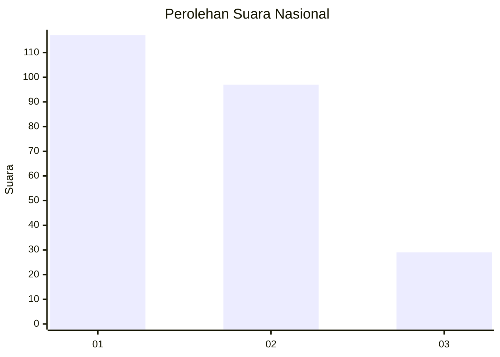
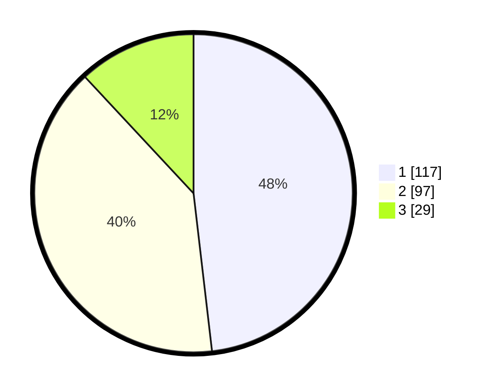

# Hasil

## Grafik

## Tabel

| No.    | Nama Paslon    | Suara | Suara (raw) | Persentase |
|:------ |:-------------- | -----:| -----------:| ----------:|
| 100025 | ANIES MUHAIMIN | 117   | [117][p-1]  | 48,15      |
| 100026 | PRABOWO GIBRAN | 97    | [97][p-2]   | 39,92      |
| 100027 | GANJAR MAHFUD  | 29    | [29][p-3]   | 11,93      |

[p-1]: https://github.com/gigit-pemilu/pemilu-2024/blob/main/pilpres/hitung-suara/sub/31-dki-jakarta/sub/74-jakarta-selatan/sub/06-cilandak/sub/1005-cipete-selatan/sub/090-tps/sub/paslon-1.txt
[p-2]: https://github.com/gigit-pemilu/pemilu-2024/blob/main/pilpres/hitung-suara/sub/31-dki-jakarta/sub/74-jakarta-selatan/sub/06-cilandak/sub/1005-cipete-selatan/sub/090-tps/sub/paslon-2.txt
[p-3]: https://github.com/gigit-pemilu/pemilu-2024/blob/main/pilpres/hitung-suara/sub/31-dki-jakarta/sub/74-jakarta-selatan/sub/06-cilandak/sub/1005-cipete-selatan/sub/090-tps/sub/paslon-3.txt

## Foto C Plano

https://sirekap-obj-formc.kpu.go.id/dfff/pemilu/ppwp/31/74/06/10/05/3174061005090-20240218-135720--c7cf476f-7e6d-4379-8ee5-9939e497bc91.jpg

https://sirekap-obj-formc.kpu.go.id/dfff/pemilu/ppwp/31/74/06/10/05/3174061005090-20240218-135543--1c86afd3-cf10-4cf9-b198-464702e611ee.jpg

https://sirekap-obj-formc.kpu.go.id/dfff/pemilu/ppwp/31/74/06/10/05/3174061005090-20240218-135935--0afa9b6d-2e79-4eb8-bad9-b37b503e5108.jpg

## Metadata

| Key        | Value               |
| ---------- | ------------------- |
| Time Stamp | 2024-02-25 12:00:00 |

