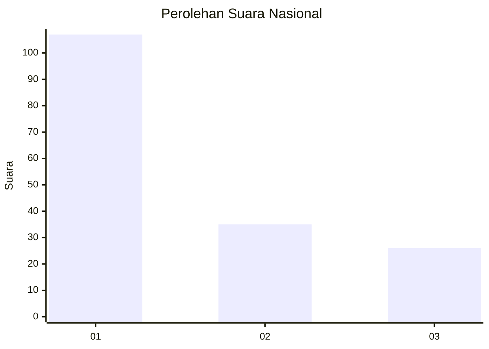
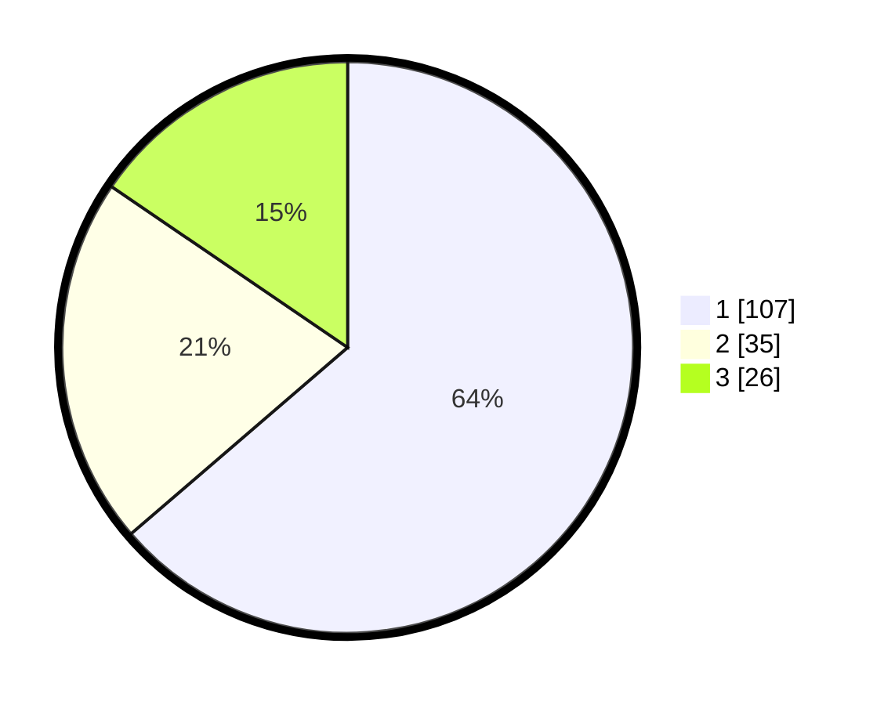

# Hasil

## Grafik

## Tabel

| No.    | Nama Paslon    | Suara | Suara (raw) | Persentase |
|:------ |:-------------- | -----:| -----------:| ----------:|
| 100025 | ANIES MUHAIMIN | 107   | [107][p-1]  | 63,69      |
| 100026 | PRABOWO GIBRAN | 35    | [35][p-2]   | 20,83      |
| 100027 | GANJAR MAHFUD  | 26    | [26][p-3]   | 15,48      |

[p-1]: https://github.com/gigit-pemilu/pemilu-2024/blob/main/pilpres/hitung-suara/sub/31-dki-jakarta/sub/74-jakarta-selatan/sub/06-cilandak/sub/1005-cipete-selatan/sub/091-tps/sub/paslon-1.txt
[p-2]: https://github.com/gigit-pemilu/pemilu-2024/blob/main/pilpres/hitung-suara/sub/31-dki-jakarta/sub/74-jakarta-selatan/sub/06-cilandak/sub/1005-cipete-selatan/sub/091-tps/sub/paslon-2.txt
[p-3]: https://github.com/gigit-pemilu/pemilu-2024/blob/main/pilpres/hitung-suara/sub/31-dki-jakarta/sub/74-jakarta-selatan/sub/06-cilandak/sub/1005-cipete-selatan/sub/091-tps/sub/paslon-3.txt

## Foto C Plano

https://sirekap-obj-formc.kpu.go.id/ca40/pemilu/ppwp/31/74/06/10/05/3174061005091-20240218-134329--a24ed23f-7be5-4f78-a835-067ab1ccb6f4.jpg

https://sirekap-obj-formc.kpu.go.id/ca40/pemilu/ppwp/31/74/06/10/05/3174061005091-20240218-134501--d4f85afc-44a0-41a3-baaf-356ba94f2ab5.jpg

https://sirekap-obj-formc.kpu.go.id/ca40/pemilu/ppwp/31/74/06/10/05/3174061005091-20240218-140232--52dc51df-6453-4ad7-a2df-a19f7132fb8f.jpg

## Metadata

| Key        | Value               |
| ---------- | ------------------- |
| Time Stamp | 2024-02-25 18:00:00 |

