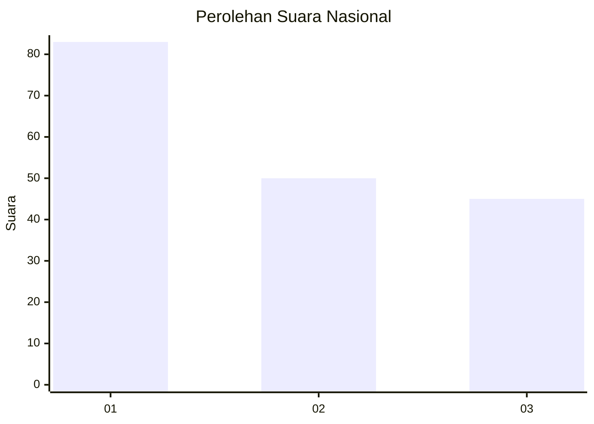
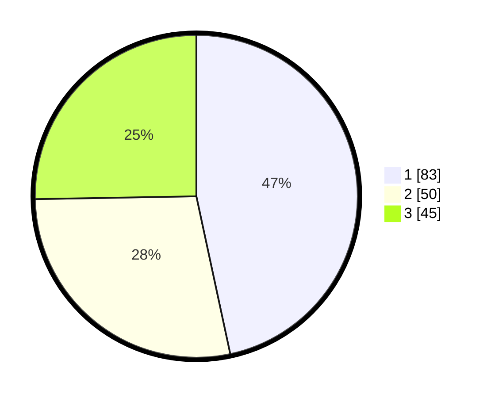

# Hasil

## Grafik

## Tabel

| No.    | Nama Paslon    | Suara | Suara (raw) | Persentase |
|:------ |:-------------- | -----:| -----------:| ----------:|
| 100025 | ANIES MUHAIMIN | 83    | [83][p-1]   | 46,63      |
| 100026 | PRABOWO GIBRAN | 50    | [50][p-2]   | 28,09      |
| 100027 | GANJAR MAHFUD  | 45    | [45][p-3]   | 25,28      |

[p-1]: https://github.com/gigit-pemilu/pemilu-2024/blob/main/pilpres/hitung-suara/sub/31-dki-jakarta/sub/74-jakarta-selatan/sub/06-cilandak/sub/1005-cipete-selatan/sub/094-tps/sub/paslon-1.txt
[p-2]: https://github.com/gigit-pemilu/pemilu-2024/blob/main/pilpres/hitung-suara/sub/31-dki-jakarta/sub/74-jakarta-selatan/sub/06-cilandak/sub/1005-cipete-selatan/sub/094-tps/sub/paslon-2.txt
[p-3]: https://github.com/gigit-pemilu/pemilu-2024/blob/main/pilpres/hitung-suara/sub/31-dki-jakarta/sub/74-jakarta-selatan/sub/06-cilandak/sub/1005-cipete-selatan/sub/094-tps/sub/paslon-3.txt

## Foto C Plano

https://sirekap-obj-formc.kpu.go.id/a38f/pemilu/ppwp/31/74/06/10/05/3174061005094-20240218-141224--c34451c2-2fa1-4a42-b6cb-9026ee716772.jpg

https://sirekap-obj-formc.kpu.go.id/a38f/pemilu/ppwp/31/74/06/10/05/3174061005094-20240218-141319--b181f621-e4e8-4093-93aa-60dd7f481bc9.jpg

https://sirekap-obj-formc.kpu.go.id/a38f/pemilu/ppwp/31/74/06/10/05/3174061005094-20240218-141405--bec09a43-6120-428b-85c5-436b28b93d99.jpg

## Metadata

| Key        | Value               |
| ---------- | ------------------- |
| Time Stamp | 2024-02-24 22:31:28 |

