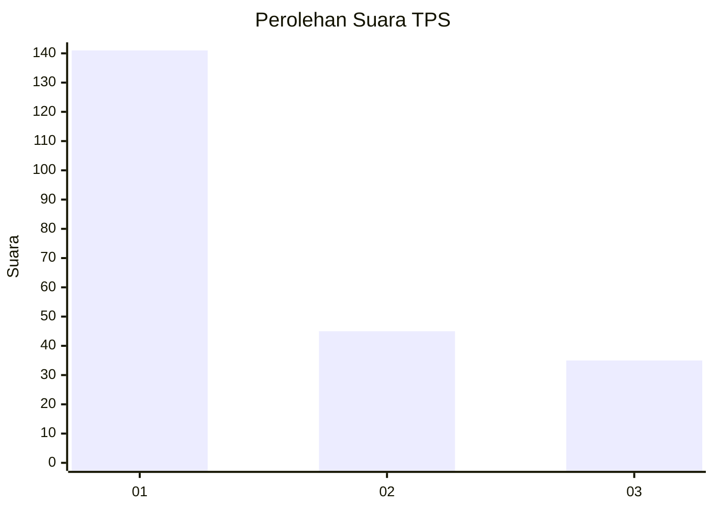
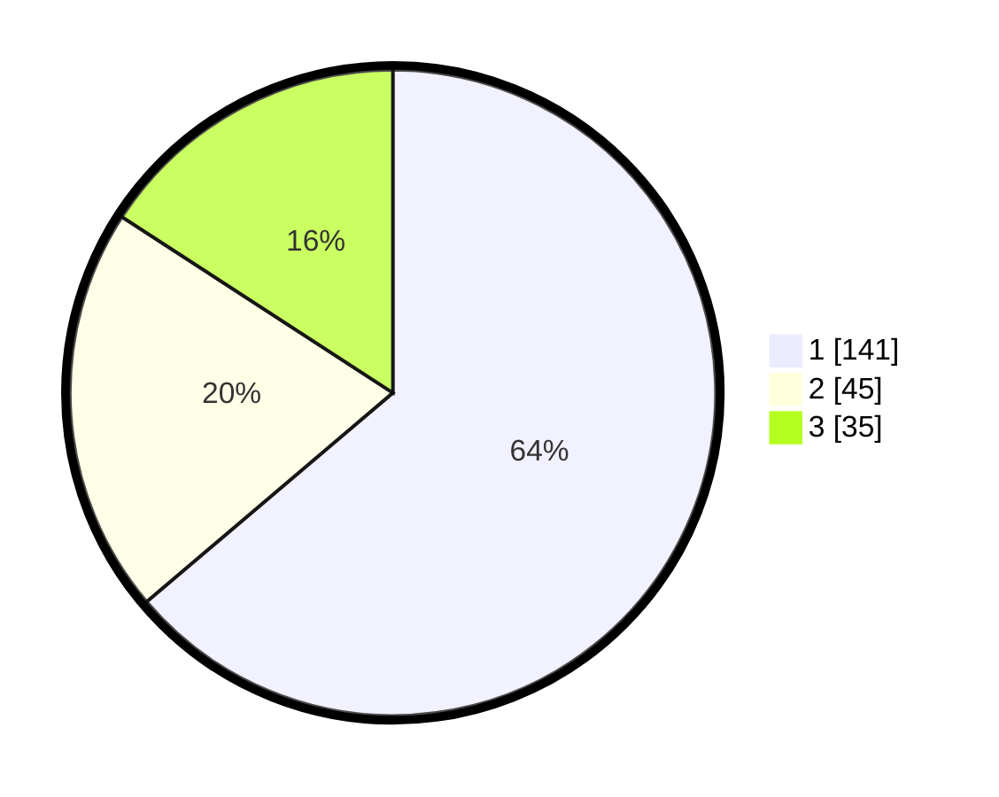

# Hasil

## Grafik

## Tabel

| No. | Nama Paslon    | Suara | Suara (raw) | Persentase |
|:--- |:-------------- | -----:| -----------:| ----------:|
| 1   | ANIES MUHAIMIN | 141   | [141][p-1]  | 63,80      |
| 2   | PRABOWO GIBRAN | 45    | [45][p-2]   | 20,36      |
| 3   | GANJAR MAHFUD  | 35    | [35][p-3]   | 15,84      |

[p-1]: https://github.com/gigit-pemilu/pemilu-2024-31-dki-jakarta/blob/main/pilpres/hitung-suara/sub/31-dki-jakarta/sub/74-jakarta-selatan/sub/06-cilandak/sub/1005-cipete-selatan/sub/095-tps/sub/paslon-1.txt
[p-2]: https://github.com/gigit-pemilu/pemilu-2024-31-dki-jakarta/blob/main/pilpres/hitung-suara/sub/31-dki-jakarta/sub/74-jakarta-selatan/sub/06-cilandak/sub/1005-cipete-selatan/sub/095-tps/sub/paslon-2.txt
[p-3]: https://github.com/gigit-pemilu/pemilu-2024-31-dki-jakarta/blob/main/pilpres/hitung-suara/sub/31-dki-jakarta/sub/74-jakarta-selatan/sub/06-cilandak/sub/1005-cipete-selatan/sub/095-tps/sub/paslon-3.txt

## Foto C Plano

https://sirekap-obj-formc.kpu.go.id/d4c0/pemilu/ppwp/31/74/06/10/05/3174061005095-20240218-141656--de54a4d2-6f70-426d-80cb-0ab5c72cdcb0.jpg

https://sirekap-obj-formc.kpu.go.id/d4c0/pemilu/ppwp/31/74/06/10/05/3174061005095-20240218-141754--2d9e0bc5-0450-4f38-957b-99cd94b2f07e.jpg

https://sirekap-obj-formc.kpu.go.id/d4c0/pemilu/ppwp/31/74/06/10/05/3174061005095-20240218-141843--1c5d5100-b2ce-4fc7-ae76-6c201a5615d1.jpg

## Metadata

| Key        | Value               |
| ---------- | ------------------- |
| Time Stamp | 2024-02-27 11:00:00 |

