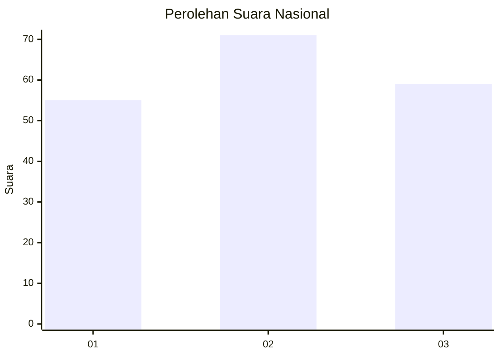
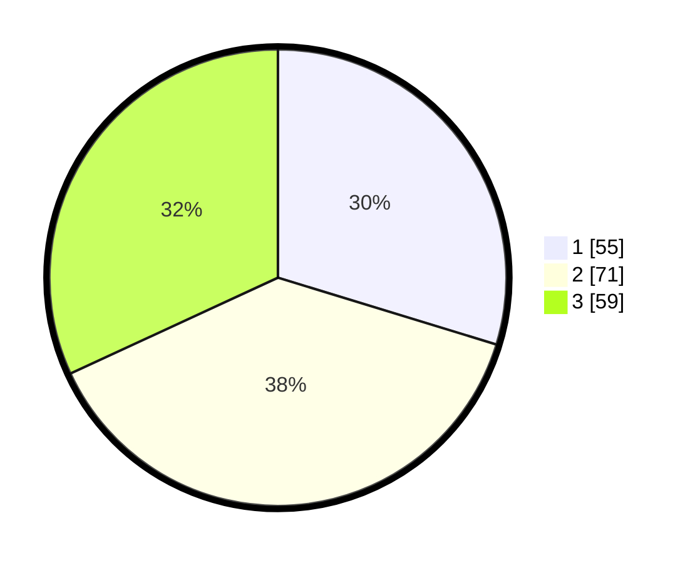

# Hasil

## Grafik

## Tabel

| No.    | Nama Paslon    | Suara | Suara (raw) | Persentase |
|:------ |:-------------- | -----:| -----------:| ----------:|
| 100025 | ANIES MUHAIMIN | 55    | [55][p-1]   | 29,73      |
| 100026 | PRABOWO GIBRAN | 71    | [71][p-2]   | 38,38      |
| 100027 | GANJAR MAHFUD  | 59    | [59][p-3]   | 31,89      |

[p-1]: https://github.com/gigit-pemilu/pemilu-2024/blob/main/pilpres/hitung-suara/sub/31-dki-jakarta/sub/74-jakarta-selatan/sub/07-kebayoran-baru/sub/1001-melawai/sub/002-tps/sub/paslon-1.txt
[p-2]: https://github.com/gigit-pemilu/pemilu-2024/blob/main/pilpres/hitung-suara/sub/31-dki-jakarta/sub/74-jakarta-selatan/sub/07-kebayoran-baru/sub/1001-melawai/sub/002-tps/sub/paslon-2.txt
[p-3]: https://github.com/gigit-pemilu/pemilu-2024/blob/main/pilpres/hitung-suara/sub/31-dki-jakarta/sub/74-jakarta-selatan/sub/07-kebayoran-baru/sub/1001-melawai/sub/002-tps/sub/paslon-3.txt

## Foto C Plano

https://sirekap-obj-formc.kpu.go.id/cf59/pemilu/ppwp/31/74/07/10/01/3174071001002-20240226-174458--9c9a2248-7a51-4ae4-8bd8-d39b665ae75d.jpg

https://sirekap-obj-formc.kpu.go.id/cf59/pemilu/ppwp/31/74/07/10/01/3174071001002-20240226-174536--9bf92fde-48e4-486e-8fb0-96a14de03033.jpg

https://sirekap-obj-formc.kpu.go.id/cf59/pemilu/ppwp/31/74/07/10/01/3174071001002-20240226-174900--265ae4d5-7f50-4314-9555-f7a8b27b4dc9.jpg

## Metadata

| Key        | Value               |
| ---------- | ------------------- |
| Time Stamp | 2024-02-26 23:00:00 |

## DATA PEMILIH TETAP

Jumlah pemilih dalam DPT: **277**.
 * L: **347**.
 * P: **112**.

## DATA PENGGUNA HAK PILIH

Jumlah pengguna hak pilih dalam DPT: **133**.
 * L: **75**.
 * P: **545**.

Jumlah pengguna hak pilih dalam DPTb: **25**.
 * L: **509**.
 * P: **16**.

Jumlah pengguna hak pilih dalam DPK: **352**.
 * L: **51**.
 * P: **34**.

Jumlah pengguna hak pilih: **190**.
 * L: **345**.
 * P: **345**.

## JUMLAH SUARA SAH DAN TIDAK SAH

JUMLAH SELURUH SUARA SAH: **185**.

JUMLAH SUARA TIDAK SAH: **5**.

JUMLAH SELURUH SUARA SAH DAN SUARA TIDAK SAH: **190**.

