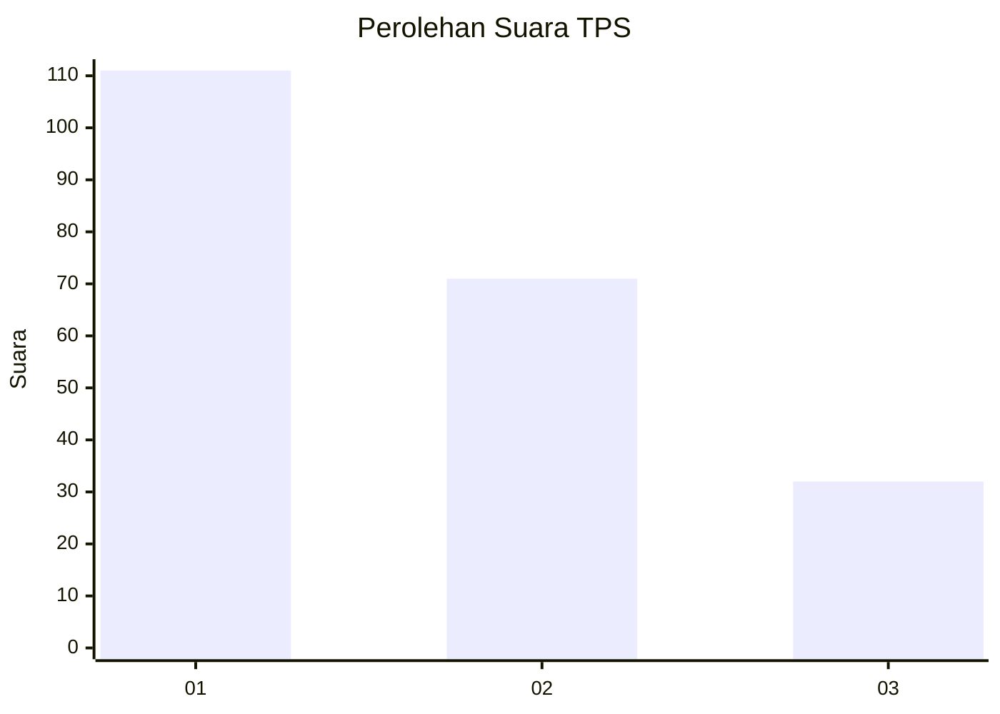
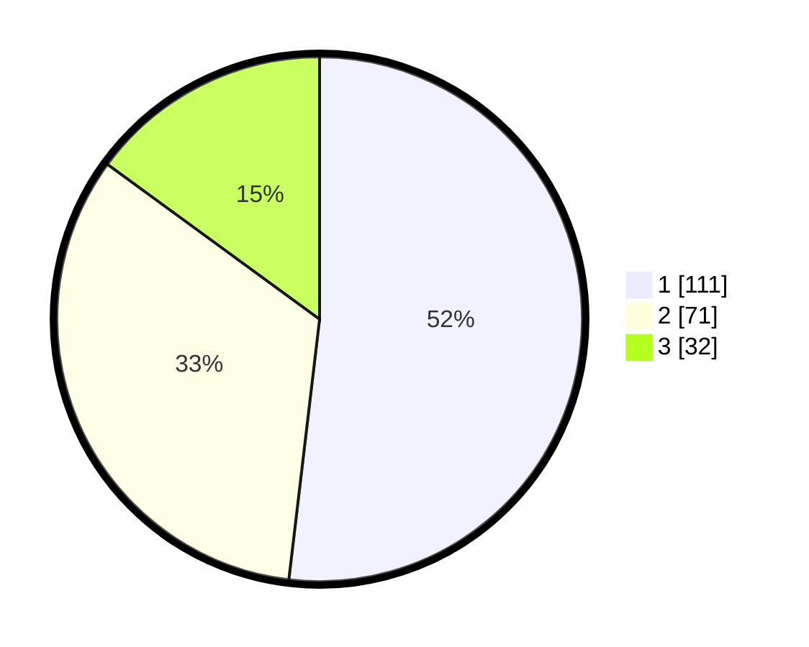

# Hasil

## Grafik

## Tabel

| No. | Nama Paslon    | Suara | Suara (raw) | Persentase |
|:--- |:-------------- | -----:| -----------:| ----------:|
| 1   | ANIES MUHAIMIN | 111   | [111][p-1]  | 51,87      |
| 2   | PRABOWO GIBRAN | 71    | [71][p-2]   | 33,18      |
| 3   | GANJAR MAHFUD  | 32    | [32][p-3]   | 14,95      |

[p-1]: https://github.com/gigit-pemilu/pemilu-2024-31-dki-jakarta/blob/main/pilpres/hitung-suara/sub/31-dki-jakarta/sub/74-jakarta-selatan/sub/07-kebayoran-baru/sub/1001-melawai/sub/003-tps/sub/paslon-1.txt
[p-2]: https://github.com/gigit-pemilu/pemilu-2024-31-dki-jakarta/blob/main/pilpres/hitung-suara/sub/31-dki-jakarta/sub/74-jakarta-selatan/sub/07-kebayoran-baru/sub/1001-melawai/sub/003-tps/sub/paslon-2.txt
[p-3]: https://github.com/gigit-pemilu/pemilu-2024-31-dki-jakarta/blob/main/pilpres/hitung-suara/sub/31-dki-jakarta/sub/74-jakarta-selatan/sub/07-kebayoran-baru/sub/1001-melawai/sub/003-tps/sub/paslon-3.txt

## Foto C Plano

https://sirekap-obj-formc.kpu.go.id/3fec/pemilu/ppwp/31/74/07/10/01/3174071001003-20240218-180314--2932aa08-dabb-4a60-b6fd-61d0e854dead.jpg

https://sirekap-obj-formc.kpu.go.id/3fec/pemilu/ppwp/31/74/07/10/01/3174071001003-20240218-180349--18669d5f-0b63-4967-a330-d67a5aab429e.jpg

https://sirekap-obj-formc.kpu.go.id/3fec/pemilu/ppwp/31/74/07/10/01/3174071001003-20240218-180420--3aaa3097-d155-41b6-a5fb-049e98477021.jpg

## Metadata

| Key        | Value               |
| ---------- | ------------------- |
| Time Stamp | 2024-02-20 11:00:00 |

