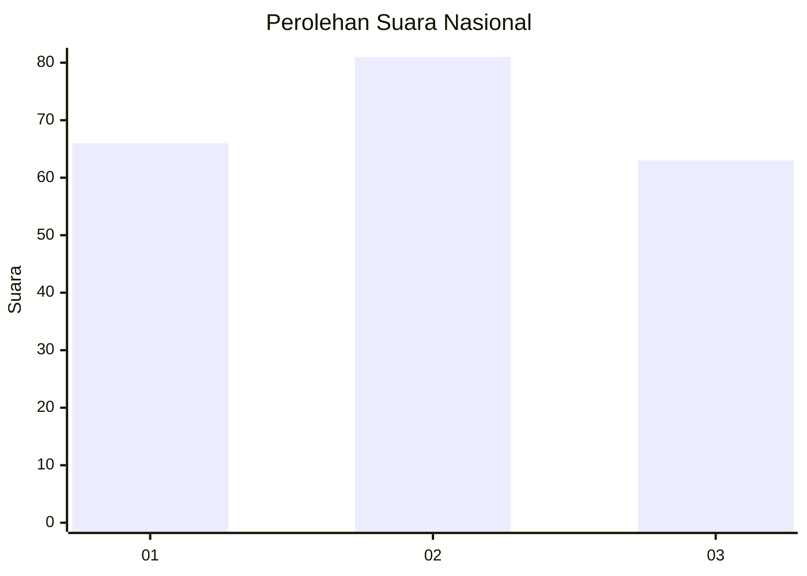
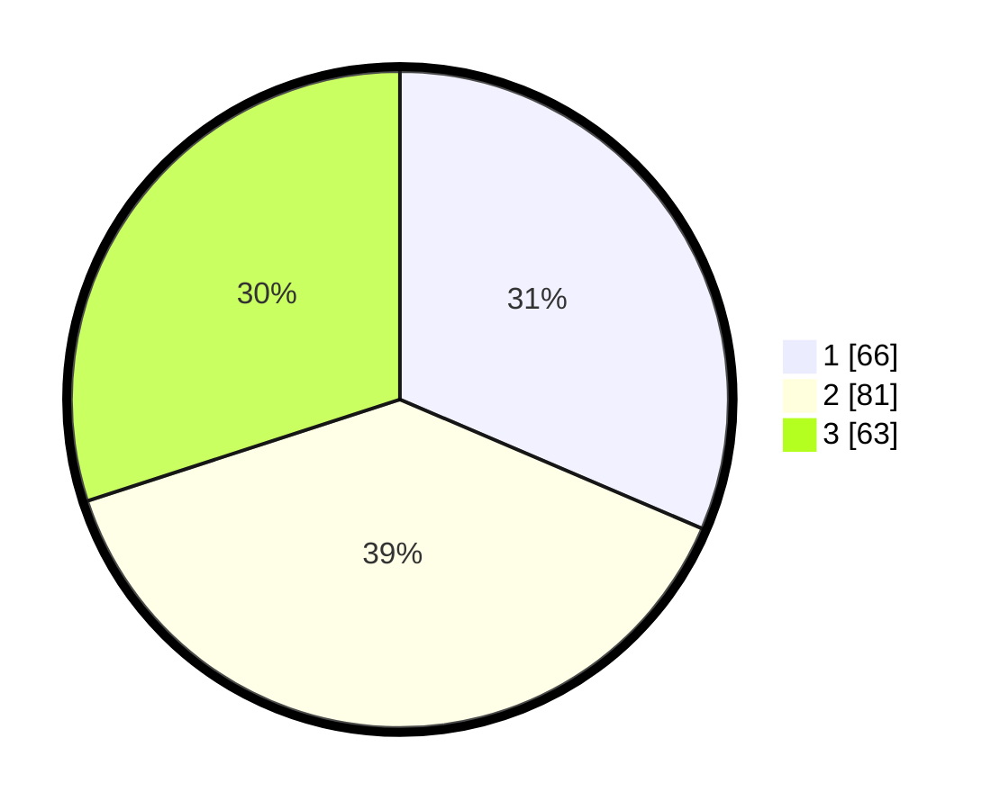

# Hasil

## Grafik

## Tabel

| No.    | Nama Paslon    | Suara | Suara (raw) | Persentase |
|:------ |:-------------- | -----:| -----------:| ----------:|
| 100025 | ANIES MUHAIMIN | 66    | [66][p-1]   | 31,43      |
| 100026 | PRABOWO GIBRAN | 81    | [81][p-2]   | 38,57      |
| 100027 | GANJAR MAHFUD  | 63    | [63][p-3]   | 30,00      |

[p-1]: https://github.com/gigit-pemilu/pemilu-2024/blob/main/pilpres/hitung-suara/sub/31-dki-jakarta/sub/74-jakarta-selatan/sub/07-kebayoran-baru/sub/1003-kramat-pela/sub/004-tps/sub/paslon-1.txt
[p-2]: https://github.com/gigit-pemilu/pemilu-2024/blob/main/pilpres/hitung-suara/sub/31-dki-jakarta/sub/74-jakarta-selatan/sub/07-kebayoran-baru/sub/1003-kramat-pela/sub/004-tps/sub/paslon-2.txt
[p-3]: https://github.com/gigit-pemilu/pemilu-2024/blob/main/pilpres/hitung-suara/sub/31-dki-jakarta/sub/74-jakarta-selatan/sub/07-kebayoran-baru/sub/1003-kramat-pela/sub/004-tps/sub/paslon-3.txt

## Foto C Plano

https://sirekap-obj-formc.kpu.go.id/0c2f/pemilu/ppwp/31/74/07/10/03/3174071003004-20240214-194006--0e9c0945-e7ea-43e4-b877-ada4af352dcb.jpg

https://sirekap-obj-formc.kpu.go.id/0c2f/pemilu/ppwp/31/74/07/10/03/3174071003004-20240214-155138--185b5f63-a30e-44f8-bb51-a6b0236066da.jpg

https://sirekap-obj-formc.kpu.go.id/0c2f/pemilu/ppwp/31/74/07/10/03/3174071003004-20240214-210239--5eb9e889-49f8-4154-82e5-2335dd66fd94.jpg

## Metadata

| Key        | Value               |
| ---------- | ------------------- |
| Time Stamp | 2024-02-15 17:30:25 |

