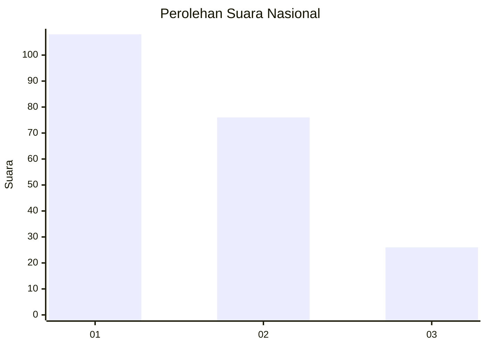
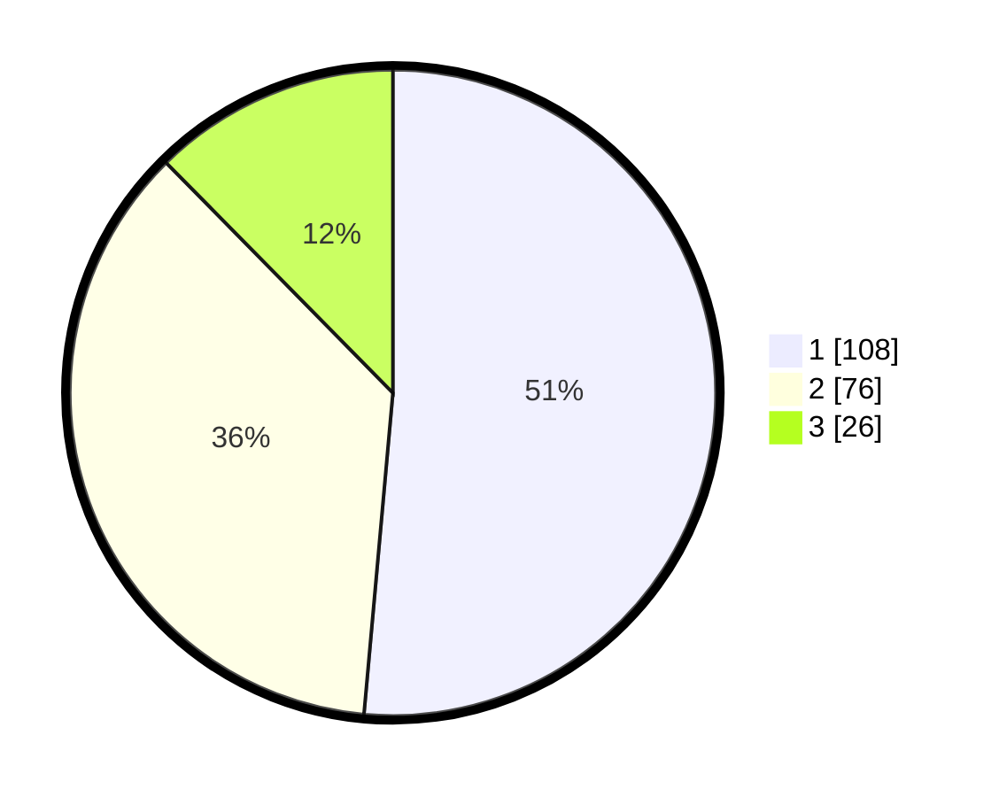

# Hasil

## Grafik

## Tabel

| No.    | Nama Paslon    | Suara | Suara (raw) | Persentase |
|:------ |:-------------- | -----:| -----------:| ----------:|
| 100025 | ANIES MUHAIMIN | 108   | [108][p-1]  | 51,43      |
| 100026 | PRABOWO GIBRAN | 76    | [76][p-2]   | 36,19      |
| 100027 | GANJAR MAHFUD  | 26    | [26][p-3]   | 12,38      |

[p-1]: https://github.com/gigit-pemilu/pemilu-2024/blob/main/pilpres/hitung-suara/sub/31-dki-jakarta/sub/74-jakarta-selatan/sub/07-kebayoran-baru/sub/1003-kramat-pela/sub/036-tps/sub/paslon-1.txt
[p-2]: https://github.com/gigit-pemilu/pemilu-2024/blob/main/pilpres/hitung-suara/sub/31-dki-jakarta/sub/74-jakarta-selatan/sub/07-kebayoran-baru/sub/1003-kramat-pela/sub/036-tps/sub/paslon-2.txt
[p-3]: https://github.com/gigit-pemilu/pemilu-2024/blob/main/pilpres/hitung-suara/sub/31-dki-jakarta/sub/74-jakarta-selatan/sub/07-kebayoran-baru/sub/1003-kramat-pela/sub/036-tps/sub/paslon-3.txt

## Foto C Plano

https://sirekap-obj-formc.kpu.go.id/4b35/pemilu/ppwp/31/74/07/10/03/3174071003036-20240214-230313--c0c2f366-ddb2-4683-b4b0-13e583ec0dd6.jpg

https://sirekap-obj-formc.kpu.go.id/4b35/pemilu/ppwp/31/74/07/10/03/3174071003036-20240214-230728--a0f3bc64-3d73-440c-aa07-a9bf684c553a.jpg

https://sirekap-obj-formc.kpu.go.id/4b35/pemilu/ppwp/31/74/07/10/03/3174071003036-20240214-231027--000a29f2-b85c-4160-aa15-39c01b744947.jpg

## Metadata

| Key        | Value               |
| ---------- | ------------------- |
| Time Stamp | 2024-02-24 22:31:28 |

