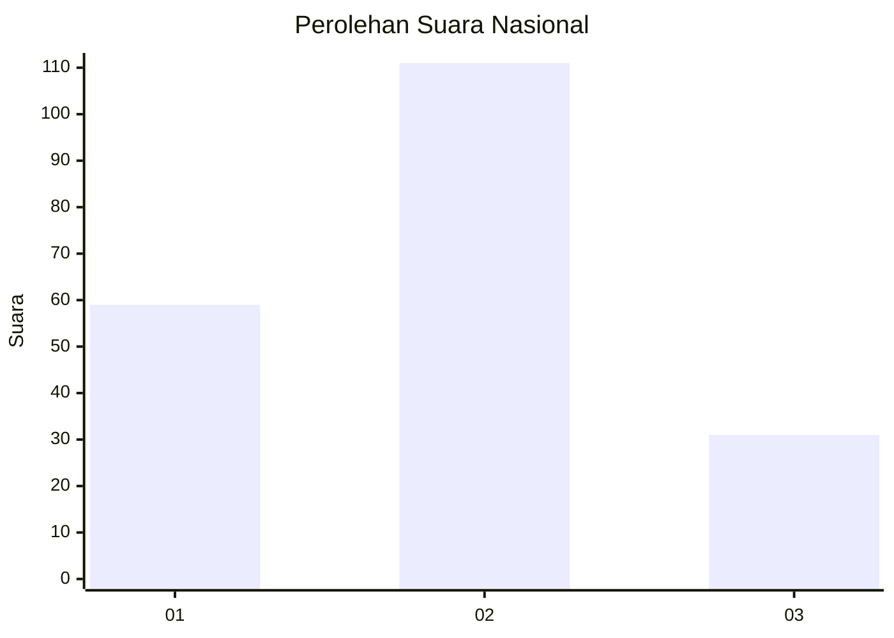
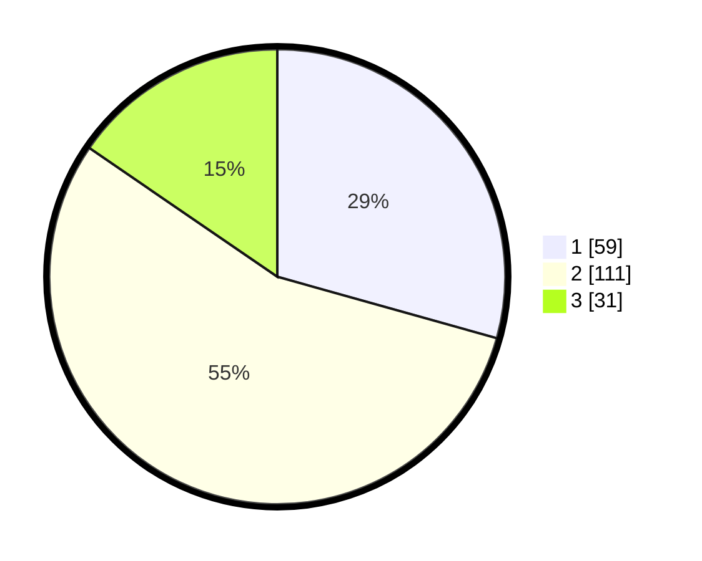

# Hasil

## Grafik

## Tabel

| No. | Nama Paslon    | Suara | Suara (raw) | Persentase |
|:--- |:-------------- | -----:| -----------:| ----------:|
| 1   | ANIES MUHAIMIN | 59    | [59][p-1]   | 29,35      |
| 2   | PRABOWO GIBRAN | 111   | [111][p-2]  | 55,22      |
| 3   | GANJAR MAHFUD  | 31    | [31][p-3]   | 15,42      |

[p-1]: https://github.com/gigit-pemilu/pemilu-2024/blob/main/pilpres/hitung-suara/sub/31-dki-jakarta/sub/74-jakarta-selatan/sub/07-kebayoran-baru/sub/1009-gandaria-utara/sub/002-tps/sub/paslon-1.txt
[p-2]: https://github.com/gigit-pemilu/pemilu-2024/blob/main/pilpres/hitung-suara/sub/31-dki-jakarta/sub/74-jakarta-selatan/sub/07-kebayoran-baru/sub/1009-gandaria-utara/sub/002-tps/sub/paslon-2.txt
[p-3]: https://github.com/gigit-pemilu/pemilu-2024/blob/main/pilpres/hitung-suara/sub/31-dki-jakarta/sub/74-jakarta-selatan/sub/07-kebayoran-baru/sub/1009-gandaria-utara/sub/002-tps/sub/paslon-3.txt

## Foto C Plano

https://sirekap-obj-formc.kpu.go.id/cd65/pemilu/ppwp/31/74/07/10/09/3174071009002-20240216-171403--28b2872a-1f37-4112-a4fa-a716bc41807c.jpg

https://sirekap-obj-formc.kpu.go.id/cd65/pemilu/ppwp/31/74/07/10/09/3174071009002-20240216-171437--add7d9b4-5016-4dba-bae1-14e8469a90f9.jpg

https://sirekap-obj-formc.kpu.go.id/cd65/pemilu/ppwp/31/74/07/10/09/3174071009002-20240216-171510--cc7cea48-5a50-4038-8fce-204e2869065f.jpg

## Metadata

| Key        | Value               |
| ---------- | ------------------- |
| Time Stamp | 2024-02-17 18:30:00 |

## DATA PEMILIH TETAP

Jumlah pemilih dalam DPT: **265**.
 * L: **33**.
 * P: **22**.

## DATA PENGGUNA HAK PILIH

Jumlah pengguna hak pilih dalam DPT: **295**.
 * L: **899**.
 * P: **897**.

Jumlah pengguna hak pilih dalam DPTb: **844**.
 * L: **886**.
 * P: **884**.

Jumlah pengguna hak pilih dalam DPK: **885**.
 * L: **888**.
 * P: **883**.

Jumlah pengguna hak pilih: **523**.
 * L: **284**.
 * P: **844**.

## JUMLAH SUARA SAH DAN TIDAK SAH

JUMLAH SELURUH SUARA SAH: **201**.

JUMLAH SUARA TIDAK SAH: **2**.

JUMLAH SELURUH SUARA SAH DAN SUARA TIDAK SAH: **203**.

