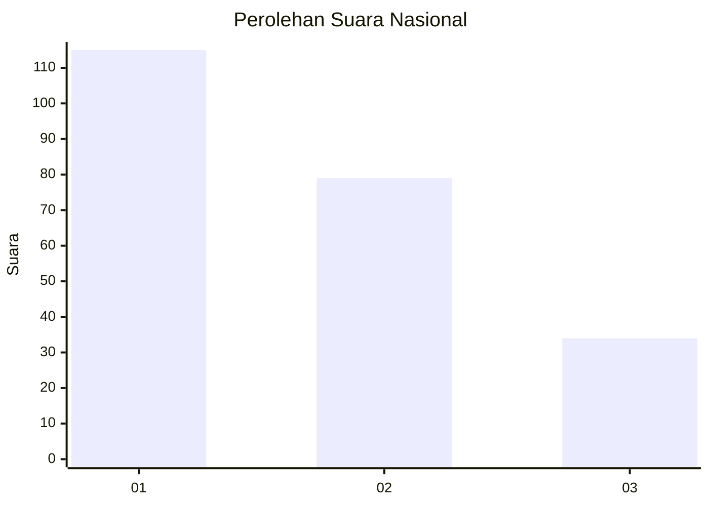
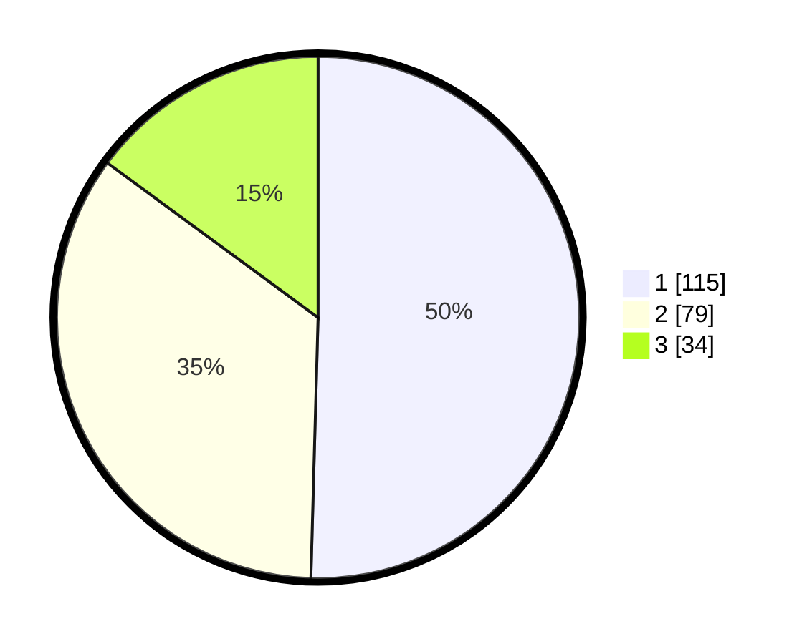

# Hasil

## Grafik

## Tabel

| No.    | Nama Paslon    | Suara | Suara (raw) | Persentase |
|:------ |:-------------- | -----:| -----------:| ----------:|
| 100025 | ANIES MUHAIMIN | 115   | [115][p-1]  | 50,44      |
| 100026 | PRABOWO GIBRAN | 79    | [79][p-2]   | 34,65      |
| 100027 | GANJAR MAHFUD  | 34    | [34][p-3]   | 14,91      |

[p-1]: https://github.com/gigit-pemilu/pemilu-2024/blob/main/pilpres/hitung-suara/sub/31-dki-jakarta/sub/74-jakarta-selatan/sub/07-kebayoran-baru/sub/1009-gandaria-utara/sub/003-tps/sub/paslon-1.txt
[p-2]: https://github.com/gigit-pemilu/pemilu-2024/blob/main/pilpres/hitung-suara/sub/31-dki-jakarta/sub/74-jakarta-selatan/sub/07-kebayoran-baru/sub/1009-gandaria-utara/sub/003-tps/sub/paslon-2.txt
[p-3]: https://github.com/gigit-pemilu/pemilu-2024/blob/main/pilpres/hitung-suara/sub/31-dki-jakarta/sub/74-jakarta-selatan/sub/07-kebayoran-baru/sub/1009-gandaria-utara/sub/003-tps/sub/paslon-3.txt

## Foto C Plano

https://sirekap-obj-formc.kpu.go.id/014f/pemilu/ppwp/31/74/07/10/09/3174071009003-20240216-183204--887615ae-d2ac-4496-ac4c-69903f14d5e0.jpg

https://sirekap-obj-formc.kpu.go.id/014f/pemilu/ppwp/31/74/07/10/09/3174071009003-20240216-183255--7fcea2d0-4dd3-4955-b07b-0d70eec62f0f.jpg

https://sirekap-obj-formc.kpu.go.id/014f/pemilu/ppwp/31/74/07/10/09/3174071009003-20240216-183403--64273251-8b7b-42e3-8bf2-e14fabc7c74c.jpg

## Metadata

| Key        | Value               |
| ---------- | ------------------- |
| Time Stamp | 2024-02-17 19:00:04 |

## DATA PEMILIH TETAP

Jumlah pemilih dalam DPT: **382**.
 * L: **38**.
 * P: **438**.

## DATA PENGGUNA HAK PILIH

Jumlah pengguna hak pilih dalam DPT: **355**.
 * L: **553**.
 * P: **553**.

Jumlah pengguna hak pilih dalam DPTb: **804**.
 * L: **883**.
 * P: **886**.

Jumlah pengguna hak pilih dalam DPK: **880**.
 * L: **885**.
 * P: **888**.

Jumlah pengguna hak pilih: **330**.
 * L: **306**.
 * P: **325**.

## JUMLAH SUARA SAH DAN TIDAK SAH

JUMLAH SELURUH SUARA SAH: **228**.

JUMLAH SUARA TIDAK SAH: **3**.

JUMLAH SELURUH SUARA SAH DAN SUARA TIDAK SAH: **231**.

