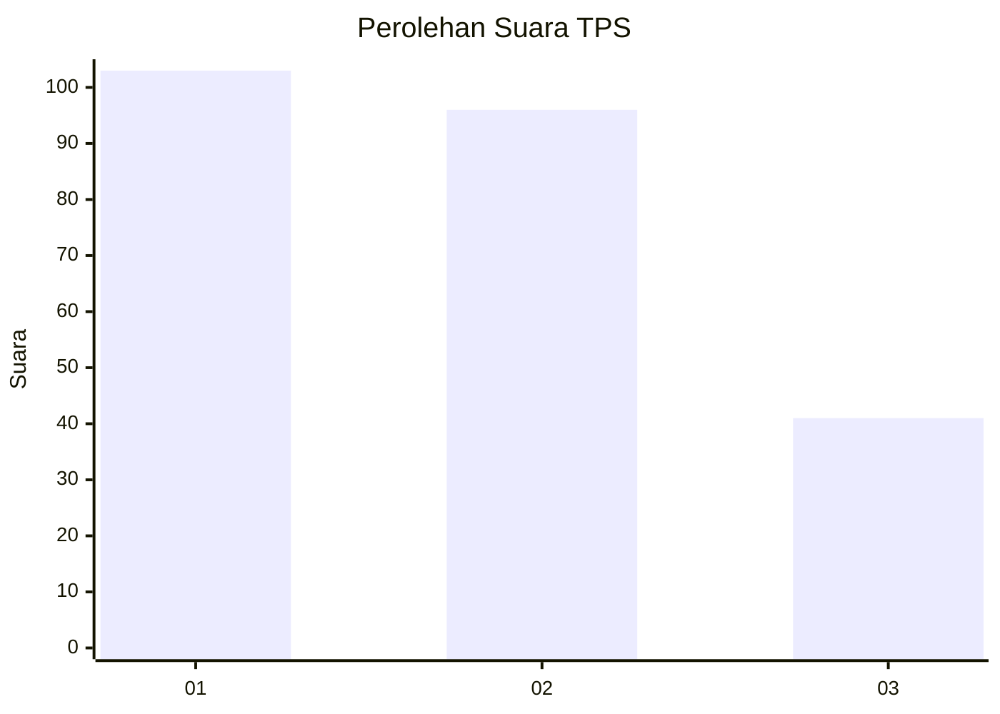
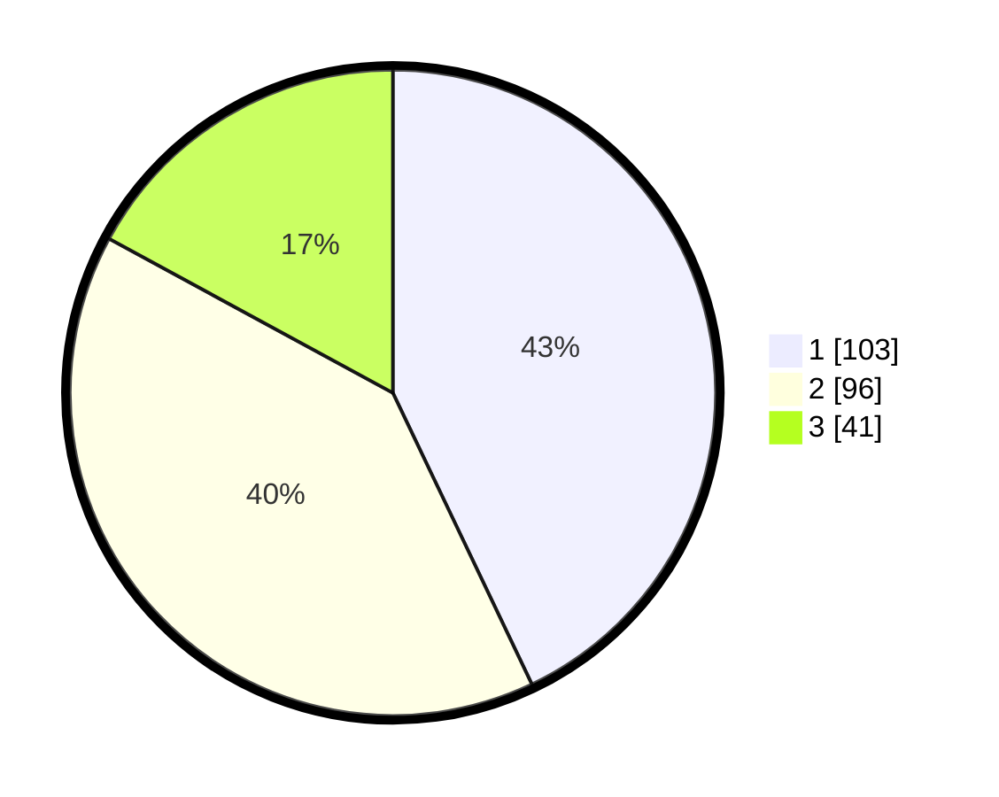

# Hasil

## Grafik

## Tabel

| No. | Nama Paslon    | Suara | Suara (raw) | Persentase |
|:--- |:-------------- | -----:| -----------:| ----------:|
| 1   | ANIES MUHAIMIN | 103   | [103][p-1]  | 42,92      |
| 2   | PRABOWO GIBRAN | 96    | [96][p-2]   | 40,00      |
| 3   | GANJAR MAHFUD  | 41    | [41][p-3]   | 17,08      |

[p-1]: https://github.com/gigit-pemilu/pemilu-2024-31-dki-jakarta/blob/main/pilpres/hitung-suara/sub/31-dki-jakarta/sub/74-jakarta-selatan/sub/07-kebayoran-baru/sub/1009-gandaria-utara/sub/004-tps/sub/paslon-1.txt
[p-2]: https://github.com/gigit-pemilu/pemilu-2024-31-dki-jakarta/blob/main/pilpres/hitung-suara/sub/31-dki-jakarta/sub/74-jakarta-selatan/sub/07-kebayoran-baru/sub/1009-gandaria-utara/sub/004-tps/sub/paslon-2.txt
[p-3]: https://github.com/gigit-pemilu/pemilu-2024-31-dki-jakarta/blob/main/pilpres/hitung-suara/sub/31-dki-jakarta/sub/74-jakarta-selatan/sub/07-kebayoran-baru/sub/1009-gandaria-utara/sub/004-tps/sub/paslon-3.txt

## Foto C Plano

https://sirekap-obj-formc.kpu.go.id/ab40/pemilu/ppwp/31/74/07/10/09/3174071009004-20240216-194512--14b5f053-d316-4a3e-ad5c-882168a6a6cd.jpg

https://sirekap-obj-formc.kpu.go.id/ab40/pemilu/ppwp/31/74/07/10/09/3174071009004-20240216-194555--f485e40d-c23c-4363-af04-5793f632ecb3.jpg

https://sirekap-obj-formc.kpu.go.id/ab40/pemilu/ppwp/31/74/07/10/09/3174071009004-20240216-194821--a475321c-56a3-4f8b-9885-8c2e9eb80174.jpg

## Metadata

| Key        | Value               |
| ---------- | ------------------- |
| Time Stamp | 2024-02-17 19:00:04 |

## DATA PEMILIH TETAP

Jumlah pemilih dalam DPT: **268**.
 * L: **529**.
 * P: **339**.

## DATA PENGGUNA HAK PILIH

Jumlah pengguna hak pilih dalam DPT: **258**.
 * L: **4**.
 * P: **564**.

Jumlah pengguna hak pilih dalam DPTb: **20**.
 * L: **288**.
 * P: **589**.

Jumlah pengguna hak pilih dalam DPK: **803**.
 * L: **882**.
 * P: **54**.

Jumlah pengguna hak pilih: **241**.
 * L: **587**.
 * P: **524**.

## JUMLAH SUARA SAH DAN TIDAK SAH

JUMLAH SELURUH SUARA SAH: **240**.

JUMLAH SUARA TIDAK SAH: **1**.

JUMLAH SELURUH SUARA SAH DAN SUARA TIDAK SAH: **241**.

