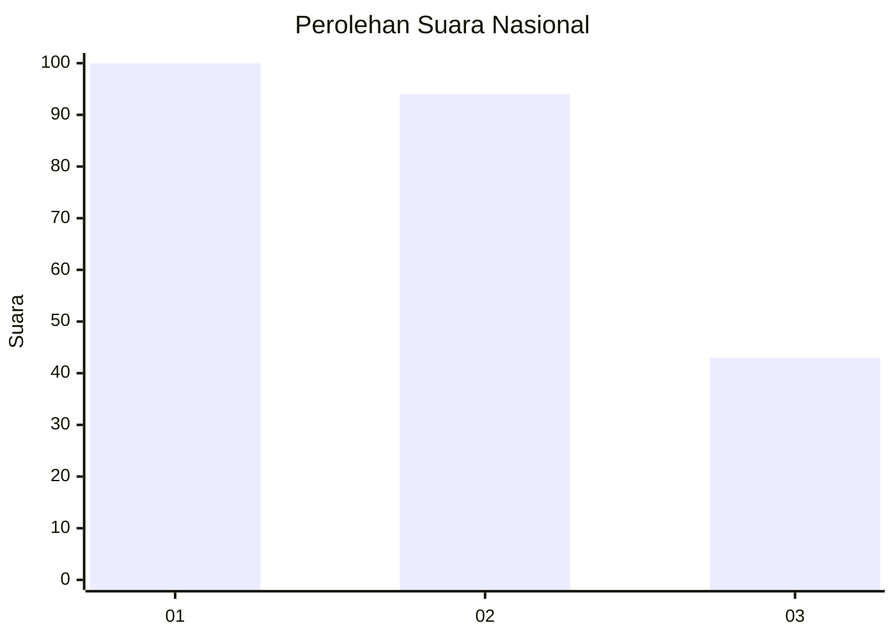
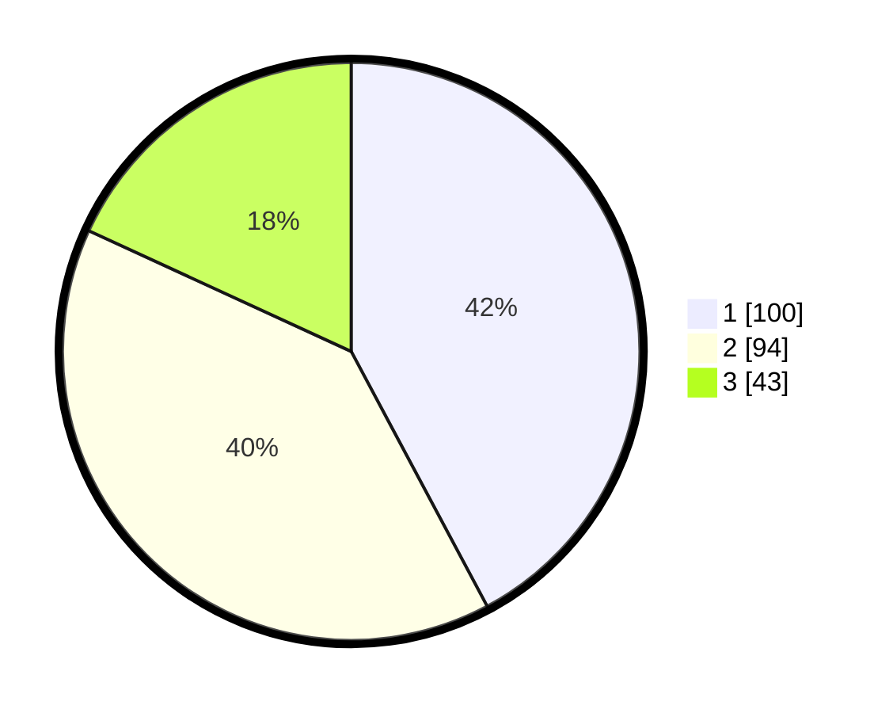

# Hasil

## Grafik

## Tabel

| No. | Nama Paslon    | Suara | Suara (raw) | Persentase |
|:--- |:-------------- | -----:| -----------:| ----------:|
| 1   | ANIES MUHAIMIN | 100   | [100][p-1]  | 42,19      |
| 2   | PRABOWO GIBRAN | 94    | [94][p-2]   | 39,66      |
| 3   | GANJAR MAHFUD  | 43    | [43][p-3]   | 18,14      |

[p-1]: https://github.com/gigit-pemilu/pemilu-2024/blob/main/pilpres/hitung-suara/sub/31-dki-jakarta/sub/74-jakarta-selatan/sub/07-kebayoran-baru/sub/1009-gandaria-utara/sub/005-tps/sub/paslon-1.txt
[p-2]: https://github.com/gigit-pemilu/pemilu-2024/blob/main/pilpres/hitung-suara/sub/31-dki-jakarta/sub/74-jakarta-selatan/sub/07-kebayoran-baru/sub/1009-gandaria-utara/sub/005-tps/sub/paslon-2.txt
[p-3]: https://github.com/gigit-pemilu/pemilu-2024/blob/main/pilpres/hitung-suara/sub/31-dki-jakarta/sub/74-jakarta-selatan/sub/07-kebayoran-baru/sub/1009-gandaria-utara/sub/005-tps/sub/paslon-3.txt

## Foto C Plano

https://sirekap-obj-formc.kpu.go.id/f957/pemilu/ppwp/31/74/07/10/09/3174071009005-20240217-095933--18f67b90-507c-48ba-a6e9-0feb58041147.jpg

https://sirekap-obj-formc.kpu.go.id/f957/pemilu/ppwp/31/74/07/10/09/3174071009005-20240217-100019--df5cbf4b-4438-4e85-9ec0-440f91415a09.jpg

https://sirekap-obj-formc.kpu.go.id/f957/pemilu/ppwp/31/74/07/10/09/3174071009005-20240217-100046--d4b00596-db46-4172-8bfa-f522a74dd281.jpg

## Metadata

| Key        | Value               |
| ---------- | ------------------- |
| Time Stamp | 2024-02-17 19:00:04 |

## DATA PEMILIH TETAP

Jumlah pemilih dalam DPT: **268**.
 * L: **555**.
 * P: **37**.

## DATA PENGGUNA HAK PILIH

Jumlah pengguna hak pilih dalam DPT: **555**.
 * L: **333**.
 * P: **555**.

Jumlah pengguna hak pilih dalam DPTb: **555**.
 * L: **355**.
 * P: **555**.

Jumlah pengguna hak pilih dalam DPK: **555**.
 * L: **555**.
 * P: **555**.

Jumlah pengguna hak pilih: **555**.
 * L: **605**.
 * P: **455**.

## JUMLAH SUARA SAH DAN TIDAK SAH

JUMLAH SELURUH SUARA SAH: **237**.

JUMLAH SUARA TIDAK SAH: **1**.

JUMLAH SELURUH SUARA SAH DAN SUARA TIDAK SAH: **238**.

