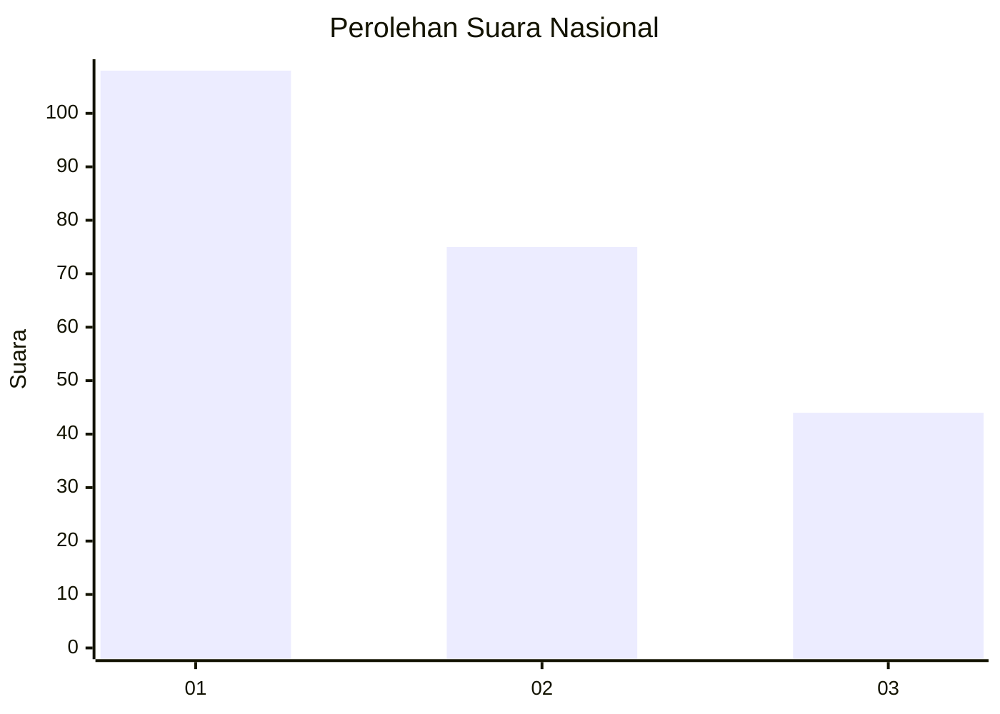
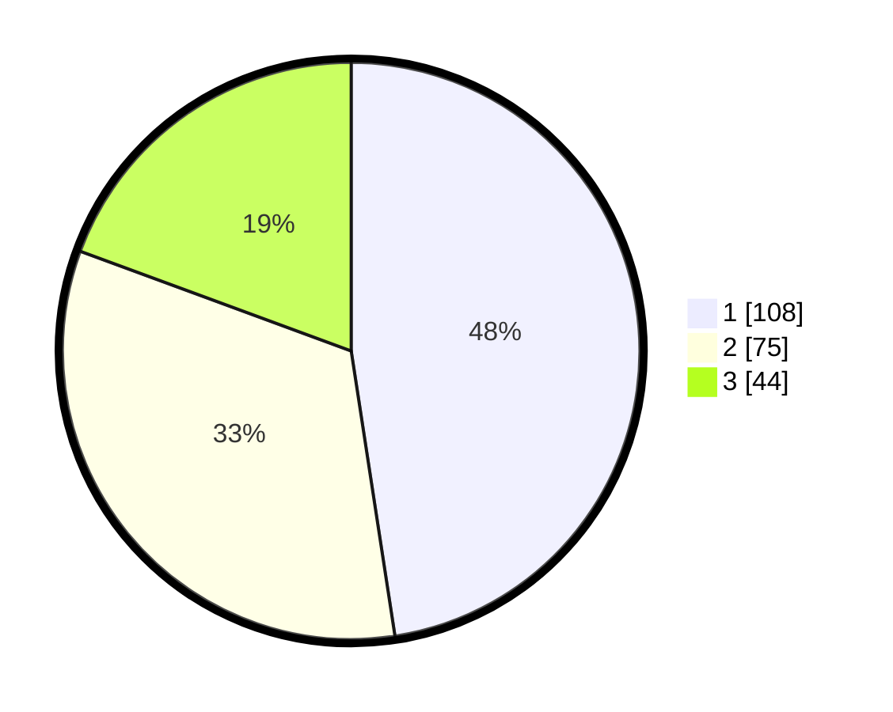

# Hasil

## Grafik

## Tabel

| No.    | Nama Paslon    | Suara | Suara (raw) | Persentase |
|:------ |:-------------- | -----:| -----------:| ----------:|
| 100025 | ANIES MUHAIMIN | 108   | [108][p-1]  | 47,58      |
| 100026 | PRABOWO GIBRAN | 75    | [75][p-2]   | 33,04      |
| 100027 | GANJAR MAHFUD  | 44    | [44][p-3]   | 19,38      |

[p-1]: https://github.com/gigit-pemilu/pemilu-2024/blob/main/pilpres/hitung-suara/sub/31-dki-jakarta/sub/74-jakarta-selatan/sub/07-kebayoran-baru/sub/1009-gandaria-utara/sub/012-tps/sub/paslon-1.txt
[p-2]: https://github.com/gigit-pemilu/pemilu-2024/blob/main/pilpres/hitung-suara/sub/31-dki-jakarta/sub/74-jakarta-selatan/sub/07-kebayoran-baru/sub/1009-gandaria-utara/sub/012-tps/sub/paslon-2.txt
[p-3]: https://github.com/gigit-pemilu/pemilu-2024/blob/main/pilpres/hitung-suara/sub/31-dki-jakarta/sub/74-jakarta-selatan/sub/07-kebayoran-baru/sub/1009-gandaria-utara/sub/012-tps/sub/paslon-3.txt

## Foto C Plano

https://sirekap-obj-formc.kpu.go.id/6a5f/pemilu/ppwp/31/74/07/10/09/3174071009012-20240217-144718--9b5936ef-a608-478c-8d52-90bf8a9d89f3.jpg

https://sirekap-obj-formc.kpu.go.id/6a5f/pemilu/ppwp/31/74/07/10/09/3174071009012-20240217-144848--d06a0285-f3f0-46b0-b708-1149d40b356c.jpg

https://sirekap-obj-formc.kpu.go.id/6a5f/pemilu/ppwp/31/74/07/10/09/3174071009012-20240217-145000--bdc63721-fbb0-4f8c-a930-4cf133ec7750.jpg

## Metadata

| Key        | Value               |
| ---------- | ------------------- |
| Time Stamp | 2024-02-17 19:00:04 |

## DATA PEMILIH TETAP

Jumlah pemilih dalam DPT: **228**.
 * L: **422**.
 * P: **50**.

## DATA PENGGUNA HAK PILIH

Jumlah pengguna hak pilih dalam DPT: **526**.
 * L: **596**.
 * P: **725**.

Jumlah pengguna hak pilih dalam DPTb: **888**.
 * L: **826**.
 * P: **882**.

Jumlah pengguna hak pilih dalam DPK: **880**.
 * L: **880**.
 * P: **888**.

Jumlah pengguna hak pilih: **239**.
 * L: **403**.
 * P: **328**.

## JUMLAH SUARA SAH DAN TIDAK SAH

JUMLAH SELURUH SUARA SAH: **227**.

JUMLAH SUARA TIDAK SAH: **3**.

JUMLAH SELURUH SUARA SAH DAN SUARA TIDAK SAH: **230**.

