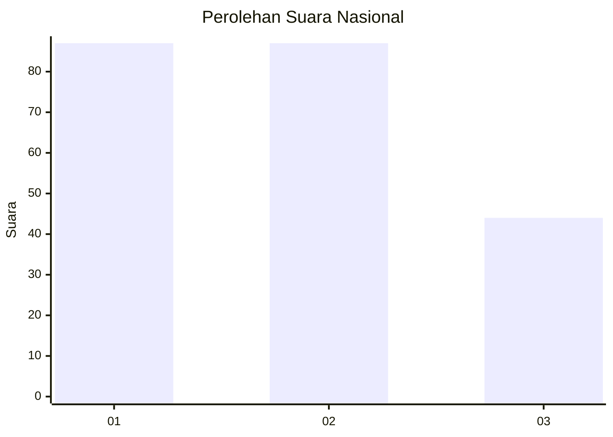
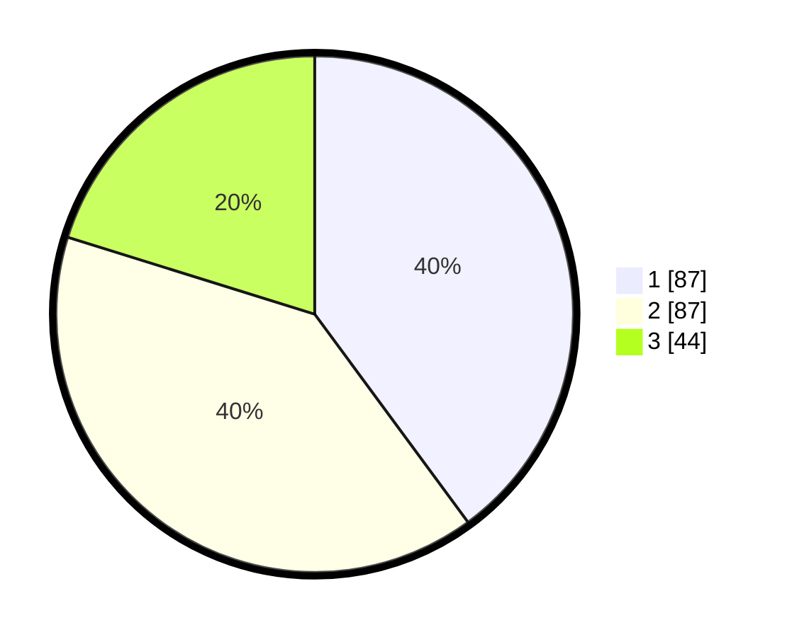

# Hasil

## Grafik

## Tabel

| No.    | Nama Paslon    | Suara | Suara (raw) | Persentase |
|:------ |:-------------- | -----:| -----------:| ----------:|
| 100025 | ANIES MUHAIMIN | 87    | [87][p-1]   | 39,91      |
| 100026 | PRABOWO GIBRAN | 87    | [87][p-2]   | 39,91      |
| 100027 | GANJAR MAHFUD  | 44    | [44][p-3]   | 20,18      |

[p-1]: https://github.com/gigit-pemilu/pemilu-2024/blob/main/pilpres/hitung-suara/sub/31-dki-jakarta/sub/74-jakarta-selatan/sub/07-kebayoran-baru/sub/1009-gandaria-utara/sub/013-tps/sub/paslon-1.txt
[p-2]: https://github.com/gigit-pemilu/pemilu-2024/blob/main/pilpres/hitung-suara/sub/31-dki-jakarta/sub/74-jakarta-selatan/sub/07-kebayoran-baru/sub/1009-gandaria-utara/sub/013-tps/sub/paslon-2.txt
[p-3]: https://github.com/gigit-pemilu/pemilu-2024/blob/main/pilpres/hitung-suara/sub/31-dki-jakarta/sub/74-jakarta-selatan/sub/07-kebayoran-baru/sub/1009-gandaria-utara/sub/013-tps/sub/paslon-3.txt

## Foto C Plano

https://sirekap-obj-formc.kpu.go.id/ca6e/pemilu/ppwp/31/74/07/10/09/3174071009013-20240217-152011--a28e3753-5905-46c4-8627-db818a1321f7.jpg

https://sirekap-obj-formc.kpu.go.id/ca6e/pemilu/ppwp/31/74/07/10/09/3174071009013-20240217-152031--003c9f36-32f3-4703-a382-33024368102e.jpg

https://sirekap-obj-formc.kpu.go.id/ca6e/pemilu/ppwp/31/74/07/10/09/3174071009013-20240217-152051--446d28cb-0dea-4be9-a6e5-cbd421caf8f0.jpg

## Metadata

| Key        | Value               |
| ---------- | ------------------- |
| Time Stamp | 2024-02-17 19:00:04 |

## DATA PEMILIH TETAP

Jumlah pemilih dalam DPT: **255**.
 * L: **846**.
 * P: **420**.

## DATA PENGGUNA HAK PILIH

Jumlah pengguna hak pilih dalam DPT: **203**.
 * L: **200**.
 * P: **802**.

Jumlah pengguna hak pilih dalam DPTb: **2**.
 * L: **86**.
 * P: **80**.

Jumlah pengguna hak pilih dalam DPK: **88**.
 * L: **888**.
 * P: **888**.

Jumlah pengguna hak pilih: **220**.
 * L: **667**.
 * P: **803**.

## JUMLAH SUARA SAH DAN TIDAK SAH

JUMLAH SELURUH SUARA SAH: **218**.

JUMLAH SUARA TIDAK SAH: **2**.

JUMLAH SELURUH SUARA SAH DAN SUARA TIDAK SAH: **220**.

