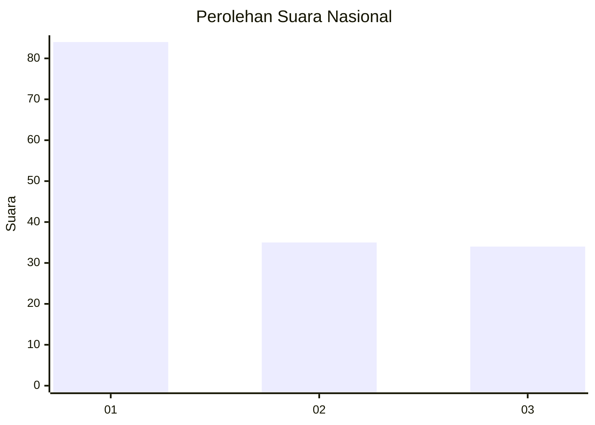
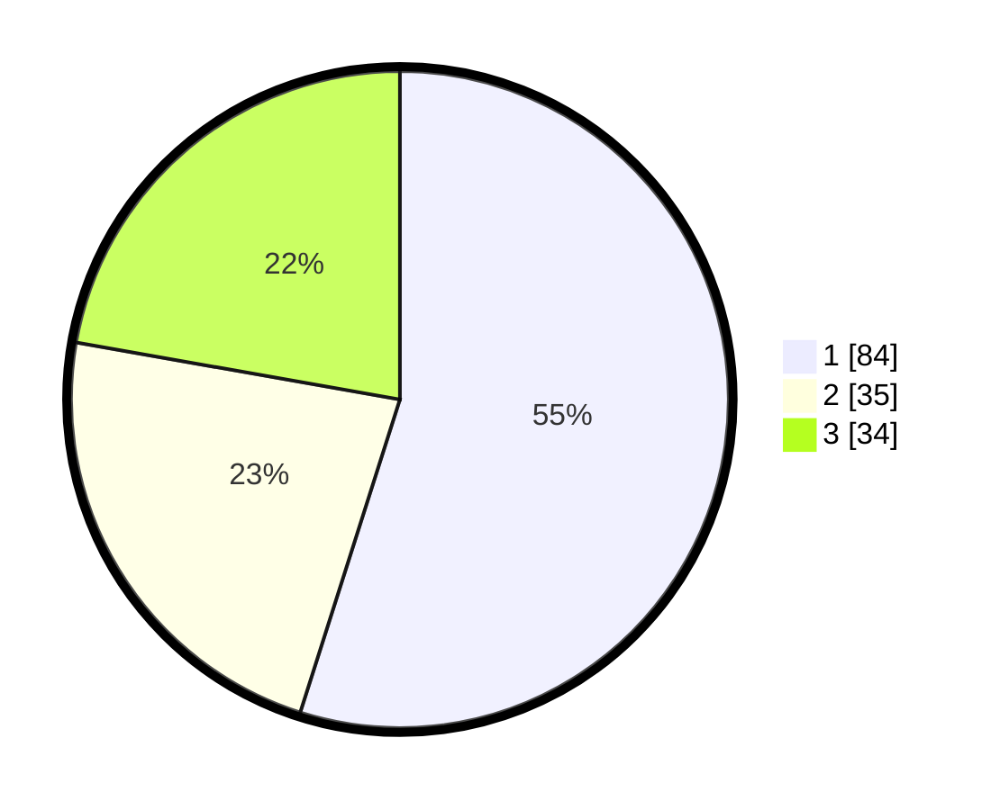

# Hasil

## Grafik

## Tabel

| No. | Nama Paslon    | Suara | Suara (raw) | Persentase |
|:--- |:-------------- | -----:| -----------:| ----------:|
| 1   | ANIES MUHAIMIN | 84    | [84][p-1]   | 54,90      |
| 2   | PRABOWO GIBRAN | 35    | [35][p-2]   | 22,88      |
| 3   | GANJAR MAHFUD  | 34    | [34][p-3]   | 22,22      |

[p-1]: https://github.com/gigit-pemilu/pemilu-2024/blob/main/pilpres/hitung-suara/sub/31-dki-jakarta/sub/74-jakarta-selatan/sub/07-kebayoran-baru/sub/1009-gandaria-utara/sub/018-tps/sub/paslon-1.txt
[p-2]: https://github.com/gigit-pemilu/pemilu-2024/blob/main/pilpres/hitung-suara/sub/31-dki-jakarta/sub/74-jakarta-selatan/sub/07-kebayoran-baru/sub/1009-gandaria-utara/sub/018-tps/sub/paslon-2.txt
[p-3]: https://github.com/gigit-pemilu/pemilu-2024/blob/main/pilpres/hitung-suara/sub/31-dki-jakarta/sub/74-jakarta-selatan/sub/07-kebayoran-baru/sub/1009-gandaria-utara/sub/018-tps/sub/paslon-3.txt

## Foto C Plano

https://sirekap-obj-formc.kpu.go.id/c1fb/pemilu/ppwp/31/74/07/10/09/3174071009018-20240218-112103--504fe42b-b2d8-4bf1-8a28-2188a4abc753.jpg

https://sirekap-obj-formc.kpu.go.id/c1fb/pemilu/ppwp/31/74/07/10/09/3174071009018-20240218-112147--517fcf2c-873f-492a-849b-e1e3c88be499.jpg

https://sirekap-obj-formc.kpu.go.id/c1fb/pemilu/ppwp/31/74/07/10/09/3174071009018-20240218-112136--745800a6-3b04-4589-9974-addd471f12cb.jpg

## Metadata

| Key        | Value               |
| ---------- | ------------------- |
| Time Stamp | 2024-02-19 06:16:00 |

## DATA PEMILIH TETAP

Jumlah pemilih dalam DPT: **46**.
 * L: **865**.
 * P: **876**.

## DATA PENGGUNA HAK PILIH

Jumlah pengguna hak pilih dalam DPT: **899**.
 * L: **54**.
 * P: **826**.

Jumlah pengguna hak pilih dalam DPTb: **888**.
 * L: **883**.
 * P: **885**.

Jumlah pengguna hak pilih dalam DPK: **885**.
 * L: **882**.
 * P: **883**.

Jumlah pengguna hak pilih: **893**.
 * L: **849**.
 * P: **854**.

## JUMLAH SUARA SAH DAN TIDAK SAH

JUMLAH SELURUH SUARA SAH: **803**.

JUMLAH SUARA TIDAK SAH: **888**.

JUMLAH SELURUH SUARA SAH DAN SUARA TIDAK SAH: **203**.

