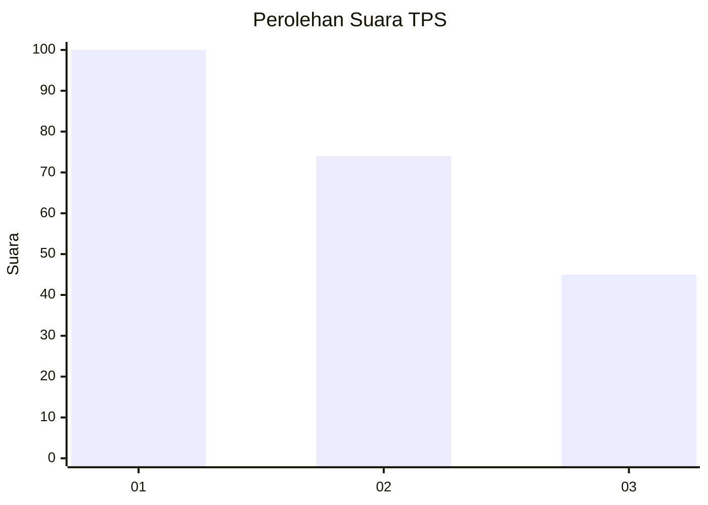
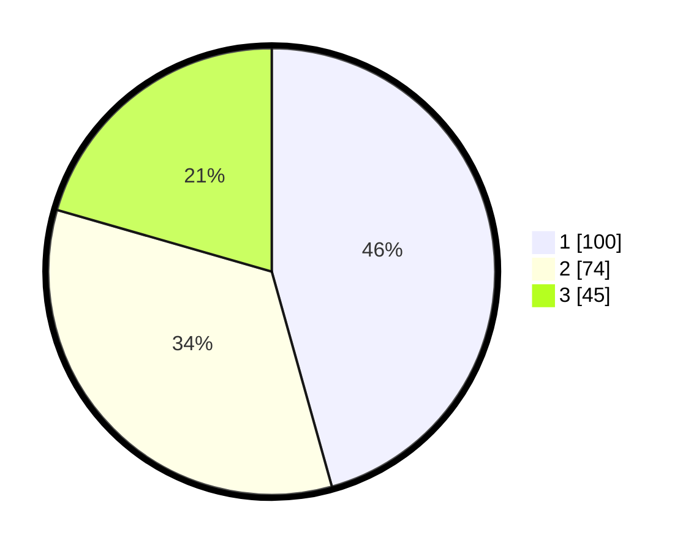

# Hasil

## Grafik

## Tabel

| No. | Nama Paslon    | Suara | Suara (raw) | Persentase |
|:--- |:-------------- | -----:| -----------:| ----------:|
| 1   | ANIES MUHAIMIN | 100   | [100][p-1]  | 45,66      |
| 2   | PRABOWO GIBRAN | 74    | [74][p-2]   | 33,79      |
| 3   | GANJAR MAHFUD  | 45    | [45][p-3]   | 20,55      |

[p-1]: https://github.com/gigit-pemilu/pemilu-2024-31-dki-jakarta/blob/main/pilpres/hitung-suara/sub/31-dki-jakarta/sub/74-jakarta-selatan/sub/07-kebayoran-baru/sub/1009-gandaria-utara/sub/029-tps/sub/paslon-1.txt
[p-2]: https://github.com/gigit-pemilu/pemilu-2024-31-dki-jakarta/blob/main/pilpres/hitung-suara/sub/31-dki-jakarta/sub/74-jakarta-selatan/sub/07-kebayoran-baru/sub/1009-gandaria-utara/sub/029-tps/sub/paslon-2.txt
[p-3]: https://github.com/gigit-pemilu/pemilu-2024-31-dki-jakarta/blob/main/pilpres/hitung-suara/sub/31-dki-jakarta/sub/74-jakarta-selatan/sub/07-kebayoran-baru/sub/1009-gandaria-utara/sub/029-tps/sub/paslon-3.txt

## Foto C Plano

https://sirekap-obj-formc.kpu.go.id/1207/pemilu/ppwp/31/74/07/10/09/3174071009029-20240218-203728--71927374-ead1-4217-811f-aee2391211e1.jpg

https://sirekap-obj-formc.kpu.go.id/1207/pemilu/ppwp/31/74/07/10/09/3174071009029-20240218-203807--478a69c1-e445-4334-bc47-2513eb48439e.jpg

https://sirekap-obj-formc.kpu.go.id/1207/pemilu/ppwp/31/74/07/10/09/3174071009029-20240218-203824--6e2b0439-9942-4e2f-80bc-d6fcf63f7e60.jpg

## Metadata

| Key        | Value               |
| ---------- | ------------------- |
| Time Stamp | 2024-02-19 15:00:00 |

## DATA PEMILIH TETAP

Jumlah pemilih dalam DPT: **366**.
 * L: **233**.
 * P: **233**.

## DATA PENGGUNA HAK PILIH

Jumlah pengguna hak pilih dalam DPT: **543**.
 * L: **599**.
 * P: **503**.

Jumlah pengguna hak pilih dalam DPTb: **885**.
 * L: **885**.
 * P: **888**.

Jumlah pengguna hak pilih dalam DPK: **884**.
 * L: **882**.
 * P: **888**.

Jumlah pengguna hak pilih: **222**.
 * L: **8**.
 * P: **435**.

## JUMLAH SUARA SAH DAN TIDAK SAH

JUMLAH SELURUH SUARA SAH: **219**.

JUMLAH SUARA TIDAK SAH: **3**.

JUMLAH SELURUH SUARA SAH DAN SUARA TIDAK SAH: **222**.

