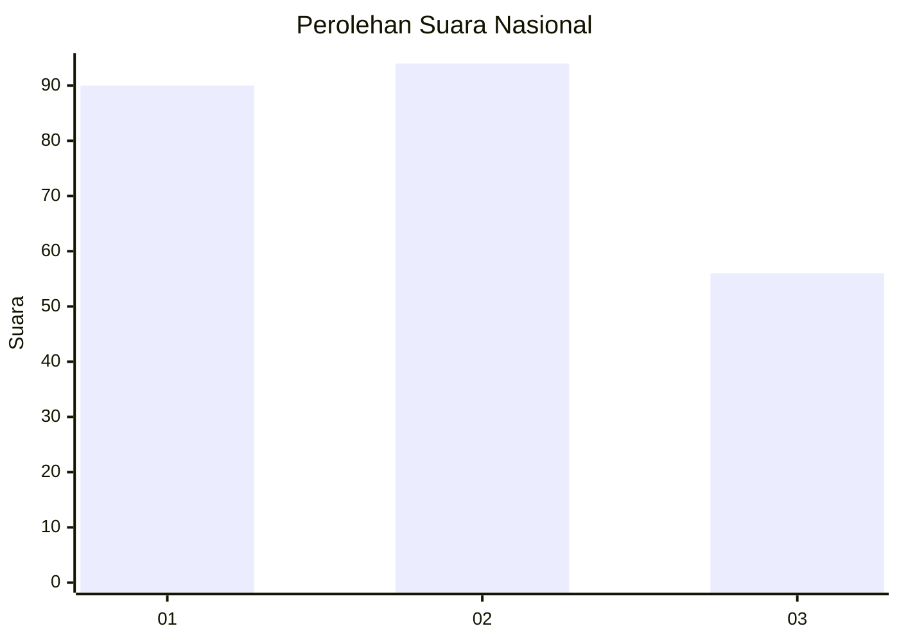
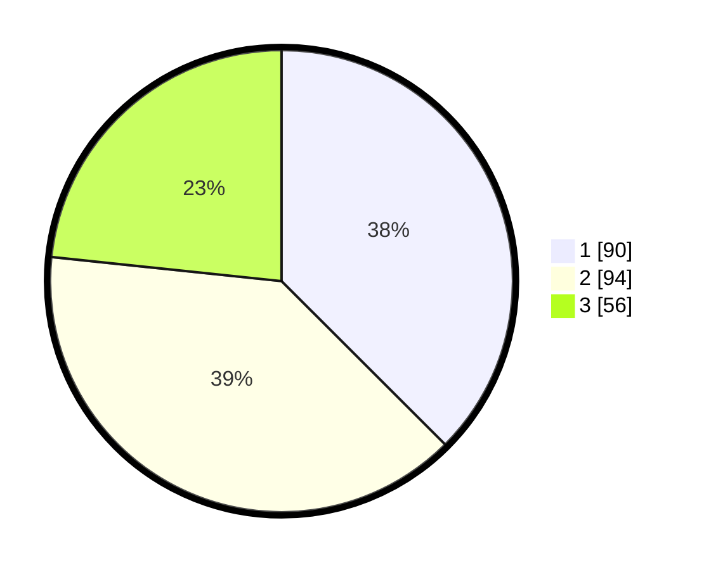

# Hasil

## Grafik

## Tabel

| No.    | Nama Paslon    | Suara | Suara (raw) | Persentase |
|:------ |:-------------- | -----:| -----------:| ----------:|
| 100025 | ANIES MUHAIMIN | 90    | [90][p-1]   | 37,50      |
| 100026 | PRABOWO GIBRAN | 94    | [94][p-2]   | 39,17      |
| 100027 | GANJAR MAHFUD  | 56    | [56][p-3]   | 23,33      |

[p-1]: https://github.com/gigit-pemilu/pemilu-2024/blob/main/pilpres/hitung-suara/sub/31-dki-jakarta/sub/74-jakarta-selatan/sub/07-kebayoran-baru/sub/1009-gandaria-utara/sub/031-tps/sub/paslon-1.txt
[p-2]: https://github.com/gigit-pemilu/pemilu-2024/blob/main/pilpres/hitung-suara/sub/31-dki-jakarta/sub/74-jakarta-selatan/sub/07-kebayoran-baru/sub/1009-gandaria-utara/sub/031-tps/sub/paslon-2.txt
[p-3]: https://github.com/gigit-pemilu/pemilu-2024/blob/main/pilpres/hitung-suara/sub/31-dki-jakarta/sub/74-jakarta-selatan/sub/07-kebayoran-baru/sub/1009-gandaria-utara/sub/031-tps/sub/paslon-3.txt

## Foto C Plano

https://sirekap-obj-formc.kpu.go.id/f62e/pemilu/ppwp/31/74/07/10/09/3174071009031-20240219-131403--521d1e9f-1b98-4e47-bbf1-4b39b20943d9.jpg

https://sirekap-obj-formc.kpu.go.id/f62e/pemilu/ppwp/31/74/07/10/09/3174071009031-20240219-131445--902795ed-4ea5-4a54-b527-da75a93cb4ef.jpg

https://sirekap-obj-formc.kpu.go.id/f62e/pemilu/ppwp/31/74/07/10/09/3174071009031-20240219-131514--24d40dd4-7781-4468-bb65-b755a0dc2d89.jpg

## Metadata

| Key        | Value               |
| ---------- | ------------------- |
| Time Stamp | 2024-02-19 14:00:00 |

## DATA PEMILIH TETAP

Jumlah pemilih dalam DPT: **278**.
 * L: **442**.
 * P: **536**.

## DATA PENGGUNA HAK PILIH

Jumlah pengguna hak pilih dalam DPT: **232**.
 * L: **525**.
 * P: **487**.

Jumlah pengguna hak pilih dalam DPTb: **885**.
 * L: **882**.
 * P: **883**.

Jumlah pengguna hak pilih dalam DPK: **804**.
 * L: **882**.
 * P: **803**.

Jumlah pengguna hak pilih: **248**.
 * L: **428**.
 * P: **423**.

## JUMLAH SUARA SAH DAN TIDAK SAH

JUMLAH SELURUH SUARA SAH: **249**.

JUMLAH SUARA TIDAK SAH: **4**.

JUMLAH SELURUH SUARA SAH DAN SUARA TIDAK SAH: **246**.

