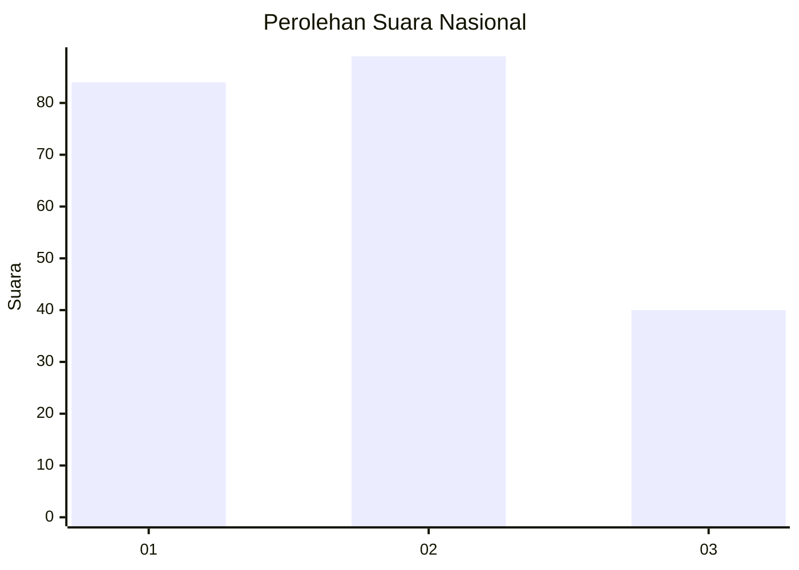
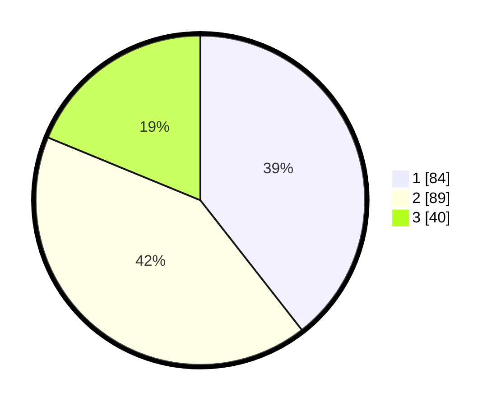

# Hasil

## Grafik

## Tabel

| No.    | Nama Paslon    | Suara | Suara (raw) | Persentase |
|:------ |:-------------- | -----:| -----------:| ----------:|
| 100025 | ANIES MUHAIMIN | 84    | [84][p-1]   | 39,44      |
| 100026 | PRABOWO GIBRAN | 89    | [89][p-2]   | 41,78      |
| 100027 | GANJAR MAHFUD  | 40    | [40][p-3]   | 18,78      |

[p-1]: https://github.com/gigit-pemilu/pemilu-2024/blob/main/pilpres/hitung-suara/sub/31-dki-jakarta/sub/74-jakarta-selatan/sub/07-kebayoran-baru/sub/1009-gandaria-utara/sub/032-tps/sub/paslon-1.txt
[p-2]: https://github.com/gigit-pemilu/pemilu-2024/blob/main/pilpres/hitung-suara/sub/31-dki-jakarta/sub/74-jakarta-selatan/sub/07-kebayoran-baru/sub/1009-gandaria-utara/sub/032-tps/sub/paslon-2.txt
[p-3]: https://github.com/gigit-pemilu/pemilu-2024/blob/main/pilpres/hitung-suara/sub/31-dki-jakarta/sub/74-jakarta-selatan/sub/07-kebayoran-baru/sub/1009-gandaria-utara/sub/032-tps/sub/paslon-3.txt

## Foto C Plano

https://sirekap-obj-formc.kpu.go.id/d40b/pemilu/ppwp/31/74/07/10/09/3174071009032-20240219-144041--4ac60c07-d246-4e78-a266-838a64f58c44.jpg

https://sirekap-obj-formc.kpu.go.id/d40b/pemilu/ppwp/31/74/07/10/09/3174071009032-20240219-144103--c32c4500-2904-404d-bdb8-9edfa52c5f25.jpg

https://sirekap-obj-formc.kpu.go.id/d40b/pemilu/ppwp/31/74/07/10/09/3174071009032-20240219-144125--471a9d94-16e4-42da-a511-22c208b44af1.jpg

## Metadata

| Key        | Value               |
| ---------- | ------------------- |
| Time Stamp | 2024-02-19 15:00:00 |

## DATA PEMILIH TETAP

Jumlah pemilih dalam DPT: **252**.
 * L: **894**.
 * P: **453**.

## DATA PENGGUNA HAK PILIH

Jumlah pengguna hak pilih dalam DPT: **248**.
 * L: **884**.
 * P: **455**.

Jumlah pengguna hak pilih dalam DPTb: **884**.
 * L: **889**.
 * P: **888**.

Jumlah pengguna hak pilih dalam DPK: **888**.
 * L: **883**.
 * P: **883**.

Jumlah pengguna hak pilih: **339**.
 * L: **899**.
 * P: **235**.

## JUMLAH SUARA SAH DAN TIDAK SAH

JUMLAH SELURUH SUARA SAH: **258**.

JUMLAH SUARA TIDAK SAH: **827**.

JUMLAH SELURUH SUARA SAH DAN SUARA TIDAK SAH: **249**.

