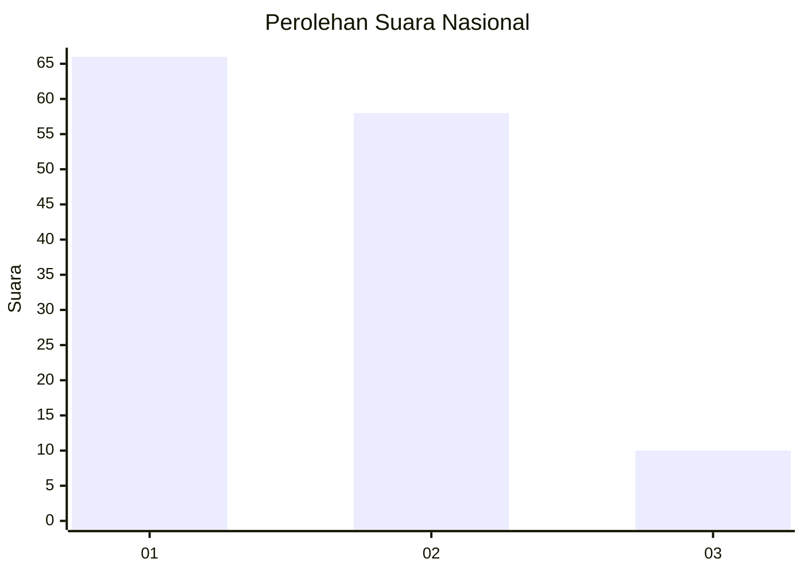
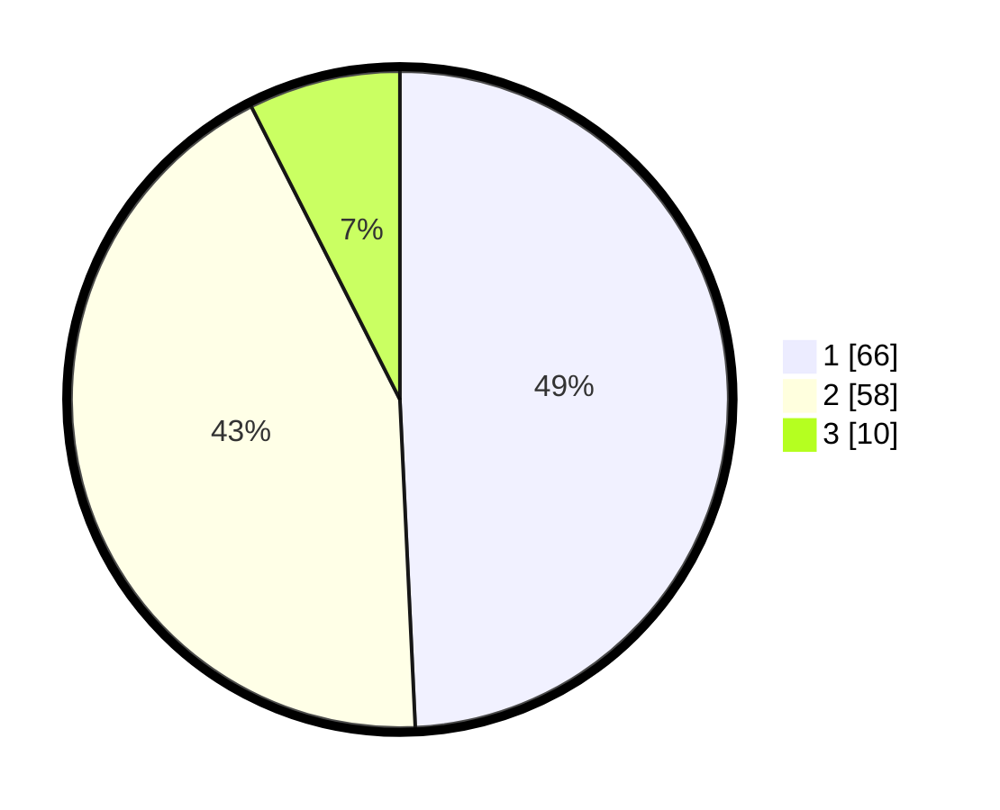

# Hasil

## Grafik

## Tabel

| No.    | Nama Paslon    | Suara | Suara (raw) | Persentase |
|:------ |:-------------- | -----:| -----------:| ----------:|
| 100025 | ANIES MUHAIMIN | 66    | [66][p-1]   | 49,25      |
| 100026 | PRABOWO GIBRAN | 58    | [58][p-2]   | 43,28      |
| 100027 | GANJAR MAHFUD  | 10    | [10][p-3]   | 7,46       |

[p-1]: https://github.com/gigit-pemilu/pemilu-2024/blob/main/pilpres/hitung-suara/sub/31-dki-jakarta/sub/74-jakarta-selatan/sub/07-kebayoran-baru/sub/1009-gandaria-utara/sub/034-tps/sub/paslon-1.txt
[p-2]: https://github.com/gigit-pemilu/pemilu-2024/blob/main/pilpres/hitung-suara/sub/31-dki-jakarta/sub/74-jakarta-selatan/sub/07-kebayoran-baru/sub/1009-gandaria-utara/sub/034-tps/sub/paslon-2.txt
[p-3]: https://github.com/gigit-pemilu/pemilu-2024/blob/main/pilpres/hitung-suara/sub/31-dki-jakarta/sub/74-jakarta-selatan/sub/07-kebayoran-baru/sub/1009-gandaria-utara/sub/034-tps/sub/paslon-3.txt

## Foto C Plano

https://sirekap-obj-formc.kpu.go.id/288c/pemilu/ppwp/31/74/07/10/09/3174071009034-20240219-161744--eb00423e-3e2a-4f71-be10-da00bdbbf176.jpg

https://sirekap-obj-formc.kpu.go.id/288c/pemilu/ppwp/31/74/07/10/09/3174071009034-20240219-161904--b700a351-5c99-4f43-ba6d-04776abb38c3.jpg

https://sirekap-obj-formc.kpu.go.id/288c/pemilu/ppwp/31/74/07/10/09/3174071009034-20240219-161835--a2531554-ec9c-456d-9753-8abb75a9bff2.jpg

## Metadata

| Key        | Value               |
| ---------- | ------------------- |
| Time Stamp | 2024-02-19 17:00:00 |

## DATA PEMILIH TETAP

Jumlah pemilih dalam DPT: **386**.
 * L: **309**.
 * P: **882**.

## DATA PENGGUNA HAK PILIH

Jumlah pengguna hak pilih dalam DPT: **5**.
 * L: **556**.
 * P: **656**.

Jumlah pengguna hak pilih dalam DPTb: **884**.
 * L: **882**.
 * P: **882**.

Jumlah pengguna hak pilih dalam DPK: **885**.
 * L: **882**.
 * P: **883**.

Jumlah pengguna hak pilih: **434**.
 * L: **824**.
 * P: **860**.

## JUMLAH SUARA SAH DAN TIDAK SAH

JUMLAH SELURUH SUARA SAH: **434**.

JUMLAH SUARA TIDAK SAH: **888**.

JUMLAH SELURUH SUARA SAH DAN SUARA TIDAK SAH: **888**.

