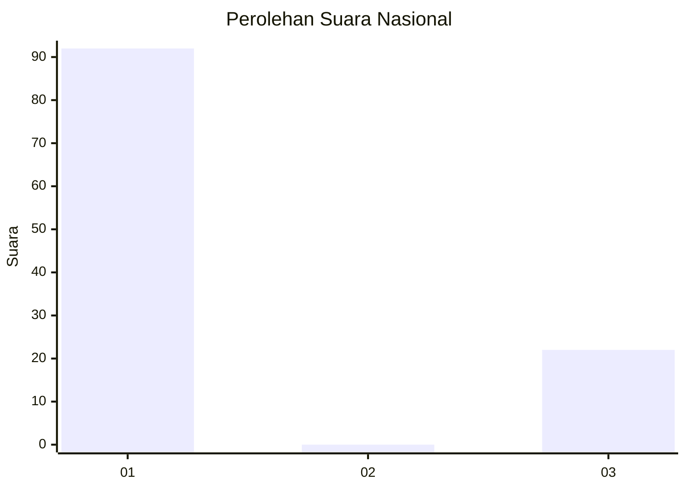
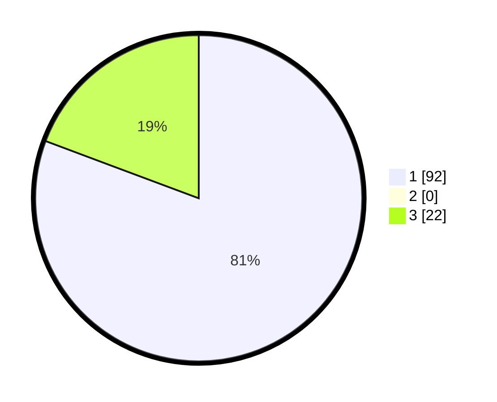

# Hasil

## Grafik

## Tabel

| No.    | Nama Paslon    | Suara | Suara (raw) | Persentase |
|:------ |:-------------- | -----:| -----------:| ----------:|
| 100025 | ANIES MUHAIMIN | 92    | [92][p-1]   | 80,70      |
| 100026 | PRABOWO GIBRAN | 0     | [0][p-2]    | 0,00       |
| 100027 | GANJAR MAHFUD  | 22    | [22][p-3]   | 19,30      |

[p-1]: https://github.com/gigit-pemilu/pemilu-2024/blob/main/pilpres/hitung-suara/sub/31-dki-jakarta/sub/74-jakarta-selatan/sub/07-kebayoran-baru/sub/1009-gandaria-utara/sub/037-tps/sub/paslon-1.txt
[p-2]: https://github.com/gigit-pemilu/pemilu-2024/blob/main/pilpres/hitung-suara/sub/31-dki-jakarta/sub/74-jakarta-selatan/sub/07-kebayoran-baru/sub/1009-gandaria-utara/sub/037-tps/sub/paslon-2.txt
[p-3]: https://github.com/gigit-pemilu/pemilu-2024/blob/main/pilpres/hitung-suara/sub/31-dki-jakarta/sub/74-jakarta-selatan/sub/07-kebayoran-baru/sub/1009-gandaria-utara/sub/037-tps/sub/paslon-3.txt

## Foto C Plano

https://sirekap-obj-formc.kpu.go.id/fc2b/pemilu/ppwp/31/74/07/10/09/3174071009037-20240219-175118--9fff1855-9058-42a7-a64e-7abad672e57c.jpg

https://sirekap-obj-formc.kpu.go.id/fc2b/pemilu/ppwp/31/74/07/10/09/3174071009037-20240219-175053--4bddf97c-fa70-445c-99dc-27c7645f7a03.jpg

https://sirekap-obj-formc.kpu.go.id/fc2b/pemilu/ppwp/31/74/07/10/09/3174071009037-20240219-175033--22d27198-57e2-4763-a601-c98e2acd082d.jpg

## Metadata

| Key        | Value               |
| ---------- | ------------------- |
| Time Stamp | 2024-02-19 18:00:00 |

## DATA PEMILIH TETAP

Jumlah pemilih dalam DPT: **226**.
 * L: **644**.
 * P: **32**.

## DATA PENGGUNA HAK PILIH

Jumlah pengguna hak pilih dalam DPT: **283**.
 * L: **564**.
 * P: **804**.

Jumlah pengguna hak pilih dalam DPTb: **880**.
 * L: **882**.
 * P: **889**.

Jumlah pengguna hak pilih dalam DPK: **883**.
 * L: **4**.
 * P: **882**.

Jumlah pengguna hak pilih: **226**.
 * L: **580**.
 * P: **485**.

## JUMLAH SUARA SAH DAN TIDAK SAH

JUMLAH SELURUH SUARA SAH: **224**.

JUMLAH SUARA TIDAK SAH: **802**.

JUMLAH SELURUH SUARA SAH DAN SUARA TIDAK SAH: **226**.

