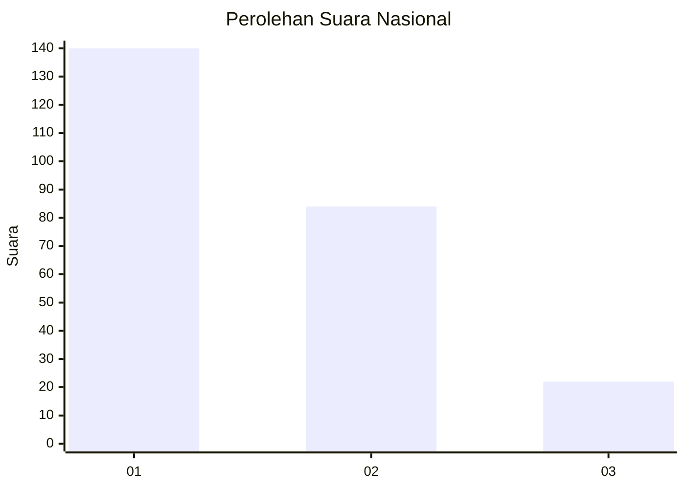
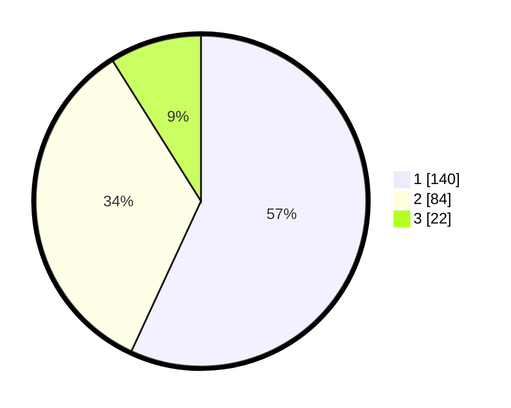

# Hasil

## Grafik

## Tabel

| No.    | Nama Paslon    | Suara | Suara (raw) | Persentase |
|:------ |:-------------- | -----:| -----------:| ----------:|
| 100025 | ANIES MUHAIMIN | 140   | [140][p-1]  | 56,91      |
| 100026 | PRABOWO GIBRAN | 84    | [84][p-2]   | 34,15      |
| 100027 | GANJAR MAHFUD  | 22    | [22][p-3]   | 8,94       |

[p-1]: https://github.com/gigit-pemilu/pemilu-2024/blob/main/pilpres/hitung-suara/sub/31-dki-jakarta/sub/74-jakarta-selatan/sub/07-kebayoran-baru/sub/1009-gandaria-utara/sub/039-tps/sub/paslon-1.txt
[p-2]: https://github.com/gigit-pemilu/pemilu-2024/blob/main/pilpres/hitung-suara/sub/31-dki-jakarta/sub/74-jakarta-selatan/sub/07-kebayoran-baru/sub/1009-gandaria-utara/sub/039-tps/sub/paslon-2.txt
[p-3]: https://github.com/gigit-pemilu/pemilu-2024/blob/main/pilpres/hitung-suara/sub/31-dki-jakarta/sub/74-jakarta-selatan/sub/07-kebayoran-baru/sub/1009-gandaria-utara/sub/039-tps/sub/paslon-3.txt

## Foto C Plano

https://sirekap-obj-formc.kpu.go.id/0956/pemilu/ppwp/31/74/07/10/09/3174071009039-20240219-183517--69f11323-d5a9-4ca4-a152-44f33e929b5f.jpg

https://sirekap-obj-formc.kpu.go.id/0956/pemilu/ppwp/31/74/07/10/09/3174071009039-20240219-183534--b16fe04c-9e09-4c4e-ade0-67ccc4bfed80.jpg

https://sirekap-obj-formc.kpu.go.id/0956/pemilu/ppwp/31/74/07/10/09/3174071009039-20240219-183654--e7925824-a213-4633-96fc-bc63f80adc47.jpg

## Metadata

| Key        | Value               |
| ---------- | ------------------- |
| Time Stamp | 2024-02-19 19:00:00 |

## DATA PEMILIH TETAP

Jumlah pemilih dalam DPT: **286**.
 * L: **425**.
 * P: **454**.

## DATA PENGGUNA HAK PILIH

Jumlah pengguna hak pilih dalam DPT: **235**.
 * L: **9**.
 * P: **22**.

Jumlah pengguna hak pilih dalam DPTb: **888**.
 * L: **82**.
 * P: **880**.

Jumlah pengguna hak pilih dalam DPK: **886**.
 * L: **883**.
 * P: **883**.

Jumlah pengguna hak pilih: **249**.
 * L: **669**.
 * P: **439**.

## JUMLAH SUARA SAH DAN TIDAK SAH

JUMLAH SELURUH SUARA SAH: **235**.

JUMLAH SUARA TIDAK SAH: **883**.

JUMLAH SELURUH SUARA SAH DAN SUARA TIDAK SAH: **229**.

