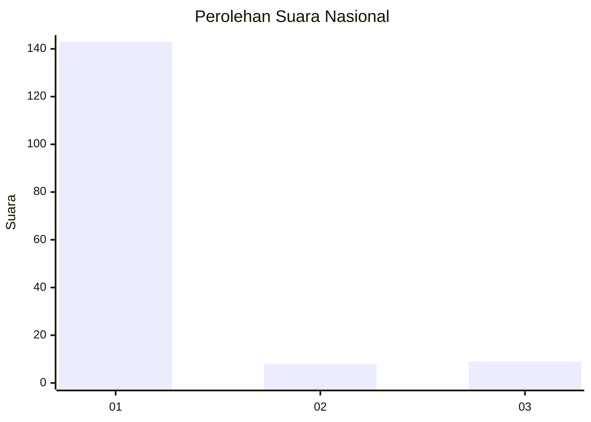
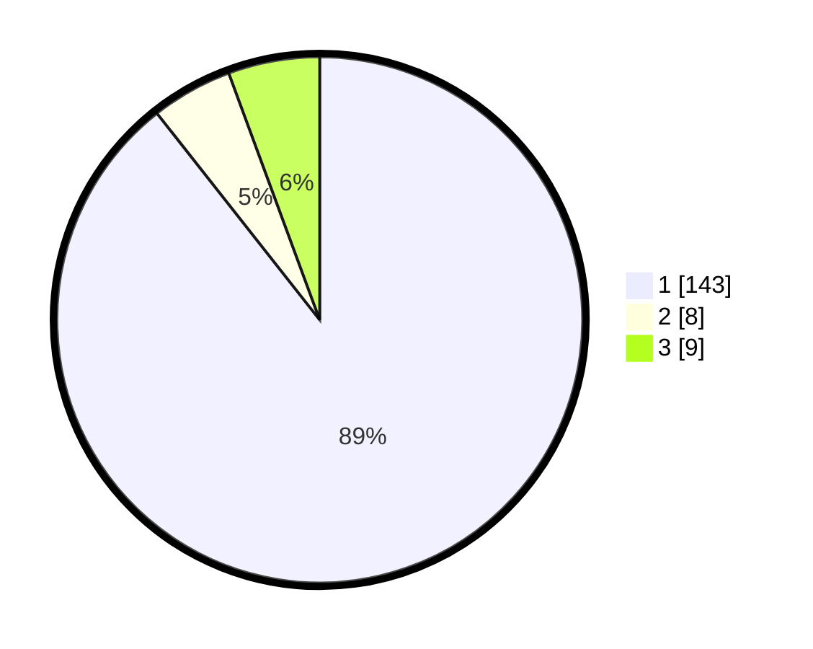

# Hasil

## Grafik

## Tabel

| No.    | Nama Paslon    | Suara | Suara (raw) | Persentase |
|:------ |:-------------- | -----:| -----------:| ----------:|
| 100025 | ANIES MUHAIMIN | 143   | [143][p-1]  | 89,38      |
| 100026 | PRABOWO GIBRAN | 8     | [8][p-2]    | 5,00       |
| 100027 | GANJAR MAHFUD  | 9     | [9][p-3]    | 5,63       |

[p-1]: https://github.com/gigit-pemilu/pemilu-2024/blob/main/pilpres/hitung-suara/sub/31-dki-jakarta/sub/74-jakarta-selatan/sub/07-kebayoran-baru/sub/1009-gandaria-utara/sub/040-tps/sub/paslon-1.txt
[p-2]: https://github.com/gigit-pemilu/pemilu-2024/blob/main/pilpres/hitung-suara/sub/31-dki-jakarta/sub/74-jakarta-selatan/sub/07-kebayoran-baru/sub/1009-gandaria-utara/sub/040-tps/sub/paslon-2.txt
[p-3]: https://github.com/gigit-pemilu/pemilu-2024/blob/main/pilpres/hitung-suara/sub/31-dki-jakarta/sub/74-jakarta-selatan/sub/07-kebayoran-baru/sub/1009-gandaria-utara/sub/040-tps/sub/paslon-3.txt

## Foto C Plano

https://sirekap-obj-formc.kpu.go.id/47b1/pemilu/ppwp/31/74/07/10/09/3174071009040-20240219-192930--ed97082d-2d4c-4277-8011-f8aeea0c2e72.jpg

https://sirekap-obj-formc.kpu.go.id/47b1/pemilu/ppwp/31/74/07/10/09/3174071009040-20240219-193006--828e10a7-5000-47a5-9c06-9b3a40a02438.jpg

https://sirekap-obj-formc.kpu.go.id/47b1/pemilu/ppwp/31/74/07/10/09/3174071009040-20240219-193026--72c257ab-de73-4fc3-b808-c911aee430f4.jpg

## Metadata

| Key        | Value               |
| ---------- | ------------------- |
| Time Stamp | 2024-02-19 20:00:00 |

## DATA PEMILIH TETAP

Jumlah pemilih dalam DPT: **275**.
 * L: **337**.
 * P: **538**.

## DATA PENGGUNA HAK PILIH

Jumlah pengguna hak pilih dalam DPT: **333**.
 * L: **828**.
 * P: **33**.

Jumlah pengguna hak pilih dalam DPTb: **883**.
 * L: **883**.
 * P: **888**.

Jumlah pengguna hak pilih dalam DPK: **882**.
 * L: **882**.
 * P: **888**.

Jumlah pengguna hak pilih: **234**.
 * L: **222**.
 * P: **22**.

## JUMLAH SUARA SAH DAN TIDAK SAH

JUMLAH SELURUH SUARA SAH: **234**.

JUMLAH SUARA TIDAK SAH: **883**.

JUMLAH SELURUH SUARA SAH DAN SUARA TIDAK SAH: **234**.

