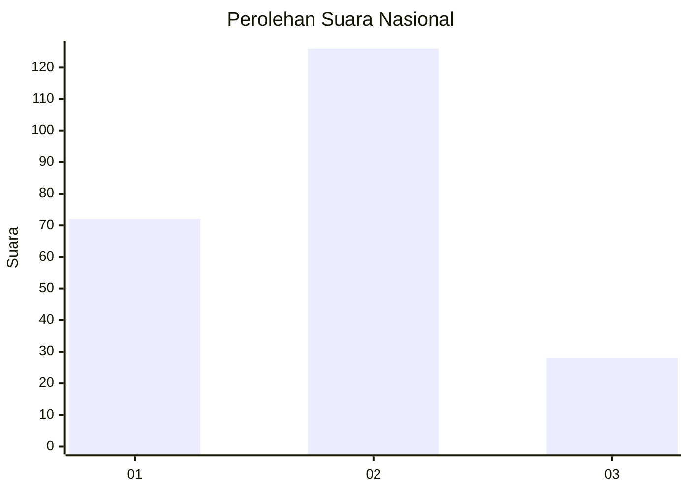
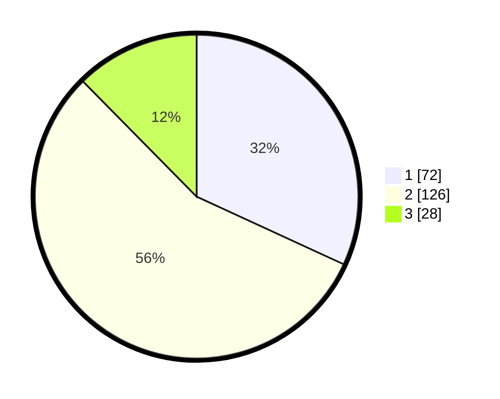

# Hasil

## Grafik

## Tabel

| No.    | Nama Paslon    | Suara | Suara (raw) | Persentase |
|:------ |:-------------- | -----:| -----------:| ----------:|
| 100025 | ANIES MUHAIMIN | 72    | [72][p-1]   | 31,86      |
| 100026 | PRABOWO GIBRAN | 126   | [126][p-2]  | 55,75      |
| 100027 | GANJAR MAHFUD  | 28    | [28][p-3]   | 12,39      |

[p-1]: https://github.com/gigit-pemilu/pemilu-2024/blob/main/pilpres/hitung-suara/sub/31-dki-jakarta/sub/74-jakarta-selatan/sub/07-kebayoran-baru/sub/1009-gandaria-utara/sub/106-tps/sub/paslon-1.txt
[p-2]: https://github.com/gigit-pemilu/pemilu-2024/blob/main/pilpres/hitung-suara/sub/31-dki-jakarta/sub/74-jakarta-selatan/sub/07-kebayoran-baru/sub/1009-gandaria-utara/sub/106-tps/sub/paslon-2.txt
[p-3]: https://github.com/gigit-pemilu/pemilu-2024/blob/main/pilpres/hitung-suara/sub/31-dki-jakarta/sub/74-jakarta-selatan/sub/07-kebayoran-baru/sub/1009-gandaria-utara/sub/106-tps/sub/paslon-3.txt

## Foto C Plano

https://sirekap-obj-formc.kpu.go.id/ca06/pemilu/ppwp/31/74/07/10/09/3174071009106-20240226-132212--2d1051d6-c504-46db-83c0-f5945e1c6991.jpg

https://sirekap-obj-formc.kpu.go.id/ca06/pemilu/ppwp/31/74/07/10/09/3174071009106-20240226-132239--310fee3b-c2a5-4610-b036-bd8d7b62a14a.jpg

https://sirekap-obj-formc.kpu.go.id/ca06/pemilu/ppwp/31/74/07/10/09/3174071009106-20240226-132305--2677190f-717c-4f32-9062-0884504c935c.jpg

## Metadata

| Key        | Value               |
| ---------- | ------------------- |
| Time Stamp | 2024-02-26 15:00:00 |

## DATA PEMILIH TETAP

Jumlah pemilih dalam DPT: **73**.
 * L: **145**.
 * P: **132**.

## DATA PENGGUNA HAK PILIH

Jumlah pengguna hak pilih dalam DPT: **212**.
 * L: **112**.
 * P: **199**.

Jumlah pengguna hak pilih dalam DPTb: **843**.
 * L: **703**.
 * P: **702**.

Jumlah pengguna hak pilih dalam DPK: **3**.
 * L: **72**.
 * P: **6**.

Jumlah pengguna hak pilih: **223**.
 * L: **112**.
 * P: **112**.

## JUMLAH SUARA SAH DAN TIDAK SAH

JUMLAH SELURUH SUARA SAH: **226**.

JUMLAH SUARA TIDAK SAH: **3**.

JUMLAH SELURUH SUARA SAH DAN SUARA TIDAK SAH: **229**.

