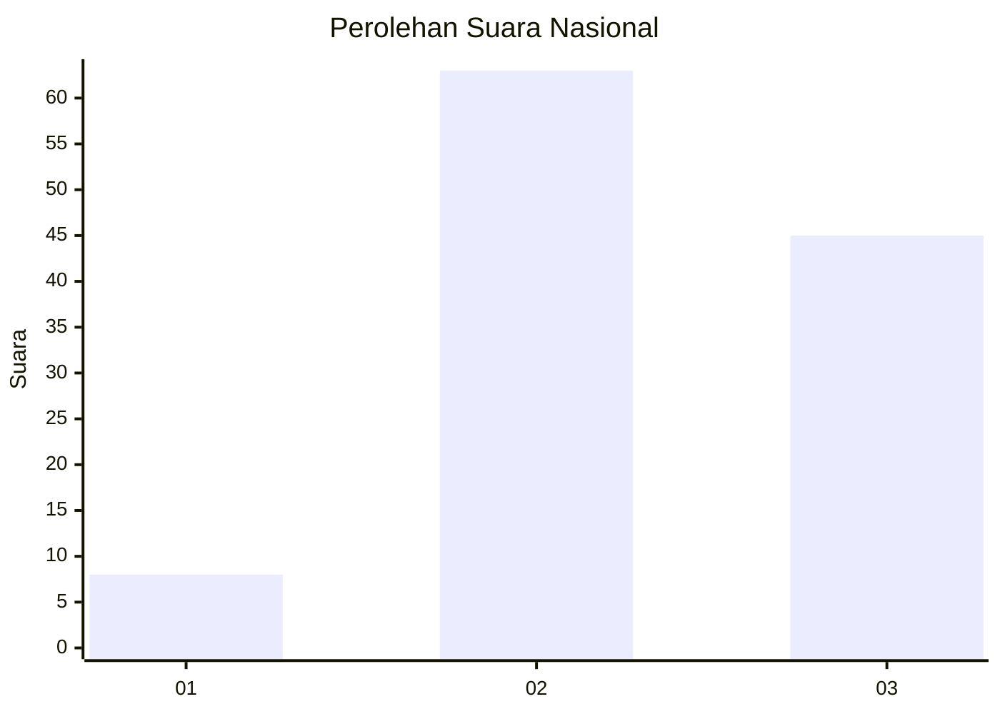
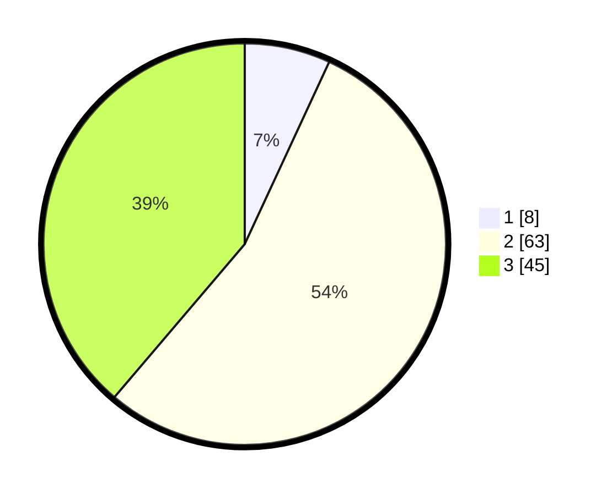

# Hasil

## Grafik

## Tabel

| No.    | Nama Paslon    | Suara | Suara (raw) | Persentase |
|:------ |:-------------- | -----:| -----------:| ----------:|
| 100025 | ANIES MUHAIMIN | 8     | [8][p-1]    | 6,90       |
| 100026 | PRABOWO GIBRAN | 63    | [63][p-2]   | 54,31      |
| 100027 | GANJAR MAHFUD  | 45    | [45][p-3]   | 38,79      |

[p-1]: https://github.com/gigit-pemilu/pemilu-2024/blob/main/pilpres/hitung-suara/sub/31-dki-jakarta/sub/74-jakarta-selatan/sub/07-kebayoran-baru/sub/1009-gandaria-utara/sub/114-tps/sub/paslon-1.txt
[p-2]: https://github.com/gigit-pemilu/pemilu-2024/blob/main/pilpres/hitung-suara/sub/31-dki-jakarta/sub/74-jakarta-selatan/sub/07-kebayoran-baru/sub/1009-gandaria-utara/sub/114-tps/sub/paslon-2.txt
[p-3]: https://github.com/gigit-pemilu/pemilu-2024/blob/main/pilpres/hitung-suara/sub/31-dki-jakarta/sub/74-jakarta-selatan/sub/07-kebayoran-baru/sub/1009-gandaria-utara/sub/114-tps/sub/paslon-3.txt

## Foto C Plano

https://sirekap-obj-formc.kpu.go.id/a3c5/pemilu/ppwp/31/74/07/10/09/3174071009114-20240226-165524--b65f5c75-dad9-4193-8990-d94fb64191ef.jpg

https://sirekap-obj-formc.kpu.go.id/a3c5/pemilu/ppwp/31/74/07/10/09/3174071009114-20240226-165609--5c7ef959-57fe-4716-94a0-cee28314f5ca.jpg

https://sirekap-obj-formc.kpu.go.id/a3c5/pemilu/ppwp/31/74/07/10/09/3174071009114-20240226-165642--83d8632a-c7ab-41d3-b105-c5125fe6d9d7.jpg

## Metadata

| Key        | Value               |
| ---------- | ------------------- |
| Time Stamp | 2024-02-26 17:00:04 |

## DATA PEMILIH TETAP

Jumlah pemilih dalam DPT: **289**.
 * L: **85**.
 * P: **4**.

## DATA PENGGUNA HAK PILIH

Jumlah pengguna hak pilih dalam DPT: **284**.
 * L: **85**.
 * P: **804**.

Jumlah pengguna hak pilih dalam DPTb: **2**.
 * L: **82**.
 * P: **882**.

Jumlah pengguna hak pilih dalam DPK: **802**.
 * L: **886**.
 * P: **0**.

Jumlah pengguna hak pilih: **242**.
 * L: **888**.
 * P: **205**.

## JUMLAH SUARA SAH DAN TIDAK SAH

JUMLAH SELURUH SUARA SAH: **286**.

JUMLAH SUARA TIDAK SAH: **6**.

JUMLAH SELURUH SUARA SAH DAN SUARA TIDAK SAH: **892**.

